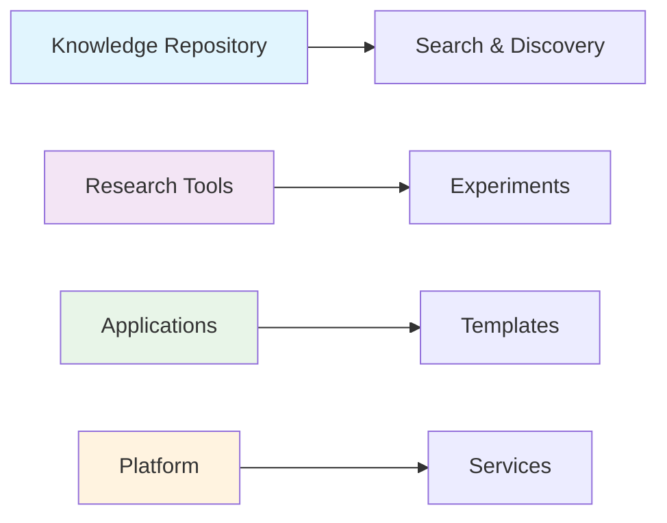

# Quick Start Guide - Active Inference Knowledge Environment

**Get up and running with the Active Inference Knowledge Environment in minutes!**

## 5-Minute Quick Start

### 1. Prerequisites (30 seconds)

```bash
# Check Python version (requires 3.9+)
python --version

# If needed, install Python 3.11
pyenv install 3.11
pyenv local 3.11
```

---

### 2. Installation (2 minutes)

```bash
# Clone the repository
git clone https://github.com/docxology/active_inference.git
cd active_inference

# Install uv (recommended package manager)
curl -LsSf https://astral.sh/uv/install.sh | sh

# Install dependencies
uv sync

# Activate virtual environment
source .venv/bin/activate  # Linux/Mac
.venv\Scripts\activate     # Windows
```

---

### 3. Verify Installation (30 seconds)

```bash
# Check installation
python -c "from active_inference import KnowledgeRepository; print('✓ Installed successfully')"

# Run tests
uv run pytest tests/unit/test_knowledge_repository.py -v
```

---

### 4. First Steps (2 minutes)

#### Explore the Knowledge Repository

```python
from active_inference import KnowledgeRepository

# Initialize repository
repo = KnowledgeRepository()

# Search for concepts
results = repo.search("entropy", limit=5)
for result in results:
    print(f"- {result.title}: {result.description[:100]}...")

# Get a specific learning path
path = repo.get_learning_path("foundations_complete")
print(f"Learning path: {path.name} ({path.estimated_hours} hours)")
```

---

## 10-Minute Deep Dive

### Understanding the Architecture



### Core Components

1. **Knowledge Repository**: Educational content and learning systems
2. **Research Tools**: Scientific research and experimentation
3. **Applications**: Practical implementations and templates
4. **Platform**: Infrastructure and services

---

### Interactive Tutorial

#### Tutorial 1: Working with Knowledge

```python
from active_inference import KnowledgeRepository, ContentType, DifficultyLevel

# Initialize with custom configuration
repo = KnowledgeRepository({
    'root_path': './knowledge',
    'auto_index': True,
    'cache_enabled': True
})

# Search with filters
results = repo.search(
    query="information theory",
    content_types=[ContentType.FOUNDATION, ContentType.MATHEMATICS],
    difficulty=[DifficultyLevel.BEGINNER, DifficultyLevel.INTERMEDIATE]
)

print(f"Found {len(results)} results")
for result in results:
    print(f"  - {result.title} ({result.content_type}, {result.difficulty})")
```

#### Tutorial 2: Running Experiments

```python
from active_inference.research import ExperimentFramework, ExperimentConfig

# Initialize research framework
research = ExperimentFramework()

# Create experiment
config = ExperimentConfig(
    name="entropy_analysis",
    description="Analyze entropy measures",
    parameters={"n_samples": 1000}
)

# Run experiment
experiment_id = research.create_experiment(config)
results = research.run_experiment(experiment_id)

print(f"Experiment completed: {results['status']}")
```

#### Tutorial 3: Using LLM Integration

```python
from active_inference.llm import LLMClient

# Initialize LLM client
llm = LLMClient({
    'provider': 'ollama',
    'model': 'llama2',
    'base_url': 'http://localhost:11434'
})

# Ask questions about Active Inference
response = await llm.ask("What is variational free energy?")
print(response)

# Generate explanations
explanation = await llm.explain_concept("active inference", difficulty="beginner")
print(explanation)
```

---

## Common Use Cases

### Use Case 1: Learning Active Inference

```bash
# Start the platform
make serve

# Open browser to http://localhost:8080
# Navigate to learning paths
# Follow structured curriculum
```

### Use Case 2: Research with Active Inference

```python
from active_inference.research import create_research_project

# Create research project
project = create_research_project({
    "name": "perceptual_inference_study",
    "objectives": ["Study perceptual inference", "Analyze free energy"],
    "methodology": "experimental"
})

# Run research pipeline
results = project.execute()
print(results)
```

### Use Case 3: Building Applications

```python
from active_inference.applications import ApplicationFramework

# Create application from template
app = ApplicationFramework()

# Generate application code
code = app.create_application(
    template="basic_model",
    parameters={
        "n_states": 10,
        "n_observations": 20
    }
)

# Save generated application
with open("my_app.py", "w") as f:
    f.write(code)
```

---

## Next Steps

### Learning Paths

1. **Beginner**: Start with [Foundations](knowledge/foundations/README.md)
2. **Intermediate**: Explore [Mathematics](knowledge/mathematics/README.md)
3. **Advanced**: Study [Implementations](knowledge/implementations/README.md)
4. **Expert**: Apply to [Applications](applications/README.md)

### Resources

- **Documentation**: Complete docs at [docs/](docs/)
- **Examples**: Working examples in [examples/](examples/)
- **API Reference**: Full API docs at [docs/api/](docs/api/)
- **Community**: Join discussions on [GitHub](https://github.com/docxology/active_inference/discussions)

### Support

- **Issues**: Report bugs on [GitHub Issues](https://github.com/docxology/active_inference/issues)
- **Troubleshooting**: Check [TROUBLESHOOTING.md](TROUBLESHOOTING.md)
- **FAQ**: See [FAQ section](knowledge/faq.json)

---

## Development Quick Start

### Running Tests

```bash
# All tests
make test

# Unit tests only
make test-unit

# With coverage
make test-coverage
```

### Building Documentation

```bash
# Generate documentation
make docs

# Serve locally
make docs-serve
```

### Code Quality

```bash
# Format code
make format

# Lint code
make lint

# Type check
make type-check

# All quality checks
make check-all
```

---

## Troubleshooting

### Issue: Installation fails

```bash
# Check Python version
python --version  # Should be 3.9+

# Try with specific Python version
python3.11 -m venv venv
source venv/bin/activate
uv sync
```

### Issue: Import errors

```bash
# Reinstall in development mode
uv pip install -e .

# Check PYTHONPATH
export PYTHONPATH="${PYTHONPATH}:$(pwd)"
```

### Issue: Platform won't start

```bash
# Check if port is in use
lsof -i :8080

# Use different port
export PLATFORM_PORT=8081
python platform/serve.py
```

For more troubleshooting help, see [TROUBLESHOOTING.md](TROUBLESHOOTING.md)

---

## Tips and Best Practices

### 1. Use Virtual Environment

Always work within a virtual environment to avoid conflicts:

```bash
# Create and activate
python3 -m venv venv
source venv/bin/activate  # Linux/Mac
```

### 2. Follow TDD

Write tests before implementation:

```python
def test_feature():
    # Arrange
    setup_test()
    # Act
    result = run_feature()
    # Assert
    assert result == expected
```

### 3. Use Type Hints

Add type annotations for better code quality:

```python
def process_data(data: Dict[str, Any]) -> List[Result]:
    """Process data and return results"""
    return [transform(item) for item in data]
```

### 4. Document Your Code

Follow documentation standards:

```python
def important_function(param1: str, param2: int) -> dict:
    """
    Brief description of what the function does.

    Args:
        param1: Description of param1
        param2: Description of param2

    Returns:
        Dictionary containing results

    Examples:
        >>> result = important_function("test", 42)
        >>> print(result)
        {'status': 'success'}
    """
```

### 5. Regular Testing

Run tests frequently:

```bash
# Before committing
make test

# Before pushing
make check-all
```

---

## Getting Help

### Community Resources

- **GitHub Discussions**: Ask questions and share ideas
- **GitHub Issues**: Report bugs and request features
- **Documentation**: Comprehensive guides and references
- **Examples**: Working code examples and tutorials

### Contributing

See [CONTRIBUTING.md](CONTRIBUTING.md) for guidelines on contributing to the project.

---

## Summary

You're now ready to start working with the Active Inference Knowledge Environment!

**Key Takeaways**:
- ✅ Installation takes ~2 minutes
- ✅ Core functionality works out of the box
- ✅ Extensive documentation available
- ✅ Active community support

**Next Steps**:
1. Explore the knowledge repository
2. Try running experiments
3. Build your first application
4. Join the community

Happy learning! 🚀

---

**Last Updated**: December 2024  
**Version**: 1.0.0

*"Active Inference for, with, by Generative AI"* - Getting started with collaborative intelligence and comprehensive Active Inference understanding.

