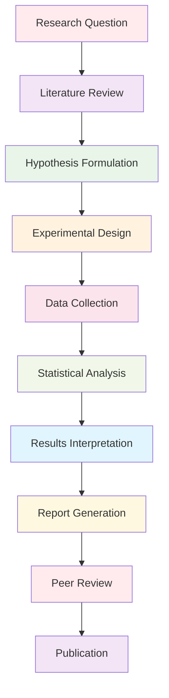

# Research Documentation Hub

This directory contains comprehensive documentation for the research tools and scientific methods integrated into the Active Inference Knowledge Environment. It provides guidance for researchers, scientists, and developers working with Active Inference research frameworks.

## Overview

The research documentation hub serves as the central resource for understanding and utilizing the research capabilities of the Active Inference platform. This includes experimental design, simulation frameworks, analysis tools, and benchmarking systems.

### Mission & Role

This documentation contributes to the platform mission by:

- **Research Enablement**: Providing tools and frameworks for Active Inference research
- **Scientific Validation**: Ensuring rigorous scientific methods and reproducible results
- **Knowledge Integration**: Connecting theoretical concepts with empirical research
- **Community Collaboration**: Supporting collaborative research across disciplines

## Architecture

### Documentation Structure

```
docs/research/
├── analysis/              # Statistical and information-theoretic analysis
├── benchmarks/            # Performance evaluation and comparison
├── experiments/           # Reproducible research pipelines
├── simulations/           # Multi-scale modeling and simulation
└── README.md             # This file
```

### Integration Points

**Platform Integration:**
- **Research Tools**: Core research functionality and analysis methods
- **Knowledge Base**: Connection between theory and empirical research
- **Visualization**: Research data visualization and exploration tools
- **Applications**: Research-driven application development

**External Systems:**
- **Scientific Computing**: NumPy, SciPy, statistical packages
- **Visualization**: Matplotlib, Plotly, interactive plotting libraries
- **Data Management**: Research data storage and processing systems
- **Publication Systems**: Academic writing and publication tools

## Research Categories

### Analysis Tools
Comprehensive statistical and information-theoretic analysis methods:
- **Information Theory**: Entropy analysis, divergence measures, mutual information
- **Bayesian Methods**: Advanced Bayesian inference and model comparison
- **Statistical Testing**: Hypothesis testing, model validation, significance testing
- **Time Series Analysis**: Temporal pattern analysis and forecasting

### Benchmarking Systems
Standardized evaluation and comparison frameworks:
- **Performance Metrics**: Computational efficiency and accuracy measures
- **Comparative Analysis**: Side-by-side model performance evaluation
- **Scalability Testing**: Performance under varying computational loads
- **Reproducibility Validation**: Ensuring consistent results across environments

### Experimental Frameworks
Reproducible research pipeline orchestration:
- **Experiment Design**: Structured experimental planning and execution
- **Data Collection**: Automated data gathering and preprocessing
- **Result Analysis**: Statistical analysis and interpretation
- **Report Generation**: Automated research reporting and visualization

### Simulation Systems
Multi-scale modeling and simulation environments:
- **Neural Simulation**: Neural network and brain region modeling
- **Cognitive Models**: Behavioral and cognitive process simulation
- **System Dynamics**: Complex system behavior modeling
- **Parameter Studies**: Sensitivity analysis and optimization

## Getting Started

### Prerequisites
- **Scientific Computing**: Python scientific stack (NumPy, SciPy, Pandas)
- **Statistical Knowledge**: Understanding of statistical methods and inference
- **Research Methods**: Familiarity with experimental design and analysis
- **Programming Skills**: Python programming for research automation

### Basic Setup

```bash
# Install research dependencies
pip install numpy scipy pandas matplotlib seaborn

# Install research-specific packages
pip install statsmodels scikit-learn networkx

# Set up research environment
export RESEARCH_ENV="development"
export DATA_DIR="./research_data"
```

### Initial Research Project

```python
# Basic research workflow
from active_inference.research.experiments import ExperimentManager
from active_inference.research.analysis import StatisticalAnalyzer

# Initialize research components
experiment_manager = ExperimentManager(config)
analyzer = StatisticalAnalyzer(config)

# Define research question
research_question = {
    "hypothesis": "Active inference improves decision-making efficiency",
    "variables": ["model_type", "complexity", "performance"],
    "metrics": ["accuracy", "response_time", "confidence"]
}

# Design experiment
experiment = experiment_manager.design_experiment(research_question)
```

## Usage Examples

### Example 1: Information Theory Analysis

```python
# Analyze information content in neural signals
from active_inference.research.analysis import InformationTheoryAnalyzer

# Load neural data
neural_data = load_neural_recording("experiment_001.h5")

# Perform information theory analysis
analyzer = InformationTheoryAnalyzer(neural_data)

# Calculate entropy measures
entropy_results = analyzer.calculate_entropy(time_window=1000)
mutual_information = analyzer.calculate_mutual_information()

# Visualize results
analyzer.plot_entropy_dynamics()
analyzer.plot_information_flow()
```

### Example 2: Model Benchmarking

```python
# Compare different Active Inference implementations
from active_inference.research.benchmarks import BenchmarkSuite

# Define benchmark scenarios
scenarios = [
    "simple_control",
    "multi_agent_interaction",
    "continuous_state_estimation",
    "hierarchical_inference"
]

# Run comprehensive benchmarks
benchmark = BenchmarkSuite(scenarios)
results = benchmark.run_all_scenarios()

# Generate comparison report
report = benchmark.generate_comparison_report(results)
benchmark.visualize_performance_comparison()
```

## Configuration

### Research Environment Configuration

```python
# Basic research configuration
research_config = {
    "environment": {
        "name": "active_inference_research",
        "version": "1.0.0",
        "data_directory": "./research_data"
    },
    "analysis": {
        "significance_level": 0.05,
        "multiple_testing_correction": "bonferroni",
        "effect_size_threshold": 0.8
    },
    "simulation": {
        "time_steps": 1000,
        "integration_method": "euler",
        "noise_level": 0.1
    },
    "benchmarking": {
        "repetitions": 100,
        "confidence_interval": 0.95,
        "performance_metrics": ["accuracy", "efficiency", "robustness"]
    }
}
```

### Advanced Configuration

```python
# Advanced research settings
advanced_config = {
    "parallel_processing": {
        "enabled": True,
        "max_workers": 8,
        "memory_limit": "16GB"
    },
    "data_management": {
        "auto_backup": True,
        "compression": "gzip",
        "versioning": True
    },
    "quality_control": {
        "validation_level": "comprehensive",
        "reproducibility_checks": True,
        "bias_detection": True
    },
    "publication": {
        "auto_citation": True,
        "figure_generation": True,
        "statistical_reporting": "apa"
    }
}
```

## API Reference

### Core Research Classes

#### `ExperimentManager`
Main class for orchestrating research experiments.

```python
class ExperimentManager:
    """Orchestrate research experiments and data collection"""

    def __init__(self, config: Dict[str, Any]):
        """Initialize experiment manager with configuration"""

    def design_experiment(self, research_question: Dict) -> Experiment:
        """Design structured experiment from research question"""

    def run_experiment(self, experiment: Experiment) -> Results:
        """Execute experiment and collect results"""

    def validate_results(self, results: Results) -> ValidationReport:
        """Validate experimental results and statistical power"""
```

#### `StatisticalAnalyzer`
Comprehensive statistical analysis toolkit.

```python
class StatisticalAnalyzer:
    """Statistical analysis and hypothesis testing"""

    def __init__(self, data: Union[pd.DataFrame, np.ndarray]):
        """Initialize analyzer with research data"""

    def hypothesis_test(self, hypothesis: str, alpha: float = 0.05) -> TestResult:
        """Perform statistical hypothesis testing"""

    def effect_size_analysis(self) -> EffectSizeReport:
        """Calculate and interpret effect sizes"""

    def power_analysis(self, effect_size: float, alpha: float) -> PowerReport:
        """Conduct statistical power analysis"""
```

#### `SimulationEngine`
Multi-scale simulation framework.

```python
class SimulationEngine:
    """Multi-scale modeling and simulation"""

    def __init__(self, model_config: Dict[str, Any]):
        """Initialize simulation with model configuration"""

    def run_simulation(self, parameters: Dict) -> SimulationResults:
        """Execute simulation with given parameters"""

    def parameter_sweep(self, parameter_ranges: Dict) -> SweepResults:
        """Perform parameter sensitivity analysis"""

    def validate_model(self, validation_data: Any) -> ValidationReport:
        """Validate simulation against empirical data"""
```

## Research Workflows

### Standard Research Pipeline



### Advanced Research Patterns

```python
# Multi-stage research workflow
def conduct_comprehensive_research(research_plan: Dict) -> ResearchReport:
    """Conduct comprehensive multi-stage research project"""

    # Stage 1: Exploratory analysis
    exploratory_results = perform_exploratory_analysis(research_plan)

    # Stage 2: Hypothesis refinement
    refined_hypotheses = refine_hypotheses(exploratory_results)

    # Stage 3: Confirmatory research
    confirmatory_results = conduct_confirmatory_research(refined_hypotheses)

    # Stage 4: Meta-analysis
    meta_analysis = perform_meta_analysis(confirmatory_results)

    # Generate comprehensive report
    return generate_research_report(meta_analysis)
```

## Contributing

### Research Documentation Standards

When contributing to research documentation:

1. **Scientific Accuracy**: Ensure all methods and results are scientifically sound
2. **Reproducibility**: Provide complete code and data for reproduction
3. **Clarity**: Explain complex methods in accessible language
4. **Validation**: Include validation against established benchmarks
5. **Ethics**: Follow research ethics and responsible conduct guidelines

### Research Contribution Process

1. **Identify Research Gap**: Find areas needing research or validation
2. **Design Study**: Create detailed research design with clear hypotheses
3. **Implement Methods**: Develop robust research methods and tools
4. **Validate Results**: Ensure results are reproducible and statistically sound
5. **Document Thoroughly**: Provide comprehensive documentation and examples
6. **Submit for Review**: Follow peer review process for research contributions

## Related Documentation

- **[Research Tools](../../research/README.md)**: Overview of research framework
- **[Analysis Methods](../analysis/README.md)**: Statistical analysis documentation
- **[Benchmarking Guide](../benchmarks/README.md)**: Performance evaluation methods
- **[Experiment Design](../experiments/README.md)**: Experimental research guidance
- **[Simulation Framework](../simulations/README.md)**: Multi-scale modeling tools
- **[Main Research Documentation](../../research/README.md)**: Research module overview

---

**Research Documentation Version**: 1.0.0 | **Last Updated**: October 2024 | **Development Status**: Active Development

*"Active Inference for, with, by Generative AI"* - Advancing Active Inference research through comprehensive documentation, rigorous methods, and collaborative scientific inquiry.
