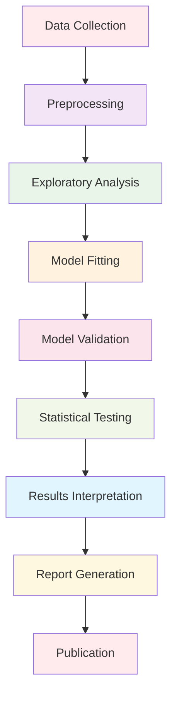

# Research Analysis Documentation

This directory contains comprehensive documentation for statistical and information-theoretic analysis tools in the Active Inference Knowledge Environment. It provides guidance for researchers conducting quantitative analysis of Active Inference models and systems.

## Overview

The research analysis documentation covers the complete toolkit for analyzing Active Inference systems, from basic statistical methods to advanced information-theoretic analysis. This includes entropy analysis, divergence measures, Bayesian inference, and model validation techniques.

### Mission & Role

This documentation contributes to the platform mission by:

- **Scientific Analysis**: Providing rigorous analytical methods for Active Inference research
- **Method Validation**: Ensuring statistical validity of research findings
- **Model Assessment**: Enabling comprehensive evaluation of Active Inference models
- **Research Quality**: Supporting high-quality, reproducible research practices

## Architecture

### Analysis Documentation Structure

```
docs/research/analysis/
├── information_theory/    # Information-theoretic analysis methods
├── statistical_methods/   # Statistical analysis and inference
├── model_validation/      # Model assessment and validation
├── performance_analysis/  # Performance evaluation and optimization
└── README.md             # This file
```

### Integration Points

**Platform Integration:**
- **Research Framework**: Core analysis tools and statistical methods
- **Simulation Engine**: Analysis of simulated Active Inference systems
- **Knowledge Base**: Theoretical foundations for analysis methods
- **Visualization**: Statistical data visualization and exploration

**External Systems:**
- **Statistical Computing**: R, MATLAB, specialized statistical software
- **Scientific Libraries**: NumPy, SciPy, StatsModels, scikit-learn
- **Visualization Tools**: Matplotlib, Seaborn, Plotly for statistical graphics
- **Publication Systems**: LaTeX, Jupyter notebooks for research reporting

## Analysis Categories

### Information Theory Analysis
Comprehensive information-theoretic methods for Active Inference systems:
- **Entropy Measures**: Shannon entropy, differential entropy, relative entropy
- **Divergence Analysis**: KL divergence, Jensen-Shannon divergence, Wasserstein distance
- **Mutual Information**: Mutual information, conditional mutual information, transfer entropy
- **Complexity Measures**: Statistical complexity, effective measure complexity, causal density

### Statistical Analysis
Advanced statistical methods for model evaluation:
- **Bayesian Inference**: Bayesian model comparison, posterior predictive checks
- **Hypothesis Testing**: Statistical tests for model validation and comparison
- **Regression Analysis**: Linear and nonlinear regression for model assessment
- **Time Series Analysis**: Temporal analysis, Granger causality, frequency domain methods

### Model Validation
Rigorous validation and assessment frameworks:
- **Cross-Validation**: K-fold cross-validation, leave-one-out validation
- **Model Comparison**: AIC, BIC, WAIC, LOO-CV for model selection
- **Goodness of Fit**: Chi-square tests, likelihood ratio tests, residual analysis
- **Robustness Analysis**: Sensitivity analysis, stability assessment, uncertainty quantification

### Performance Analysis
Computational performance and efficiency evaluation:
- **Computational Complexity**: Big O analysis, algorithmic complexity assessment
- **Memory Usage**: Memory profiling, optimization strategies
- **Scalability Testing**: Performance scaling with system size and complexity
- **Benchmarking**: Comparative performance analysis, profiling, optimization

## Getting Started

### Prerequisites
- **Statistical Knowledge**: Understanding of probability, statistics, and inference
- **Information Theory**: Familiarity with entropy, divergence, and information measures
- **Programming Skills**: Python programming with scientific computing libraries
- **Research Methods**: Understanding of experimental design and validation

### Basic Setup

```bash
# Install analysis dependencies
pip install numpy scipy pandas matplotlib seaborn
pip install statsmodels scikit-learn networkx
pip install pymc3 arviz  # Bayesian analysis
pip install torch tensorflow  # Deep learning analysis

# Install specialized packages
pip install pyinform  # Information theory
pip install chaospy   # Uncertainty quantification
pip install corner     # Visualization
```

### Initial Analysis Project

```python
# Basic analysis workflow
import numpy as np
from active_inference.research.analysis import InformationTheoryAnalyzer
from active_inference.research.analysis import StatisticalValidator

# Load data for analysis
data = np.load("active_inference_data.npy")

# Initialize analysis tools
info_analyzer = InformationTheoryAnalyzer(data)
stat_validator = StatisticalValidator(data)

# Perform comprehensive analysis
entropy_analysis = info_analyzer.calculate_entropy_measures()
divergence_analysis = info_analyzer.calculate_divergence_measures()
statistical_validation = stat_validator.validate_model_performance()

# Generate analysis report
report = generate_analysis_report(entropy_analysis, divergence_analysis, statistical_validation)
```

## Usage Examples

### Example 1: Entropy Analysis of Neural Activity

```python
# Analyze entropy in neural spike trains
import numpy as np
from active_inference.research.analysis.information_theory import EntropyAnalyzer

# Load neural spike data
spike_data = load_spike_data("neural_recording.mat")
time_bins = create_time_bins(spike_data, bin_size=50)

# Perform entropy analysis
entropy_analyzer = EntropyAnalyzer(spike_data, time_bins)

# Calculate Shannon entropy
shannon_entropy = entropy_analyzer.shannon_entropy()
differential_entropy = entropy_analyzer.differential_entropy()

# Analyze entropy dynamics
entropy_rate = entropy_analyzer.entropy_rate()
entropy_production = entropy_analyzer.entropy_production()

# Visualize entropy patterns
entropy_analyzer.plot_entropy_dynamics()
entropy_analyzer.plot_spatiotemporal_entropy()
```

### Example 2: Model Comparison and Validation

```python
# Compare different Active Inference model implementations
from active_inference.research.analysis import ModelComparisonSuite
from active_inference.research.analysis import CrossValidator

# Define models to compare
models = {
    "standard_aif": StandardActiveInferenceModel(),
    "variational_aif": VariationalActiveInferenceModel(),
    "hierarchical_aif": HierarchicalActiveInferenceModel()
}

# Set up comparison framework
comparison_suite = ModelComparisonSuite(models)
cross_validator = CrossValidator(k_folds=10)

# Run comprehensive comparison
comparison_results = comparison_suite.compare_all_metrics()

# Perform cross-validation
cv_results = cross_validator.validate_models(models)

# Analyze model selection criteria
aic_scores = comparison_suite.calculate_aic_scores()
bic_scores = comparison_suite.calculate_bic_scores()
waic_scores = comparison_suite.calculate_waic_scores()

# Generate validation report
validation_report = generate_model_validation_report(
    comparison_results, cv_results, aic_scores, bic_scores, waic_scores
)
```

### Example 3: Information Flow Analysis

```python
# Analyze information flow in Active Inference systems
from active_inference.research.analysis.information_theory import InformationFlowAnalyzer

# Initialize system for analysis
system = ActiveInferenceSystem(config)
flow_analyzer = InformationFlowAnalyzer(system)

# Define analysis parameters
analysis_config = {
    "time_window": 1000,
    "lag_range": range(1, 50),
    "significance_level": 0.05
}

# Calculate transfer entropy
transfer_entropy = flow_analyzer.calculate_transfer_entropy(analysis_config)

# Analyze effective connectivity
effective_connectivity = flow_analyzer.calculate_effective_connectivity()

# Identify information pathways
information_pathways = flow_analyzer.identify_information_pathways()

# Visualize information flow
flow_analyzer.plot_transfer_entropy_network()
flow_analyzer.plot_information_flow_dynamics()
```

## Configuration

### Analysis Environment Configuration

```python
# Basic analysis configuration
analysis_config = {
    "environment": {
        "random_seed": 42,
        "precision": "double",
        "parallel_processing": True
    },
    "statistical": {
        "significance_level": 0.05,
        "multiple_testing_correction": "fdr",
        "confidence_interval": 0.95,
        "effect_size_threshold": 0.8
    },
    "information_theory": {
        "entropy_estimator": "maximum_likelihood",
        "divergence_estimator": "k_nearest_neighbors",
        "mutual_information_method": "kraskov",
        "surrogate_method": "shuffle"
    },
    "validation": {
        "cross_validation_folds": 10,
        "bootstrap_replications": 1000,
        "permutation_tests": 1000,
        "model_comparison_criterion": "waic"
    }
}
```

### Advanced Analysis Configuration

```python
# Advanced analysis settings
advanced_config = {
    "performance": {
        "memory_limit": "32GB",
        "max_workers": 16,
        "cache_size": "8GB",
        "profiling_enabled": True
    },
    "quality_control": {
        "validation_level": "comprehensive",
        "bias_detection": True,
        "outlier_detection": True,
        "distribution_assumptions": "nonparametric"
    },
    "visualization": {
        "plot_style": "publication_ready",
        "color_scheme": "colorblind_friendly",
        "figure_format": "svg",
        "interactive_plots": True
    },
    "reporting": {
        "statistical_reporting": "apa",
        "figure_captioning": "automatic",
        "reference_formatting": "bibtex",
        "supplementary_materials": True
    }
}
```

## API Reference

### Core Analysis Classes

#### `InformationTheoryAnalyzer`
Comprehensive information-theoretic analysis toolkit.

```python
class InformationTheoryAnalyzer:
    """Information-theoretic analysis of Active Inference systems"""

    def __init__(self, data: Union[np.ndarray, torch.Tensor], config: Dict[str, Any]):
        """Initialize analyzer with data and configuration"""

    def calculate_entropy_measures(self) -> EntropyMeasures:
        """Calculate comprehensive entropy measures"""

    def calculate_divergence_measures(self) -> DivergenceMeasures:
        """Calculate divergence measures between distributions"""

    def calculate_mutual_information(self) -> MutualInformationMeasures:
        """Calculate mutual information and conditional dependencies"""

    def analyze_complexity_measures(self) -> ComplexityMeasures:
        """Analyze statistical and computational complexity"""
```

#### `StatisticalValidator`
Statistical validation and model assessment framework.

```python
class StatisticalValidator:
    """Statistical validation and model assessment"""

    def __init__(self, model: ActiveInferenceModel, data: Any):
        """Initialize validator with model and validation data"""

    def cross_validate(self, k_folds: int = 10) -> CrossValidationResults:
        """Perform k-fold cross-validation"""

    def calculate_model_comparison_criteria(self) -> ModelComparisonCriteria:
        """Calculate AIC, BIC, WAIC, and LOO-CV criteria"""

    def perform_hypothesis_tests(self, hypotheses: List[str]) -> HypothesisTestResults:
        """Perform statistical hypothesis tests"""

    def assess_model_goodness_of_fit(self) -> GoodnessOfFitResults:
        """Assess model fit quality and adequacy"""
```

#### `PerformanceAnalyzer`
Computational performance and scalability analysis.

```python
class PerformanceAnalyzer:
    """Performance analysis and optimization"""

    def __init__(self, model: ActiveInferenceModel):
        """Initialize performance analyzer with model"""

    def profile_computational_complexity(self) -> ComplexityProfile:
        """Profile computational complexity and resource usage"""

    def analyze_scalability(self, size_range: Tuple[int, int]) -> ScalabilityResults:
        """Analyze performance scaling with system size"""

    def benchmark_against_baselines(self, baselines: List[Model]) -> BenchmarkResults:
        """Benchmark against standard baseline models"""

    def optimize_performance(self) -> OptimizationRecommendations:
        """Generate performance optimization recommendations"""
```

## Research Workflows

### Standard Analysis Pipeline



### Advanced Analysis Patterns

```python
# Multi-scale analysis workflow
def conduct_multiscale_analysis(data: Any, scales: List[float]) -> AnalysisReport:
    """Conduct analysis across multiple temporal and spatial scales"""

    # Scale-specific analysis
    scale_results = {}
    for scale in scales:
        scaled_data = preprocess_data_for_scale(data, scale)
        scale_analysis = perform_scale_specific_analysis(scaled_data)
        scale_results[scale] = scale_analysis

    # Cross-scale integration
    cross_scale_patterns = identify_cross_scale_patterns(scale_results)

    # Multi-scale validation
    multiscale_validation = validate_multiscale_consistency(scale_results)

    # Generate comprehensive report
    return generate_multiscale_report(scale_results, cross_scale_patterns, multiscale_validation)

# Bayesian model comparison workflow
def conduct_bayesian_model_comparison(models: List[Model], data: Any) -> ComparisonReport:
    """Conduct comprehensive Bayesian model comparison"""

    # Fit all models
    fitted_models = fit_all_models(models, data)

    # Calculate comparison criteria
    model_criteria = calculate_comparison_criteria(fitted_models)

    # Perform model averaging
    model_weights = calculate_model_weights(model_criteria)
    averaged_predictions = generate_averaged_predictions(fitted_models, model_weights)

    # Validate model comparison
    comparison_validation = validate_model_comparison(model_criteria)

    return generate_comparison_report(fitted_models, model_criteria, comparison_validation)
```

## Contributing

### Analysis Documentation Standards

When contributing to analysis documentation:

1. **Statistical Rigor**: Ensure all statistical methods are mathematically sound
2. **Method Validation**: Provide validation against known benchmarks
3. **Code Reproducibility**: Include complete, working code examples
4. **Interpretation Guidance**: Provide clear interpretation guidelines
5. **Limitations Documentation**: Clearly document method limitations and assumptions

### Analysis Contribution Process

1. **Identify Analysis Gap**: Find missing or inadequate analysis methods
2. **Research Implementation**: Implement robust analysis methods
3. **Validate Methods**: Ensure methods work correctly and efficiently
4. **Document Comprehensively**: Provide complete documentation and examples
5. **Validate Against Standards**: Ensure compliance with statistical standards
6. **Submit for Review**: Follow peer review process for analysis contributions

## Related Documentation

- **[Research Framework](../../research/README.md)**: Overview of research tools
- **[Information Theory Analysis](../information_theory/README.md)**: Specialized information theory methods
- **[Statistical Methods Documentation](../../research/analysis/README.md)**: Statistical analysis tools
- **[Model Validation Guide](../../research/analysis/validation/)**: Model assessment methods
- **[Performance Analysis](../../research/analysis/performance/)**: Performance evaluation tools

---

**Research Analysis Documentation Version**: 1.0.0 | **Last Updated**: October 2024 | **Development Status**: Active Development

*"Active Inference for, with, by Generative AI"* - Advancing scientific understanding through rigorous analysis, statistical validation, and comprehensive research methods.
