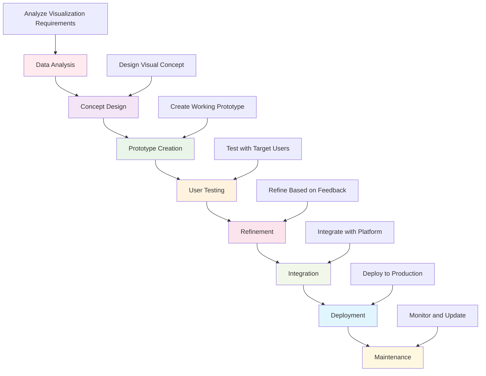

# Visualization Documentation Hub

This directory contains comprehensive documentation for the visualization systems in the Active Inference Knowledge Environment. It provides guidance for creating, using, and understanding interactive visualizations, diagrams, animations, and dashboards that help users explore and understand Active Inference concepts.

## Overview

The visualization documentation hub serves as the central resource for understanding and utilizing the platform's visualization capabilities. This includes static diagrams, interactive animations, real-time dashboards, and comparative analysis tools that make Active Inference concepts accessible and engaging.

### Mission & Role

This documentation contributes to the platform mission by:

- **Concept Visualization**: Making abstract Active Inference concepts visually accessible
- **Interactive Exploration**: Enabling hands-on learning through interactive visualizations
- **Research Communication**: Supporting clear communication of research findings
- **Educational Engagement**: Creating engaging visual learning experiences
- **Platform Usability**: Enhancing the overall user experience through effective visualization

## Architecture

### Visualization Documentation Structure

```
docs/visualization/
├── animations/            # Dynamic visualization and animation systems
├── diagrams/              # Static diagram generation and visualization
├── dashboards/            # Interactive exploration interfaces
├── comparative/           # Model comparison and analysis tools
└── README.md             # This file
```

### Integration Points

**Platform Integration:**
- **Visualization Engine**: Core rendering and display systems
- **Knowledge Base**: Visual representation of educational content
- **Research Tools**: Visualization of research data and analysis results
- **User Interface**: Integration with web interfaces and applications

**External Systems:**
- **Visualization Libraries**: Matplotlib, Plotly, D3.js, WebGL, Three.js
- **Mathematical Computing**: NumPy, SciPy for data processing and visualization
- **Web Technologies**: HTML5 Canvas, CSS animations, JavaScript frameworks
- **Design Tools**: Figma, Adobe Creative Suite for visual design

## Visualization Categories

### Animation Systems
Dynamic visualization of Active Inference processes:
- **Belief Dynamics**: Real-time visualization of belief updating and inference
- **Policy Execution**: Animation of decision-making and action sequences
- **Neural Networks**: Visualization of neural implementations and learning
- **Multi-Agent Systems**: Interactive visualization of agent interactions

### Static Diagrams
Educational and reference diagrams:
- **Architecture Diagrams**: System structure and component relationships
- **Flow Diagrams**: Process flows and information pathways
- **Mathematical Diagrams**: Visual representation of mathematical concepts
- **Workflow Diagrams**: Development and research process visualization

### Interactive Dashboards
Exploratory data analysis and visualization:
- **Research Dashboards**: Interactive exploration of research data
- **Learning Dashboards**: Interactive educational content and assessments
- **Performance Dashboards**: Real-time monitoring of system performance
- **Comparison Dashboards**: Side-by-side model and method comparison

### Comparative Analysis
Model and method comparison tools:
- **Performance Comparison**: Visualization of model performance metrics
- **Method Comparison**: Side-by-side analysis of different approaches
- **Scalability Analysis**: Visualization of scaling characteristics
- **Quality Metrics**: Visual representation of quality measures

## Getting Started

### Prerequisites
- **Visualization Knowledge**: Understanding of data visualization principles
- **Active Inference Concepts**: Familiarity with core Active Inference ideas
- **Programming Skills**: Python programming with visualization libraries
- **Design Thinking**: Understanding of visual design and user experience

### Basic Setup

```bash
# Install visualization dependencies
pip install matplotlib plotly seaborn bokeh
pip install networkx graphviz pydot
pip install ipywidgets panel streamlit  # Interactive interfaces

# Install specialized visualization libraries
pip install pyvis  # Network visualization
pip install celluloid  # Animation support
pip install holoviews  # High-level visualization

# Set up visualization environment
export VISUALIZATION_BACKEND="plotly"
export INTERACTIVE_MODE="enabled"
export HIGH_RESOLUTION="enabled"
```

### Initial Visualization Project

```python
# Basic visualization workflow
import numpy as np
from active_inference.visualization import VisualizationManager
from active_inference.visualization.diagrams import DiagramGenerator

# Initialize visualization system
viz_manager = VisualizationManager(config)

# Create diagram generator
diagram_generator = DiagramGenerator()

# Generate system architecture diagram
architecture_data = {
    "components": ["observations", "beliefs", "policies", "actions"],
    "connections": "hierarchical",
    "layout": "force_directed"
}

diagram = diagram_generator.create_architecture_diagram(architecture_data)
viz_manager.display_diagram(diagram)
```

## Usage Examples

### Example 1: Belief Dynamics Visualization

```python
# Visualize belief updating in real-time
import numpy as np
from active_inference.visualization.animations import BeliefDynamicsVisualizer

# Set up belief updating scenario
initial_beliefs = np.array([0.7, 0.2, 0.1])
evidence_sequence = generate_evidence_sequence(duration=100, pattern="periodic")

# Initialize visualizer
visualizer = BeliefDynamicsVisualizer()

# Create real-time belief dynamics visualization
visualization = visualizer.create_belief_evolution_visualization(
    initial_beliefs,
    evidence_sequence,
    visualization_config={
        "real_time": True,
        "confidence_bands": True,
        "prediction_overlay": True,
        "interactive_controls": True
    }
)

# Customize visualization
visualization.set_style("publication_quality")
visualization.add_temporal_annotations()
visualization.enable_interactive_exploration()

# Display and export
visualizer.display_visualization(visualization)
visualization.export("belief_dynamics.gif")
```

### Example 2: Multi-Agent System Dashboard

```python
# Create interactive dashboard for multi-agent systems
from active_inference.visualization.dashboards import MultiAgentDashboard

# Define multi-agent scenario
agent_configs = [
    {"id": "agent_1", "type": "explorer", "goals": ["resource_discovery", "mapping"]},
    {"id": "agent_2", "type": "exploiter", "goals": ["resource_collection", "efficiency"]},
    {"id": "agent_3", "type": "coordinator", "goals": ["communication", "cooperation"]}
]

environment_config = {
    "size": [100, 100],
    "resources": 50,
    "obstacles": 20,
    "dynamic_changes": True
}

# Initialize dashboard
dashboard = MultiAgentDashboard(agent_configs, environment_config)

# Set up visualization components
dashboard.add_agent_position_tracker()
dashboard.add_belief_state_monitor()
dashboard.add_policy_execution_viewer()
dashboard.add_performance_metrics_display()

# Create interactive dashboard
interactive_dashboard = dashboard.create_interactive_dashboard()

# Add real-time updates
dashboard.enable_real_time_updates()
dashboard.add_control_panels()
dashboard.add_export_functionality()

# Deploy dashboard
dashboard.deploy_dashboard(port=8050)
```

### Example 3: Comparative Analysis Visualization

```python
# Create comparative analysis of different Active Inference models
from active_inference.visualization.comparative import ModelComparisonVisualizer

# Define models to compare
models = {
    "standard_aif": StandardActiveInferenceModel(),
    "variational_aif": VariationalActiveInferenceModel(),
    "deep_aif": DeepActiveInferenceModel(),
    "hierarchical_aif": HierarchicalActiveInferenceModel()
}

# Set up comparison scenarios
comparison_scenarios = [
    "simple_control",
    "multi_agent_coordination",
    "continuous_state_estimation",
    "uncertainty_handling",
    "learning_adaptation"
]

# Initialize comparison visualizer
visualizer = ModelComparisonVisualizer(models, comparison_scenarios)

# Generate comprehensive comparison
comparison_analysis = visualizer.run_comparison_analysis()

# Create visualization suite
visualization_suite = visualizer.create_comparison_visualization(
    comparison_analysis,
    visualization_types=["performance_metrics", "behavioral_analysis", "scalability_study"]
)

# Customize visualizations
visualizer.add_statistical_significance_testing()
visualizer.add_interactive_filtering()
visualizer.add_detailed_annotations()

# Export comparison report
visualizer.export_comparison_report("model_comparison_analysis.pdf")
```

## Configuration

### Visualization Environment Configuration

```python
# Basic visualization configuration
visualization_config = {
    "system": {
        "backend": "plotly",  # matplotlib, plotly, bokeh, webgl
        "interactive": True,
        "real_time": False,
        "high_resolution": True
    },
    "display": {
        "theme": "scientific",
        "color_scheme": "active_inference",
        "font_family": "serif",
        "accessibility": True
    },
    "animation": {
        "frame_rate": 30,
        "duration": "auto",
        "interpolation": "smooth",
        "controls": True
    },
    "export": {
        "formats": ["png", "svg", "pdf", "gif", "mp4"],
        "quality": "high",
        "metadata": True,
        "compression": "optimal"
    }
}
```

### Advanced Visualization Configuration

```python
# Advanced visualization settings
advanced_config = {
    "performance": {
        "max_elements": 10000,
        "rendering_engine": "gpu_accelerated",
        "memory_optimization": True,
        "caching_strategy": "intelligent"
    },
    "interactivity": {
        "user_controls": True,
        "parameter_sliders": True,
        "zoom_and_pan": True,
        "selection_tools": True,
        "filtering_options": True
    },
    "accessibility": {
        "color_blind_friendly": True,
        "high_contrast": False,
        "reduced_motion": False,
        "screen_reader_support": True,
        "keyboard_navigation": True
    },
    "scientific": {
        "error_bars": True,
        "confidence_intervals": True,
        "statistical_annotations": True,
        "reference_lines": True,
        "scale_indicators": True
    }
}
```

## API Reference

### Core Visualization Classes

#### `VisualizationManager`
Central management system for all visualizations.

```python
class VisualizationManager:
    """Manage and coordinate visualization creation and display"""

    def __init__(self, config: Dict[str, Any]):
        """Initialize visualization manager with configuration"""

    def create_visualization(self, visualization_type: str, config: Dict[str, Any]) -> BaseVisualization:
        """Create visualization of specified type"""

    def display_visualization(self, visualization: BaseVisualization, display_config: Dict[str, Any]) -> None:
        """Display visualization with specified configuration"""

    def export_visualization(self, visualization: BaseVisualization, export_config: Dict[str, Any]) -> str:
        """Export visualization to file with specified format"""

    def validate_visualization(self, visualization: BaseVisualization) -> ValidationReport:
        """Validate visualization correctness and effectiveness"""
```

#### `AnimationManager`
Specialized manager for dynamic visualizations.

```python
class AnimationManager:
    """Manage dynamic visualizations and animations"""

    def __init__(self, config: Dict[str, Any]):
        """Initialize animation manager with configuration"""

    def create_belief_animation(self, belief_data: Any, animation_config: Dict[str, Any]) -> Animation:
        """Create animation of belief dynamics"""

    def create_policy_animation(self, policy_data: Any, animation_config: Dict[str, Any]) -> Animation:
        """Create animation of policy execution"""

    def create_multi_agent_animation(self, agent_data: Any, animation_config: Dict[str, Any]) -> Animation:
        """Create animation of multi-agent interactions"""

    def add_interactive_controls(self, animation: Animation) -> Animation:
        """Add interactive controls to animation"""

    def optimize_performance(self, animation: Animation) -> Animation:
        """Optimize animation for smooth playback"""
```

#### `DashboardManager`
Manager for interactive dashboards and exploration tools.

```python
class DashboardManager:
    """Manage interactive dashboards and exploration tools"""

    def __init__(self, config: Dict[str, Any]):
        """Initialize dashboard manager with configuration"""

    def create_research_dashboard(self, data_sources: List[str], dashboard_config: Dict[str, Any]) -> Dashboard:
        """Create interactive research exploration dashboard"""

    def create_learning_dashboard(self, content_modules: List[str], dashboard_config: Dict[str, Any]) -> Dashboard:
        """Create interactive learning and assessment dashboard"""

    def add_real_time_components(self, dashboard: Dashboard) -> Dashboard:
        """Add real-time data visualization components"""

    def enable_collaboration_features(self, dashboard: Dashboard) -> Dashboard:
        """Enable collaborative features for shared exploration"""

    def customize_user_interface(self, dashboard: Dashboard, ui_config: Dict[str, Any]) -> Dashboard:
        """Customize dashboard user interface"""
```

## Visualization Workflows

### Standard Visualization Pipeline



### Advanced Visualization Patterns

```python
# Interactive educational visualization workflow
def create_educational_visualization_suite(concept_config: Dict[str, Any]) -> VisualizationSuite:
    """Create comprehensive educational visualization suite"""

    # Phase 1: Static diagrams for basic understanding
    static_diagrams = create_static_concept_diagrams(concept_config)

    # Phase 2: Interactive animations for dynamic processes
    interactive_animations = create_interactive_animations(concept_config)

    # Phase 3: Exploratory dashboards for deep dive
    exploratory_dashboards = create_exploratory_dashboards(concept_config)

    # Phase 4: Assessment tools for learning validation
    assessment_tools = create_assessment_visualizations(concept_config)

    # Combine into educational suite
    visualization_suite = combine_educational_components([
        static_diagrams, interactive_animations,
        exploratory_dashboards, assessment_tools
    ])

    # Add learning progression
    learning_progression = create_learning_progression(visualization_suite)

    # Validate educational effectiveness
    educational_validation = validate_educational_effectiveness(visualization_suite)

    return EducationalVisualizationSuite(
        visualizations=visualization_suite,
        learning_progression=learning_progression,
        validation=educational_validation
    )

# Real-time research visualization workflow
def create_real_time_research_visualization(data_stream: Iterator[Any], research_config: Dict[str, Any]) -> RealTimeVisualization:
    """Create real-time visualization for research data"""

    # Initialize real-time visualizer
    visualizer = RealTimeVisualizer(research_config)

    # Set up data processing pipeline
    data_processor = setup_real_time_data_processing()

    # Create real-time visualization components
    real_time_components = create_real_time_components(data_stream, data_processor)

    # Add interactive features
    interactive_features = add_interactive_features(real_time_components)

    # Implement performance optimization
    optimized_visualization = optimize_real_time_performance(interactive_features)

    # Set up monitoring and alerting
    monitoring_system = setup_visualization_monitoring(optimized_visualization)

    return RealTimeVisualization(
        components=real_time_components,
        interactive_features=interactive_features,
        performance_optimization=optimized_visualization,
        monitoring=monitoring_system
    )
```

## Contributing

### Visualization Documentation Standards

When contributing to visualization documentation:

1. **Visual Clarity**: Ensure visualizations clearly communicate intended concepts
2. **Educational Value**: Provide clear learning objectives and user guidance
3. **Technical Accuracy**: Maintain scientific and mathematical accuracy
4. **Performance Optimization**: Ensure visualizations run smoothly and efficiently
5. **Accessibility**: Make visualizations accessible to diverse users

### Visualization Contribution Process

1. **Identify Visualization Gap**: Find concepts or processes needing visual explanation
2. **Design Visualization Concept**: Create detailed design and user experience plan
3. **Implement Visualization**: Develop robust visualization implementation
4. **Test User Experience**: Validate visualization effectiveness and usability
5. **Document Usage**: Provide comprehensive documentation and examples
6. **Submit for Review**: Follow visualization review and integration process

## Related Documentation

- **[Visualization Framework](../../visualization/README.md)**: Overview of visualization systems
- **[Animation Systems](../../visualization/animations/README.md)**: Dynamic visualization tools
- **[Interactive Dashboards](../../visualization/dashboards/README.md)**: Interactive exploration interfaces
- **[Diagramming System](../../visualization/diagrams/README.md)**: Static diagram generation
- **[Platform Integration](../../../platform/)**: Platform-wide visualization integration

---

**Visualization Documentation Version**: 1.0.0 | **Last Updated**: October 2024 | **Development Status**: Active Development

*"Active Inference for, with, by Generative AI"* - Bringing Active Inference concepts to life through engaging visualizations, interactive exploration, and educational visual experiences.