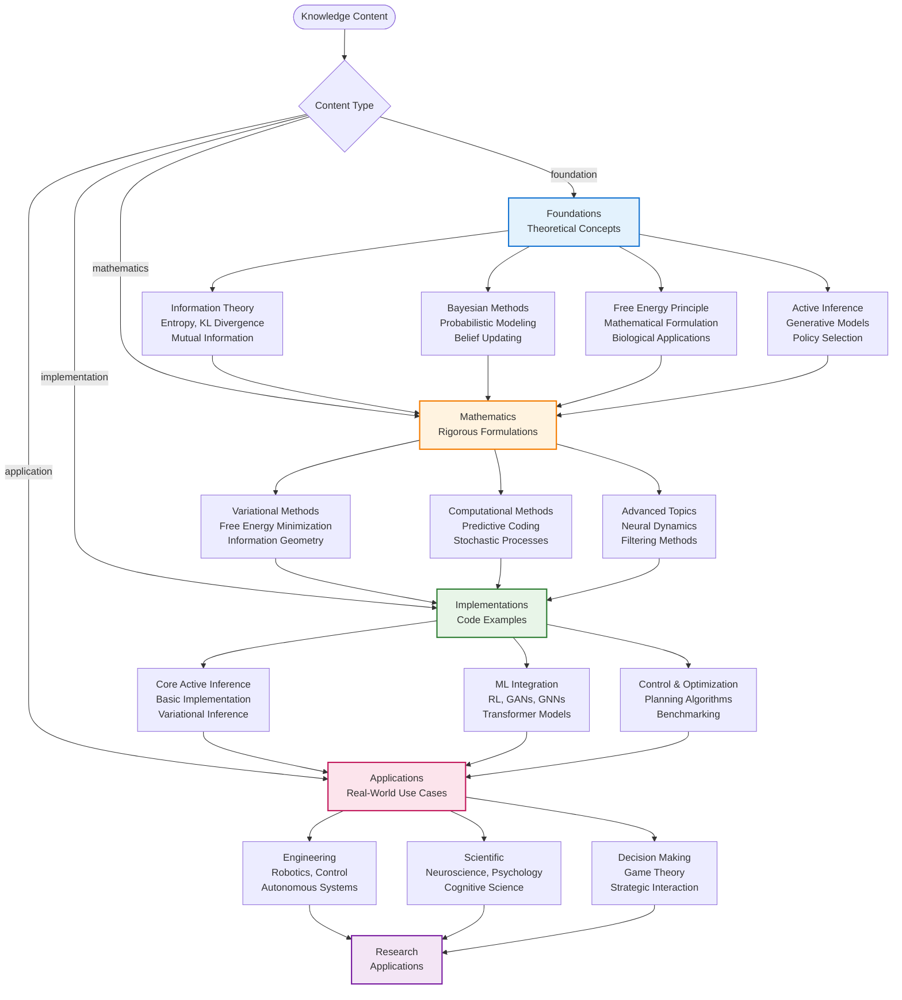
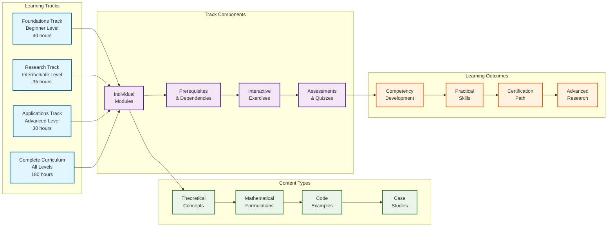
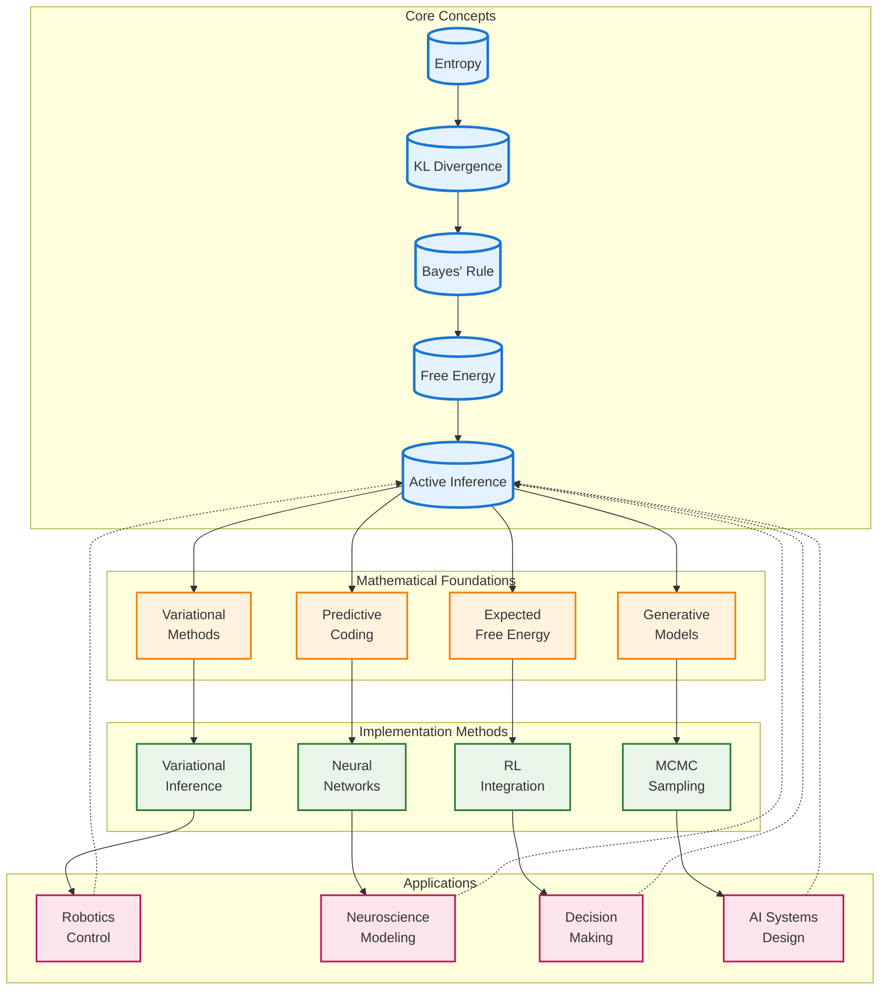

# Active Inference Knowledge Base

This directory contains the comprehensive knowledge base for Active Inference and the Free Energy Principle. The content is organized into four main sections:

## Directory Structure

```
knowledge/
├── foundations/          # Core theoretical concepts
├── mathematics/          # Mathematical formulations and derivations
├── implementations/      # Code examples and tutorials
├── applications/         # Real-world applications and use cases
└── learning_paths.json   # Structured learning paths
```

## Knowledge Architecture Diagrams

### Content Organization Flow


### Learning Path Structure


### Knowledge Graph Relationships


## Foundations

Core theoretical concepts including:
- **Information Theory**: Entropy, KL divergence, mutual information, cross-entropy
- **Bayesian Fundamentals**: Bayes' theorem, probabilistic modeling, belief updating, conjugate priors, hierarchical models, empirical Bayes
- **Free Energy Principle**: Mathematical formulation, biological applications
- **Active Inference**: Framework overview, generative models, policy selection, multi-agent systems, continuous control

## Mathematics

Rigorous mathematical treatments:
- **Variational Methods**: Variational free energy, information geometry, expected free energy
- **Computational Methods**: Predictive coding, stochastic processes, optimal transport, Markov Chain Monte Carlo
- **Advanced Topics**: Neural dynamics, filtering, sampling methods

## Implementations

Practical code examples and tutorials organized into three categories:

### Core Active Inference
- **Basic Implementation**: Complete Active Inference agent from scratch
- **Variational Inference**: Algorithms for approximate Bayesian computation
- **Expected Free Energy**: Policy evaluation and selection mechanisms
- **MCMC Sampling**: Markov Chain Monte Carlo methods for exact inference

### Advanced Machine Learning Integration
- **Reinforcement Learning**: RL algorithms using Active Inference framework
- **Deep Generative Models**: Hierarchical VAEs, GANs, and normalizing flows
- **Graph Neural Networks**: GNNs with Active Inference for relational reasoning
- **Active Inference Transformers**: Integration with large language models
- **Federated Active Inference**: Distributed and privacy-preserving systems

### Control and Optimization
- **Planning Algorithms**: Advanced planning methods for policy selection
- **Control Systems**: Continuous control with expected free energy
- **Benchmarking**: Performance evaluation and comparison frameworks
- **Simulation Methods**: Multi-scale modeling and validation tools
- **Uncertainty Quantification**: Advanced uncertainty modeling and propagation

## Applications

Real-world applications across domains:
- **Engineering**: Robotics, control systems, autonomous technologies
- **Scientific**: Neuroscience, perceptual processing, cognitive science
- **Decision Making**: Human and artificial decision processes, game theory
- **Domain-Specific**:
  - **Artificial Intelligence**: Alignment, safety, machine learning applications
  - **Education**: Adaptive learning systems, personalized instruction
  - **Engineering**: Control systems, robust design, safety-critical systems
  - **Psychology**: Cognitive modeling, behavioral science, mental health
  - **Economics**: Market behavior, strategic interaction, decision theory
  - **Climate Science**: Environmental modeling, uncertainty quantification, policy

## Usage

Each JSON file follows a structured format with:
- **id**: Unique identifier
- **title**: Descriptive title
- **content_type**: foundation|mathematics|implementation|application
- **difficulty**: beginner|intermediate|advanced|expert
- **description**: Brief summary
- **prerequisites**: Required prior knowledge
- **content**: Detailed structured content
- **metadata**: Additional information

## Learning Paths

The `learning_paths.json` file defines 22 structured curricula for different audiences and learning objectives:

### Available Tracks
- **Complete Curriculum** (180 hours): Comprehensive coverage of all Active Inference topics
- **Modern AI Integration** (80 hours): Advanced track for integrating Active Inference with cutting-edge AI technologies
- **AI Practitioner** (60 hours): Practical implementation track for AI engineers
- **Research Tracks**: Specialized paths for neuroscience, mathematics, psychology, engineering, and interdisciplinary research
- **Domain-Specific**: Specialized tracks for policy makers, educators, clinicians, and philosophers

### Track Features
Each learning path includes:
- Node dependencies and prerequisites
- Estimated time requirements
- Difficulty progression from beginner to expert
- Clear learning outcomes and assessment methods
- Interactive elements and practical exercises

## 🔗 Component Cross-References

### 📖 Knowledge Content Navigation
| Content Type | Foundations | Mathematics | Implementations | Applications |
|--------------|-------------|-------------|-----------------|--------------|
| **[Information Theory](foundations/)** | [Entropy](foundations/info_theory_entropy.json), [KL Divergence](foundations/kl_divergence.json), [Mutual Information](foundations/mutual_information.json) | [Mathematical Foundations](mathematics/information_theory_formulations.json) | [Computational Methods](implementations/info_theory_computation.json) | [Applications](applications/info_theory_applications.json) |
| **[Bayesian Methods](foundations/)** | [Bayes' Rule](foundations/bayes_rule_basics.json), [Belief Updating](foundations/belief_updating.json) | [Probabilistic Models](mathematics/bayesian_inference_math.json) | [Inference Algorithms](implementations/bayesian_inference_impl.json) | [Decision Making](applications/bayesian_decision_making.json) |
| **[Free Energy Principle](foundations/)** | [Core Concepts](foundations/free_energy_principle.json), [Biological Applications](foundations/fep_biology.json) | [Mathematical Formulation](mathematics/free_energy_mathematics.json) | [Minimization Algorithms](implementations/free_energy_minimization.json) | [Neural Implementation](applications/fep_neural_models.json) |
| **[Active Inference](foundations/)** | [Framework Overview](foundations/active_inference_basics.json), [Generative Models](foundations/generative_models.json) | [Policy Selection](mathematics/active_inference_math.json) | [Complete Implementation](implementations/active_inference_full.json) | [Multi-Agent Systems](applications/active_inference_multiagent.json) |

### 🔗 Related Components & Dependencies
| Component | Source Code | Documentation | Tests | Tools |
|-----------|-------------|---------------|-------|-------|
| **[Knowledge Repository](src/active_inference/knowledge/repository.py)** | [Implementation](src/active_inference/knowledge/) | [API Docs](docs/knowledge/) | [Unit Tests](tests/unit/test_knowledge_repository.py) | [Validation](tools/knowledge_validation.py) |
| **[Learning Paths](src/active_inference/knowledge/learning_paths.py)** | [Implementation](src/active_inference/knowledge/) | [User Guide](docs/knowledge/learning_paths.md) | [Integration Tests](tests/integration/test_learning_paths.py) | [Generation](tools/learning_path_generator.py) |
| **[Content Parser](src/active_inference/knowledge/parser.py)** | [Implementation](src/active_inference/knowledge/) | [Format Guide](docs/knowledge/content_formats.md) | [Validation Tests](tests/unit/test_content_parser.py) | [Schema Validator](tools/json_schema_validator.py) |
| **[Knowledge Graph](src/active_inference/platform/knowledge_graph.py)** | [Platform Service](src/active_inference/platform/) | [Graph API](docs/platform/knowledge_graph.md) | [Graph Tests](tests/integration/test_knowledge_graph.py) | [Query Tools](tools/knowledge_graph_tools.py) |

### 📚 Learning Path Dependencies
| Learning Track | Prerequisites | Next Steps | Related Research |
|----------------|---------------|------------|------------------|
| **[Foundations Track](learning_paths.json#foundations_complete)** | None | Mathematics Track | [Friston et al. (2010)](foundations/free_energy_principle.json) |
| **[Mathematics Track](learning_paths.json#mathematics_complete)** | Foundations | Implementation Track | [Parr & Friston (2017)](mathematics/active_inference_math.json) |
| **[Implementation Track](learning_paths.json#implementation_complete)** | Mathematics | Applications Track | [Friston et al. (2016)](implementations/active_inference_full.json) |
| **[Applications Track](learning_paths.json#applications_complete)** | Implementation | Research Tracks | [Domain-specific papers](applications/) |

### 🧪 Testing & Validation Cross-References
| Test Type | Location | Coverage | Related Content |
|-----------|----------|----------|-----------------|
| **[Content Validation](tests/knowledge/test_content_validation.py)** | [Tests](tests/knowledge/) | JSON Schema, Mathematical Accuracy | [All JSON files](foundations/), [Schema](tools/json_schema.json) |
| **[Learning Path Validation](tests/integration/test_learning_paths.py)** | [Integration Tests](tests/integration/) | Path Completeness, Prerequisites | [Learning Paths](learning_paths.json), [Content Dependencies](foundations/) |
| **[Mathematical Validation](tests/knowledge/test_mathematical_correctness.py)** | [Knowledge Tests](tests/knowledge/) | Derivations, Proofs | [Mathematics](mathematics/), [Reference Papers](foundations/) |
| **[API Integration Tests](tests/integration/test_knowledge_api.py)** | [Integration Tests](tests/integration/) | REST API, Graph Queries | [Platform Services](platform/), [API Docs](docs/api/) |

### 📖 Documentation Cross-References
| Documentation Type | Location | Content | Related Files |
|-------------------|----------|---------|---------------|
| **[Knowledge Overview](README.md)** | [Current File](README.md) | Architecture, Usage | [All content files](foundations/), [Learning paths](learning_paths.json) |
| **[Content Creation Guide](docs/knowledge/content_creation.md)** | [Documentation](docs/knowledge/) | Writing standards, templates | [JSON Schema](tools/json_schema.json), [Templates](applications/templates/) |
| **[Learning Path Design](docs/knowledge/learning_path_design.md)** | [Documentation](docs/knowledge/) | Curriculum design, assessment | [Existing paths](learning_paths.json), [Content analysis](foundations/) |
| **[Mathematical Notation](docs/knowledge/mathematical_notation.md)** | [Documentation](docs/knowledge/) | Symbol conventions, derivations | [Mathematics](mathematics/), [Reference papers](foundations/) |

## Contributing

When adding new content:
1. Follow the established JSON schema
2. Include comprehensive explanations and examples
3. Add interactive exercises where appropriate
4. Update relevant learning paths
5. Include references and further reading

## File Naming Convention

Files use descriptive names with underscores:
- `info_theory_entropy.json`
- `variational_free_energy.json`
- `active_inference_basic.json`
- `robotics_control.json`

This ensures consistency and makes files easy to locate and reference.
