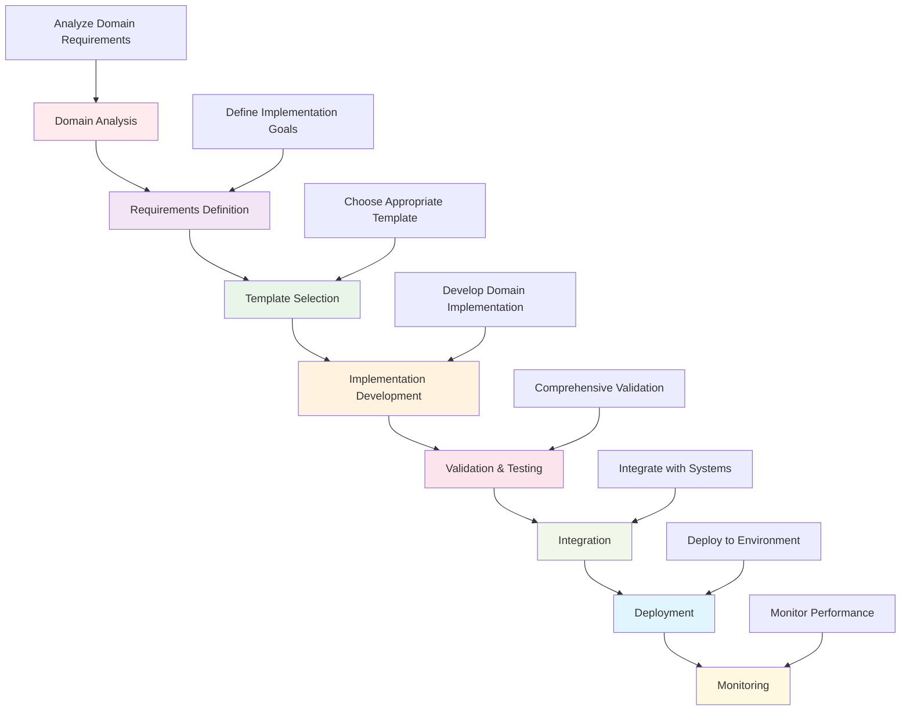

# Active Inference Applications - Domain Implementations

This directory contains comprehensive implementations and applications of Active Inference across various domains. It provides concrete examples, case studies, and domain-specific implementations that demonstrate how Active Inference principles are applied in real-world contexts and research areas.

## Overview

The applications domains section showcases Active Inference implementations across diverse fields, from artificial intelligence and robotics to neuroscience, psychology, and climate science. Each domain provides specific implementations, case studies, and practical applications that illustrate the versatility and power of Active Inference frameworks.

### Mission & Role

This applications section contributes to the platform mission by:

- **Practical Implementation**: Demonstrating concrete applications of Active Inference theory
- **Domain Expertise**: Providing domain-specific implementations and best practices
- **Research Validation**: Offering validated implementations for research and development
- **Educational Examples**: Supplying practical examples for learning and teaching
- **Industry Application**: Supporting real-world deployment and industry adoption

## Architecture

### Applications Domain Structure

```
knowledge/applications/domains/
├── artificial_intelligence/    # AI and machine learning applications
├── robotics/                  # Robotics and control systems
├── neuroscience/              # Neural and brain applications
├── psychology/                # Cognitive and behavioral applications
├── education/                 # Educational technology applications
├── engineering/               # Engineering and systems applications
├── climate_science/           # Environmental and climate applications
└── README.md                 # This file
```

### Integration Points

**Platform Integration:**
- **Implementation Framework**: Integration with core Active Inference implementations
- **Research Tools**: Connection with research validation and benchmarking
- **Knowledge Base**: Domain-specific educational content and theoretical foundations
- **Visualization**: Domain-specific visualization and analysis tools

**External Systems:**
- **Domain Libraries**: Specialized libraries for each application domain
- **Simulation Tools**: Domain-specific simulation and modeling frameworks
- **Data Sources**: Real-world datasets and domain-specific data repositories
- **Industry Tools**: Professional tools and software for each domain

## Domain Categories

### Artificial Intelligence
Active Inference applications in AI and machine learning:
- **Reinforcement Learning**: Active Inference approaches to RL problems
- **Computer Vision**: Visual perception and scene understanding
- **Natural Language Processing**: Language understanding and generation
- **Decision Making**: AI decision-making and planning systems
- **Machine Learning Integration**: Combining Active Inference with ML methods

### Robotics
Active Inference in robotics and autonomous systems:
- **Robot Control**: Motor control and movement planning
- **Sensorimotor Integration**: Sensory processing and motor coordination
- **Navigation**: Spatial navigation and path planning
- **Manipulation**: Object manipulation and interaction
- **Human-Robot Interaction**: Collaborative robotics and assistance

### Neuroscience
Neural implementations and brain-inspired computing:
- **Neural Networks**: Biologically plausible neural architectures
- **Predictive Coding**: Neural implementations of predictive processing
- **Brain-Computer Interfaces**: BCI applications using Active Inference
- **Cognitive Modeling**: Models of cognitive processes and brain function
- **Neural Data Analysis**: Analysis of neural recordings and brain data

### Psychology
Cognitive and behavioral applications:
- **Decision Making**: Models of human decision-making processes
- **Learning**: Active Inference models of human learning
- **Perception**: Models of perceptual processing and inference
- **Attention**: Attention mechanisms and cognitive control
- **Mental Health**: Applications to mental health and clinical psychology

### Education
Educational technology and learning systems:
- **Adaptive Learning**: Personalized learning systems using Active Inference
- **Educational Assessment**: Learning assessment and evaluation methods
- **Curriculum Design**: Active Inference informed curriculum development
- **Learning Analytics**: Analysis of learning processes and outcomes
- **Educational Technology**: EdTech tools and platforms

### Engineering
Engineering applications and control systems:
- **Control Systems**: Advanced control theory and applications
- **Signal Processing**: Signal processing using Active Inference
- **System Identification**: System modeling and parameter estimation
- **Fault Detection**: Anomaly detection and system monitoring
- **Optimization**: Engineering optimization using Active Inference

## Getting Started

### Prerequisites
- **Domain Knowledge**: Understanding of target application domain
- **Active Inference Theory**: Solid foundation in Active Inference concepts
- **Programming Skills**: Proficiency in relevant programming languages
- **Mathematical Background**: Mathematical tools for domain applications

### Basic Setup

```bash
# Install domain-specific dependencies
pip install numpy scipy matplotlib seaborn
pip install torch tensorflow  # For neural applications
pip install control  # For control systems
pip install scikit-learn  # For machine learning integration

# Domain-specific installations
pip install gym  # For reinforcement learning
pip install opencv-python  # For computer vision
pip install spacy transformers  # For NLP applications

# Set up domain environment
export DOMAIN="artificial_intelligence"  # or robotics, neuroscience, etc.
export IMPLEMENTATION_TYPE="practical"
export VALIDATION_LEVEL="comprehensive"
```

### Initial Domain Application

```python
# Basic domain application workflow
from active_inference.applications.domains import DomainManager
from active_inference.applications.templates import ImplementationTemplate

# Initialize domain manager
domain_manager = DomainManager(domain="artificial_intelligence")

# Select implementation template
template_config = {
    "domain": "artificial_intelligence",
    "application_type": "reinforcement_learning",
    "complexity": "intermediate",
    "validation": True
}

template = domain_manager.get_implementation_template(template_config)

# Customize for specific use case
customization = {
    "environment": "custom_environment",
    "reward_function": "information_seeking",
    "state_representation": "belief_based"
}

implementation = template.customize(customization)
```

## Usage Examples

### Example 1: AI Decision Making System

```python
# Implement Active Inference for AI decision making
from active_inference.applications.domains.artificial_intelligence import AIDecisionMaker

# Define decision-making scenario
scenario_config = {
    "decision_context": "resource_allocation",
    "uncertainty_level": "high",
    "time_horizon": 100,
    "objectives": ["maximize_information", "minimize_risk", "optimize_performance"]
}

# Initialize AI decision maker
decision_maker = AIDecisionMaker(scenario_config)

# Set up decision environment
environment_config = {
    "state_space": "continuous",
    "action_space": "discrete",
    "reward_structure": "multi_objective",
    "dynamics": "nonlinear"
}

decision_maker.setup_environment(environment_config)

# Train Active Inference model
training_config = {
    "inference_algorithm": "variational",
    "planning_horizon": 20,
    "learning_rate": 0.01,
    "epochs": 1000
}

model = decision_maker.train_model(training_config)

# Deploy for decision making
deployment_config = {
    "real_time": True,
    "adaptivity": True,
    "uncertainty_awareness": True
}

decision_system = decision_maker.deploy_model(model, deployment_config)
```

### Example 2: Robotics Control Implementation

```python
# Implement Active Inference for robot control
from active_inference.applications.domains.robotics import RobotController

# Define robotic system
robot_config = {
    "robot_type": "manipulator",
    "degrees_of_freedom": 6,
    "sensors": ["joint_angles", "end_effector_position", "force_feedback"],
    "actuators": ["joint_motors", "gripper"],
    "control_frequency": 100  # Hz
}

# Initialize robot controller
controller = RobotController(robot_config)

# Set up control objectives
control_objectives = {
    "primary": "reach_target",
    "secondary": "minimize_energy",
    "constraints": ["joint_limits", "obstacle_avoidance", "force_limits"]
}

controller.set_objectives(control_objectives)

# Implement Active Inference control
aif_config = {
    "belief_model": "hierarchical",
    "policy_selection": "expected_free_energy",
    "inference_precision": "adaptive",
    "planning_horizon": 50
}

control_system = controller.implement_active_inference_control(aif_config)

# Test and validate
validation_scenarios = [
    "simple_reaching",
    "obstacle_avoidance",
    "force_control",
    "multi_objective"
]

validation_results = controller.validate_control_system(validation_scenarios)
```

### Example 3: Neuroscience Model Implementation

```python
# Implement Active Inference in neural modeling
from active_inference.applications.domains.neuroscience import NeuralModeler

# Define neural system
neural_config = {
    "brain_region": "prefrontal_cortex",
    "cell_types": ["pyramidal", "interneurons"],
    "connectivity": "recurrent",
    "plasticity": "spike_timing_dependent",
    "scale": "mesoscopic"
}

# Initialize neural modeler
modeler = NeuralModeler(neural_config)

# Implement Active Inference neural dynamics
neural_dynamics_config = {
    "predictive_coding": True,
    "hierarchical_processing": True,
    "attention_mechanisms": True,
    "learning_rules": "bayesian"
}

neural_model = modeler.create_active_inference_model(neural_dynamics_config)

# Set up experimental validation
experimental_config = {
    "recording_modality": "electrophysiology",
    "stimulus_protocol": "odd_ball_paradigm",
    "analysis_methods": ["information_theory", "dynamical_systems"],
    "validation_criteria": "predictive_accuracy"
}

# Validate against neural data
validation_data = load_neural_recording_data("experiment_data.mat")
validation_results = modeler.validate_model(neural_model, validation_data, experimental_config)

# Generate implementation report
report = modeler.generate_implementation_report(neural_model, validation_results)
```

## Configuration

### Domain Application Configuration

```python
# Basic domain application configuration
domain_config = {
    "domain": {
        "name": "artificial_intelligence",
        "specialization": "reinforcement_learning",
        "complexity_level": "intermediate",
        "validation_standard": "research_grade"
    },
    "implementation": {
        "framework": "active_inference",
        "algorithm": "variational_inference",
        "numerical_method": "gradient_descent",
        "precision": "double"
    },
    "validation": {
        "method": "cross_validation",
        "metrics": ["accuracy", "efficiency", "robustness"],
        "benchmark_comparison": True,
        "statistical_significance": 0.05
    },
    "deployment": {
        "platform": "production",
        "scalability": "enterprise",
        "monitoring": True,
        "maintenance": "automated"
    }
}
```

### Advanced Domain Configuration

```python
# Advanced domain-specific settings
advanced_config = {
    "performance": {
        "optimization_target": "real_time",
        "parallel_processing": True,
        "memory_efficiency": True,
        "energy_optimization": True
    },
    "integration": {
        "existing_systems": ["legacy_software", "industry_standards"],
        "api_compatibility": True,
        "data_format_support": ["csv", "json", "hdf5"],
        "real_time_sync": True
    },
    "quality": {
        "validation_level": "comprehensive",
        "testing_coverage": 95,
        "documentation_completeness": 100,
        "benchmark_performance": "state_of_art"
    },
    "domain_specific": {
        "industry_standards": True,
        "regulatory_compliance": True,
        "safety_certification": True,
        "ethical_considerations": True
    }
}
```

## API Reference

### Core Domain Classes

#### `DomainManager`
Central management system for domain applications.

```python
class DomainManager:
    """Manage domain-specific Active Inference applications"""

    def __init__(self, domain: str, config: Dict[str, Any]):
        """Initialize domain manager with domain and configuration"""

    def get_available_implementations(self, domain: str) -> List[str]:
        """Get available implementations for domain"""

    def get_implementation_template(self, template_config: Dict[str, Any]) -> ImplementationTemplate:
        """Get implementation template for domain application"""

    def validate_implementation(self, implementation: Any, validation_config: Dict[str, Any]) -> ValidationResult:
        """Validate implementation against domain standards"""

    def deploy_implementation(self, implementation: Any, deployment_config: Dict[str, Any]) -> DeploymentResult:
        """Deploy implementation to target environment"""

    def monitor_implementation(self, implementation_id: str) -> MonitoringReport:
        """Monitor deployed implementation performance"""
```

#### `ImplementationTemplate`
Template system for domain implementations.

```python
class ImplementationTemplate:
    """Template for domain-specific implementations"""

    def __init__(self, domain: str, template_type: str, config: Dict[str, Any]):
        """Initialize implementation template"""

    def customize(self, customization_config: Dict[str, Any]) -> CustomizedImplementation:
        """Customize template for specific use case"""

    def validate_customization(self, customization: Dict[str, Any]) -> ValidationResult:
        """Validate customization parameters"""

    def generate_implementation(self, customization: Dict[str, Any]) -> Implementation:
        """Generate complete implementation from template"""

    def add_domain_specific_features(self, implementation: Implementation, features: List[str]) -> Implementation:
        """Add domain-specific features to implementation"""

    def validate_domain_compliance(self, implementation: Implementation) -> ComplianceReport:
        """Validate implementation complies with domain standards"""
```

#### `DomainValidator`
Validation system for domain implementations.

```python
class DomainValidator:
    """Validate domain-specific implementations"""

    def __init__(self, domain: str, validation_config: Dict[str, Any]):
        """Initialize domain validator"""

    def validate_against_benchmarks(self, implementation: Any) -> BenchmarkResults:
        """Validate implementation against domain benchmarks"""

    def validate_domain_standards(self, implementation: Any) -> StandardsValidation:
        """Validate implementation against domain standards"""

    def validate_performance_requirements(self, implementation: Any) -> PerformanceValidation:
        """Validate implementation meets performance requirements"""

    def validate_safety_standards(self, implementation: Any) -> SafetyValidation:
        """Validate implementation meets safety standards"""

    def generate_validation_report(self, validation_results: List[Any]) -> ComprehensiveReport:
        """Generate comprehensive validation report"""
```

## Domain Implementation Workflows

### Standard Domain Implementation Pipeline



### Advanced Implementation Patterns

```python
# Multi-domain integration workflow
def implement_multi_domain_solution(domain_configs: List[Dict[str, Any]]) -> MultiDomainSolution:
    """Implement solution spanning multiple domains"""

    # Analyze domain interactions
    domain_interactions = analyze_domain_interactions(domain_configs)

    # Design integrated architecture
    integrated_architecture = design_integrated_architecture(domain_interactions)

    # Implement cross-domain components
    cross_domain_components = implement_cross_domain_components(integrated_architecture)

    # Validate domain interactions
    interaction_validation = validate_domain_interactions(cross_domain_components)

    # Optimize integrated system
    optimized_system = optimize_multi_domain_system(cross_domain_components, interaction_validation)

    # Deploy integrated solution
    deployment_result = deploy_multi_domain_solution(optimized_system)

    return MultiDomainSolution(
        architecture=integrated_architecture,
        components=cross_domain_components,
        validation=interaction_validation,
        optimization=optimized_system,
        deployment=deployment_result
    )

# Industry-standard implementation workflow
def implement_industry_standard_solution(domain: str, industry_config: Dict[str, Any]) -> IndustrySolution:
    """Implement industry-standard Active Inference solution"""

    # Load industry standards
    industry_standards = load_industry_standards(domain)

    # Validate compliance requirements
    compliance_validation = validate_compliance_requirements(industry_config, industry_standards)

    # Implement to industry standards
    industry_implementation = implement_to_standards(domain, industry_config, industry_standards)

    # Validate industry compliance
    compliance_results = validate_industry_compliance(industry_implementation, industry_standards)

    # Generate compliance documentation
    compliance_docs = generate_compliance_documentation(compliance_results)

    # Deploy with industry validation
    industry_deployment = deploy_industry_solution(industry_implementation, compliance_results)

    return IndustrySolution(
        implementation=industry_implementation,
        standards=industry_standards,
        compliance=compliance_results,
        documentation=compliance_docs,
        deployment=industry_deployment
    )
```

## Contributing

### Domain Implementation Standards

When contributing to domain implementations:

1. **Domain Expertise**: Ensure deep understanding of target domain
2. **Industry Standards**: Follow relevant industry standards and best practices
3. **Validation Rigor**: Provide comprehensive validation against domain benchmarks
4. **Practical Utility**: Focus on practically useful and deployable implementations
5. **Educational Value**: Include clear educational content and documentation

### Domain Implementation Contribution Process

1. **Domain Analysis**: Identify domain-specific implementation opportunities
2. **Requirements Engineering**: Define clear requirements and use cases
3. **Implementation Development**: Develop robust, validated implementations
4. **Domain Validation**: Validate against domain standards and benchmarks
5. **Documentation Creation**: Provide comprehensive documentation and examples
6. **Review Process**: Follow domain expert review and validation process

## Related Documentation

- **[Applications Framework](../../../applications/README.md)**: Overview of application systems
- **[Domain Templates](../../../applications/templates/README.md)**: Implementation templates
- **[Best Practices](../../../applications/best_practices/README.md)**: Development best practices
- **[Integration Guide](../../../applications/integrations/README.md)**: System integration methods
- **[Case Studies](../../../applications/case_studies/README.md)**: Real-world application examples

---

**Domain Applications Version**: 1.0.0 | **Last Updated**: October 2024 | **Development Status**: Active Development

*"Active Inference for, with, by Generative AI"* - Demonstrating the practical power of Active Inference through domain-specific implementations, real-world applications, and industry-standard solutions.