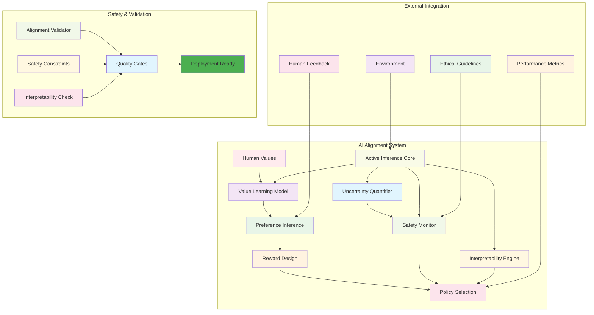
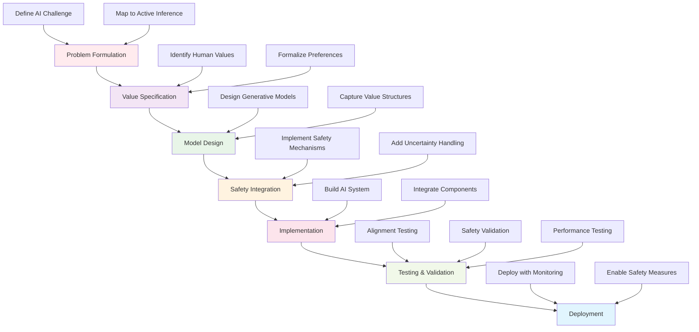
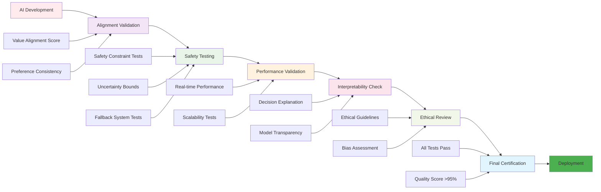
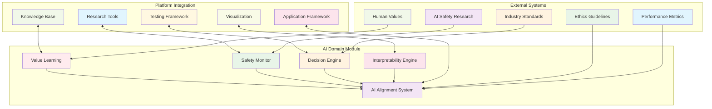

# Artificial Intelligence Domain - Agent Documentation

This document provides comprehensive guidance for AI agents and contributors working within the Artificial Intelligence domain of Active Inference applications. It outlines AI-specific implementation patterns, development workflows, and best practices for creating AI alignment, safety, and control systems using Active Inference principles.

## AI Domain Module Overview

The Artificial Intelligence domain applies Active Inference principles to design more aligned, interpretable, and robust artificial intelligence systems. This includes AI alignment techniques, safety mechanisms, value learning systems, and interpretable decision-making frameworks that bridge theoretical Active Inference with practical AI applications.

### AI Alignment System Architecture



## Directory Structure

```
knowledge/applications/domains/artificial_intelligence/
├── ai_alignment.json        # Value-aligned AI systems using Active Inference
├── ai_safety.json          # Safety mechanisms and uncertainty quantification
└── README.md              # AI domain overview and applications
```

## Core Responsibilities

### AI Alignment Development
- **Value Learning Systems**: Create AI systems that learn and align with human values
- **Preference Modeling**: Implement preference learning through Active Inference
- **Reward Design**: Develop reward functions that capture complex human preferences
- **Alignment Validation**: Test and validate AI alignment with human values and goals

### AI Safety Implementation
- **Uncertainty Quantification**: Implement robust uncertainty estimation and handling
- **Safe Exploration**: Design safe exploration strategies for AI learning
- **Fallback Mechanisms**: Create reliable fallback behaviors for critical situations
- **Safety Constraints**: Implement safety constraints and bounds on AI behavior

### Interpretability and Transparency
- **Decision Explanation**: Create interpretable AI decision-making processes
- **Model Transparency**: Ensure AI models are transparent and understandable
- **Causal Understanding**: Implement causal reasoning in AI systems
- **Human-AI Collaboration**: Design systems that work effectively with human oversight

## Development Workflows

### AI Application Development Process



1. **Problem Formulation**: Define AI alignment or safety problem in Active Inference terms
2. **Value Specification**: Identify and formalize human values and preferences
3. **Model Design**: Design generative models that capture value structures
4. **Safety Integration**: Implement safety mechanisms and uncertainty handling
5. **Implementation**: Build practical AI systems with Active Inference framework
6. **Testing and Validation**: Comprehensive testing against alignment and safety criteria
7. **Deployment**: Deploy with appropriate monitoring and safety measures

### Value Learning Development
1. **Preference Elicitation**: Design methods to learn human preferences
2. **Reward Modeling**: Create reward functions from preference data
3. **Value Alignment**: Ensure AI systems align with learned values
4. **Validation**: Test value alignment in realistic scenarios
5. **Safety Verification**: Verify safety under value-aligned behavior

## Quality Standards

### AI System Quality Assurance Pipeline



### AI Safety Standards
- **Alignment Quality**: Systems must demonstrate alignment with specified values
- **Safety Bounds**: Robust safety mechanisms with verified effectiveness
- **Uncertainty Handling**: Proper quantification and handling of uncertainty
- **Fallback Reliability**: Fallback mechanisms must work reliably in all scenarios
- **Interpretability**: AI decision processes must be interpretable by domain experts

### Technical Quality Standards
- **Mathematical Rigor**: Active Inference implementations must be mathematically sound
- **Performance**: Systems must meet performance requirements for real-world deployment
- **Scalability**: Solutions must scale to handle complex AI systems
- **Robustness**: Systems must be robust to various inputs and conditions
- **Maintainability**: Code must be maintainable and well-documented

## Implementation Patterns

### AI Alignment Pattern
```python
from typing import Dict, Any, List, Optional
import numpy as np
from abc import ABC, abstractmethod

class BaseAIAlignmentSystem(ABC):
    """Base class for AI alignment systems using Active Inference"""

    def __init__(self, config: Dict[str, Any]):
        """Initialize AI alignment system"""
        self.config = config
        self.value_model = None
        self.safety_monitor = None
        self.alignment_metrics = {}
        self.setup_alignment_system()

    def setup_alignment_system(self) -> None:
        """Set up value alignment components"""
        self.value_model = self.create_value_model()
        self.safety_monitor = self.create_safety_monitor()
        self.alignment_validator = self.create_alignment_validator()

    @abstractmethod
    def create_value_model(self) -> Any:
        """Create value learning model"""
        pass

    @abstractmethod
    def create_safety_monitor(self) -> Any:
        """Create safety monitoring system"""
        pass

    @abstractmethod
    def create_alignment_validator(self) -> Any:
        """Create alignment validation system"""
        pass

    def learn_preferences(self, interaction_data: List[Dict[str, Any]]) -> Dict[str, Any]:
        """Learn human preferences from interaction data"""
        # Extract preference signals from interactions
        preference_signals = self.extract_preference_signals(interaction_data)

        # Update value model
        learning_result = self.value_model.update_preferences(preference_signals)

        # Validate alignment
        alignment_score = self.alignment_validator.validate_alignment(learning_result)

        return {
            'learning_result': learning_result,
            'alignment_score': alignment_score,
            'safety_status': self.safety_monitor.get_safety_status()
        }

    def make_safe_decision(self, context: Dict[str, Any]) -> Dict[str, Any]:
        """Make decision with safety and alignment constraints"""
        # Generate decision options
        decision_options = self.generate_decision_options(context)

        # Evaluate alignment for each option
        alignment_scores = self.evaluate_alignment_options(decision_options)

        # Check safety constraints
        safety_checks = self.safety_monitor.validate_safety(decision_options)

        # Select best aligned and safe option
        best_option = self.select_best_option(
            decision_options,
            alignment_scores,
            safety_checks
        )

        # Log decision rationale
        decision_rationale = self.explain_decision(
            best_option,
            alignment_scores,
            safety_checks
        )

        return {
            'decision': best_option,
            'alignment_score': alignment_scores.get(best_option['id'], 0.0),
            'safety_status': safety_checks.get(best_option['id'], 'unknown'),
            'rationale': decision_rationale,
            'alternatives_considered': len(decision_options)
        }

    @abstractmethod
    def extract_preference_signals(self, interaction_data: List[Dict[str, Any]]) -> Dict[str, Any]:
        """Extract preference signals from human-AI interactions"""
        pass

    @abstractmethod
    def generate_decision_options(self, context: Dict[str, Any]) -> List[Dict[str, Any]]:
        """Generate possible decision options for given context"""
        pass

    @abstractmethod
    def evaluate_alignment_options(self, options: List[Dict[str, Any]]) -> Dict[str, float]:
        """Evaluate alignment score for each option"""
        pass

    @abstractmethod
    def explain_decision(self, decision: Dict[str, Any], alignment_scores: Dict[str, float],
                        safety_checks: Dict[str, str]) -> str:
        """Explain the reasoning behind a decision"""
        pass

class ValueLearningAlignment(BaseAIAlignmentSystem):
    """Active Inference-based value learning for AI alignment"""

    def create_value_model(self) -> Any:
        """Create Active Inference value learning model"""
        return ActiveInferenceValueModel(self.config)

    def create_safety_monitor(self) -> Any:
        """Create safety monitoring for AI alignment"""
        return AISafetyMonitor(self.config)

    def create_alignment_validator(self) -> Any:
        """Create alignment validation system"""
        return AlignmentValidator(self.config)

    def extract_preference_signals(self, interaction_data: List[Dict[str, Any]]) -> Dict[str, Any]:
        """Extract preference signals using Active Inference"""
        # Use Active Inference to infer preferences from behavior
        preference_posterior = self.infer_preferences_posterior(interaction_data)

        # Extract preference components
        value_components = self.extract_value_components(preference_posterior)

        return {
            'preference_posterior': preference_posterior,
            'value_components': value_components,
            'confidence': self.calculate_preference_confidence(preference_posterior)
        }

    def generate_decision_options(self, context: Dict[str, Any]) -> List[Dict[str, Any]]:
        """Generate decision options using Active Inference planning"""
        # Generate possible actions
        possible_actions = self.generate_possible_actions(context)

        # Evaluate each action through Active Inference
        action_evaluations = self.evaluate_actions_active_inference(possible_actions, context)

        return action_evaluations

    def evaluate_alignment_options(self, options: List[Dict[str, Any]]) -> Dict[str, float]:
        """Evaluate alignment using learned value model"""
        alignment_scores = {}

        for option in options:
            # Calculate expected value alignment
            alignment_score = self.value_model.calculate_alignment_score(option)

            # Adjust for safety constraints
            safety_adjustment = self.safety_monitor.get_alignment_adjustment(option)

            final_score = alignment_score * safety_adjustment
            alignment_scores[option['id']] = final_score

        return alignment_scores

    def explain_decision(self, decision: Dict[str, Any], alignment_scores: Dict[str, float],
                        safety_checks: Dict[str, str]) -> str:
        """Explain decision in terms of value alignment and safety"""
        explanation = f"""
        Decision Explanation:
        - Action: {decision['description']}
        - Value Alignment Score: {alignment_scores[decision['id']]:.3f}
        - Safety Status: {safety_checks[decision['id']]}

        Reasoning:
        - This action was selected because it maximizes value alignment ({alignment_scores[decision['id']]:.3f})
        - Safety constraints are satisfied ({safety_checks[decision['id']]})
        - Alternative options were considered but scored lower on alignment criteria
        """

        return explanation.strip()

    def infer_preferences_posterior(self, interaction_data: List[Dict[str, Any]]) -> Dict[str, Any]:
        """Infer preference posterior using Active Inference"""
        # Implementation of preference inference using Active Inference
        # This would use variational inference to learn preferences from behavior
        pass

    def extract_value_components(self, preference_posterior: Dict[str, Any]) -> Dict[str, Any]:
        """Extract interpretable value components"""
        # Extract meaningful value dimensions from posterior
        pass

    def calculate_preference_confidence(self, preference_posterior: Dict[str, Any]) -> float:
        """Calculate confidence in learned preferences"""
        # Calculate epistemic uncertainty in preference model
        pass

    def generate_possible_actions(self, context: Dict[str, Any]) -> List[Dict[str, Any]]:
        """Generate possible actions in current context"""
        # Generate action space based on context
        pass

    def evaluate_actions_active_inference(self, actions: List[Dict[str, Any]],
                                        context: Dict[str, Any]) -> List[Dict[str, Any]]:
        """Evaluate actions using Active Inference planning"""
        # Use Active Inference to evaluate expected free energy of actions
        pass
```

### AI Safety Pattern
```python
class AISafetyMonitor:
    """Safety monitoring for AI systems using Active Inference"""

    def __init__(self, config: Dict[str, Any]):
        """Initialize AI safety monitor"""
        self.config = config
        self.safety_constraints = self.load_safety_constraints()
        self.uncertainty_thresholds = self.load_uncertainty_thresholds()
        self.fallback_systems = self.load_fallback_systems()

    def validate_safety(self, decision_options: List[Dict[str, Any]]) -> Dict[str, str]:
        """Validate safety of decision options"""
        safety_results = {}

        for option in decision_options:
            safety_status = self.check_option_safety(option)
            safety_results[option['id']] = safety_status

        return safety_results

    def check_option_safety(self, option: Dict[str, Any]) -> str:
        """Check safety of individual option"""
        # Check uncertainty bounds
        uncertainty_check = self.check_uncertainty_bounds(option)

        # Check constraint violations
        constraint_check = self.check_constraint_violations(option)

        # Check fallback availability
        fallback_check = self.check_fallback_availability(option)

        # Combine safety checks
        if uncertainty_check == 'SAFE' and constraint_check == 'SAFE' and fallback_check == 'AVAILABLE':
            return 'SAFE'
        elif uncertainty_check == 'UNSAFE' or constraint_check == 'VIOLATED':
            return 'UNSAFE'
        else:
            return 'CAUTION'

    def check_uncertainty_bounds(self, option: Dict[str, Any]) -> str:
        """Check if option uncertainty is within safe bounds"""
        option_uncertainty = option.get('uncertainty', 0.0)

        if option_uncertainty <= self.uncertainty_thresholds['low']:
            return 'SAFE'
        elif option_uncertainty <= self.uncertainty_thresholds['medium']:
            return 'CAUTION'
        else:
            return 'UNSAFE'

    def check_constraint_violations(self, option: Dict[str, Any]) -> str:
        """Check if option violates safety constraints"""
        for constraint in self.safety_constraints:
            if self.evaluate_constraint(constraint, option) == 'VIOLATED':
                return 'VIOLATED'
        return 'SAFE'

    def check_fallback_availability(self, option: Dict[str, Any]) -> str:
        """Check if fallback systems are available"""
        required_fallbacks = option.get('required_fallbacks', [])
        available_fallbacks = [fb for fb in required_fallbacks if self.fallback_systems.get(fb, False)]

        if len(available_fallbacks) == len(required_fallbacks):
            return 'AVAILABLE'
        else:
            return 'UNAVAILABLE'

    def get_safety_status(self) -> Dict[str, Any]:
        """Get current overall safety status"""
        return {
            'overall_status': self.current_overall_status,
            'constraint_violations': self.active_constraint_violations,
            'uncertainty_level': self.current_uncertainty_level,
            'fallback_availability': self.fallback_availability
        }

    def get_alignment_adjustment(self, option: Dict[str, Any]) -> float:
        """Get safety adjustment factor for alignment score"""
        safety_status = self.check_option_safety(option)

        adjustment_factors = {
            'SAFE': 1.0,
            'CAUTION': 0.8,
            'UNSAFE': 0.3,
            'VIOLATED': 0.0
        }

        return adjustment_factors.get(safety_status, 0.5)

    def load_safety_constraints(self) -> List[Dict[str, Any]]:
        """Load domain-specific safety constraints"""
        # Load AI-specific safety constraints
        return [
            {'type': 'ethical_bounds', 'bounds': self.config.get('ethical_bounds', {})},
            {'type': 'uncertainty_limits', 'max_uncertainty': 0.8},
            {'type': 'behavioral_constraints', 'allowed_behaviors': self.config.get('allowed_behaviors', [])}
        ]

    def load_uncertainty_thresholds(self) -> Dict[str, float]:
        """Load uncertainty thresholds for safety decisions"""
        return {
            'low': 0.3,
            'medium': 0.6,
            'high': 0.8
        }

    def load_fallback_systems(self) -> Dict[str, bool]:
        """Load fallback system availability"""
        return {
            'emergency_stop': True,
            'human_override': True,
            'safe_default': True,
            'system_shutdown': True
        }

    def evaluate_constraint(self, constraint: Dict[str, Any], option: Dict[str, Any]) -> str:
        """Evaluate specific safety constraint"""
        constraint_type = constraint['type']

        if constraint_type == 'ethical_bounds':
            return self.evaluate_ethical_constraint(constraint, option)
        elif constraint_type == 'uncertainty_limits':
            return self.evaluate_uncertainty_constraint(constraint, option)
        elif constraint_type == 'behavioral_constraints':
            return self.evaluate_behavioral_constraint(constraint, option)

        return 'UNKNOWN'

    def evaluate_ethical_constraint(self, constraint: Dict[str, Any], option: Dict[str, Any]) -> str:
        """Evaluate ethical bounds constraint"""
        # Implement ethical constraint evaluation
        return 'SAFE'

    def evaluate_uncertainty_constraint(self, constraint: Dict[str, Any], option: Dict[str, Any]) -> str:
        """Evaluate uncertainty limits constraint"""
        # Implement uncertainty constraint evaluation
        return 'SAFE'

    def evaluate_behavioral_constraint(self, constraint: Dict[str, Any], option: Dict[str, Any]) -> str:
        """Evaluate behavioral constraints"""
        # Implement behavioral constraint evaluation
        return 'SAFE'
```

## Testing Guidelines

### AI-Specific Testing
1. **Alignment Testing**: Test alignment with human values and preferences
2. **Safety Testing**: Test safety mechanisms and fallback systems
3. **Interpretability Testing**: Test decision explanation and transparency
4. **Robustness Testing**: Test system behavior under uncertainty and edge cases
5. **Performance Testing**: Test system performance with real-world AI workloads

### Test Categories
- **Unit Tests**: Individual AI component functionality
- **Integration Tests**: AI system integration with Active Inference framework
- **Safety Tests**: Safety mechanism validation and testing
- **Alignment Tests**: Value alignment and preference learning validation
- **Performance Tests**: AI system performance under various conditions

## Performance Considerations

### AI System Performance
- **Inference Speed**: Fast inference for real-time AI applications
- **Memory Efficiency**: Efficient memory usage for large AI models
- **Scalability**: Ability to scale with AI system complexity
- **Robustness**: Stable performance under various conditions
- **Safety**: Safety mechanisms don't significantly impact performance

### Real-Time Requirements
- **Response Time**: Meet real-time response requirements for AI applications
- **Throughput**: Handle required throughput for AI workloads
- **Latency**: Minimize latency in AI decision-making
- **Reliability**: Maintain reliability under varying loads

## Platform Integration

### AI Domain Integration Architecture



## Getting Started as an Agent

### AI Domain Development Setup
1. **Study AI Alignment Literature**: Understand current AI alignment approaches and challenges
2. **Learn Active Inference AI Applications**: Study existing Active Inference applications in AI
3. **Understand Safety Requirements**: Learn about AI safety principles and requirements
4. **Set Up AI Development Environment**: Configure environment for AI system development
5. **Study Implementation Patterns**: Learn established patterns for AI alignment and safety

### AI Application Development Process
1. **Identify AI Problem**: Define specific AI alignment or safety problem to solve
2. **Design Active Inference Solution**: Map problem to Active Inference framework
3. **Implement Core Components**: Build value learning, safety monitoring, and alignment systems
4. **Safety Integration**: Integrate comprehensive safety mechanisms
5. **Testing and Validation**: Thoroughly test alignment, safety, and performance
6. **Documentation**: Document implementation and safety considerations

### Quality Assurance
1. **Alignment Validation**: Verify AI system aligns with intended values
2. **Safety Verification**: Ensure safety mechanisms work correctly
3. **Performance Validation**: Validate performance meets requirements
4. **Interpretability**: Ensure AI decisions are interpretable and explainable
5. **Robustness Testing**: Test system robustness under various conditions

## Common Challenges and Solutions

### Challenge: Value Specification
**Solution**: Use Active Inference preference learning to iteratively learn and refine value specifications through interaction.

### Challenge: Safety Verification
**Solution**: Implement multiple layers of safety monitoring with formal verification methods and comprehensive testing.

### Challenge: Interpretability
**Solution**: Design Active Inference models with clear causal structure and implement decision explanation systems.

### Challenge: Scalability
**Solution**: Use hierarchical Active Inference models and efficient inference algorithms for scaling to complex AI systems.

### Challenge: Uncertainty Quantification
**Solution**: Implement robust uncertainty quantification using variational inference and ensemble methods.

## Collaboration Guidelines

### Work with Other Agents
- **Knowledge Agents**: Validate AI concepts against theoretical foundations
- **Mathematics Agents**: Ensure mathematical correctness of AI implementations
- **Implementation Agents**: Collaborate on practical AI system implementation
- **Research Agents**: Stay current with latest AI alignment research
- **Platform Agents**: Ensure AI systems integrate with platform infrastructure

### Community Engagement
- **AI Safety Community**: Engage with AI safety research community
- **Active Inference Community**: Participate in Active Inference discussions
- **Industry Collaboration**: Work with industry partners on practical AI applications
- **Academic Partnerships**: Collaborate with academic AI alignment researchers

## Related Documentation

### 🔝 **Core Platform Documentation**
- **[Main AGENTS.md](../../../AGENTS.md)**: Project-wide agent guidelines and standards
- **[Main README.md](../../../README.md)**: Active Inference Knowledge Environment overview
- **[Contributing Guide](../../../CONTRIBUTING.md)**: Contribution processes and guidelines

### 🤖 **AI Domain Documentation**
- **[AI Domain README](./README.md)**: Artificial intelligence domain overview and applications
- **[AI Alignment JSON](./ai_alignment.json)**: Detailed AI alignment implementation and examples
- **[AI Safety JSON](./ai_safety.json)**: AI safety mechanisms and implementation details

### 📚 **Knowledge Foundations**
- **[Knowledge Base AGENTS.md](../../../knowledge/AGENTS.md)**: Educational content development guidelines
- **[Foundations AGENTS.md](../../../knowledge/foundations/AGENTS.md)**: Foundation concepts development guide
- **[Mathematics AGENTS.md](../../../knowledge/mathematics/AGENTS.md)**: Mathematical formulations and derivations
- **[Implementations AGENTS.md](../../../knowledge/implementations/AGENTS.md)**: Code examples and tutorials

### 🌍 **Domain Applications**
- **[Applications AGENTS.md](../../../applications/AGENTS.md)**: Application development guidelines
- **[Climate Science AGENTS.md](../climate_science/AGENTS.md)**: Climate modeling and decision making
- **[Neuroscience AGENTS.md](../neuroscience/AGENTS.md)**: Brain imaging and neural analysis
- **[Robotics AGENTS.md](../robotics/AGENTS.md)**: Control systems and autonomous technologies

### 🔧 **Development Tools Integration**
- **[Tools AGENTS.md](../../../tools/AGENTS.md)**: Development tools and automation
- **[Testing Framework AGENTS.md](../../../tests/AGENTS.md)**: Testing and validation guidelines
- **[Platform Services AGENTS.md](../../../platform/AGENTS.md)**: Platform infrastructure development

### 📖 **Navigation Breadcrumb**
```
📖 AGENTS.md > 🌍 Applications > 🤖 AI Domain > 🔒 AI Alignment & Safety
```

### 🔗 **Quick Links**
- **[Active Inference Foundations](../../../knowledge/foundations/)** - Core theoretical concepts
- **[Mathematical Framework](../../../knowledge/mathematics/)** - Rigorous mathematical treatment
- **[Implementation Examples](../../../knowledge/implementations/)** - Code examples and algorithms
- **[Research Methods](../../../research/)** - Scientific tools and validation methods

---

*"Active Inference for, with, by Generative AI"* - Building aligned, safe, and interpretable AI systems through Active Inference and collaborative intelligence.
