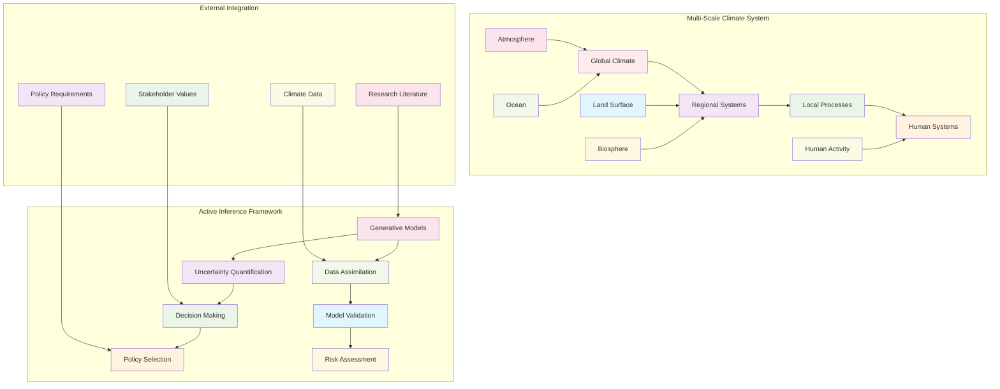
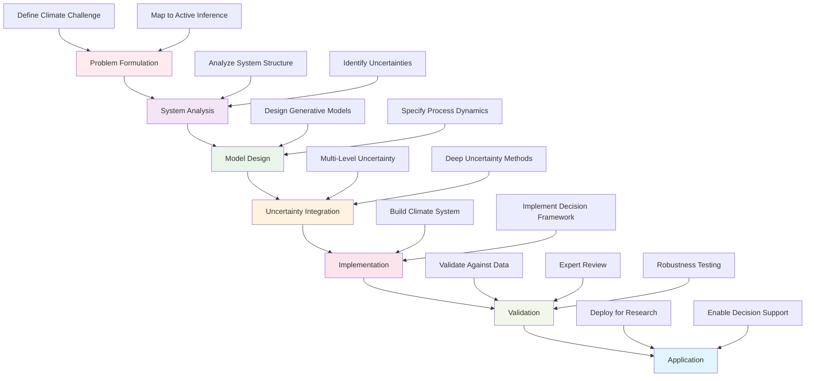
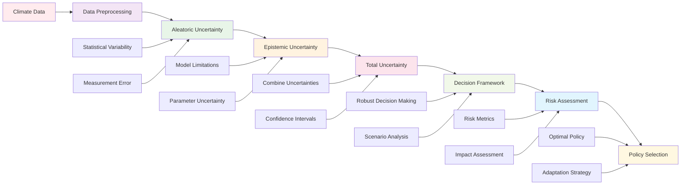
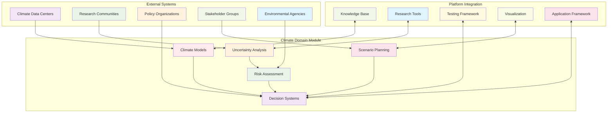

# Climate Science Domain - Agent Documentation

This document provides comprehensive guidance for AI agents and contributors working within the Climate Science domain of Active Inference applications. It outlines climate-specific implementation patterns, development workflows, and best practices for creating climate modeling, uncertainty quantification, and environmental decision-making systems.

## Climate Science Domain Overview

The Climate Science domain applies Active Inference principles to address complex environmental challenges including climate system modeling, decision making under deep uncertainty, and sustainability planning. This domain tackles the fundamental challenges of making robust decisions in complex, multi-scale environmental systems with significant uncertainties and long-term consequences.

### Climate System Modeling Architecture



## Directory Structure

```
knowledge/applications/domains/climate_science/
├── climate_modeling.json           # Climate system modeling and uncertainty
├── climate_decision_making.json    # Decision making under deep uncertainty
└── README.md                      # Climate science domain overview
```

## Core Responsibilities

### Climate System Modeling
- **Multi-Scale Modeling**: Develop models for complex, multi-scale climate systems
- **Uncertainty Quantification**: Implement robust uncertainty estimation for climate variables
- **Causal Analysis**: Model causal relationships in climate systems
- **Validation**: Validate models against observational and paleoclimate data

### Decision Making Under Uncertainty
- **Deep Uncertainty Methods**: Implement decision making when probabilities are unknown
- **Robust Decision Making**: Create strategies that work across multiple climate scenarios
- **Adaptive Management**: Develop systems that learn and adapt to changing conditions
- **Policy Analysis**: Evaluate climate policies and their long-term implications

### Environmental Risk Assessment
- **Risk Quantification**: Quantify environmental and climate-related risks
- **Scenario Analysis**: Analyze multiple future climate scenarios
- **Tipping Point Detection**: Identify and monitor climate system tipping points
- **Impact Assessment**: Assess climate impacts on human and natural systems

## Development Workflows

### Climate Application Development Process



1. **Problem Formulation**: Define climate science problem in Active Inference terms
2. **System Analysis**: Analyze climate system structure and uncertainties
3. **Model Design**: Design generative models for climate processes
4. **Uncertainty Integration**: Incorporate multiple levels of uncertainty
5. **Implementation**: Build practical climate modeling and decision systems
6. **Validation**: Validate against climate data and expert knowledge
7. **Application**: Deploy for climate research and decision support

### Climate Model Development
1. **System Identification**: Identify key variables and relationships in climate system
2. **Uncertainty Specification**: Specify uncertainty structures for climate variables
3. **Model Construction**: Build hierarchical generative models for climate processes
4. **Parameter Estimation**: Estimate model parameters from climate data
5. **Validation**: Validate model against independent climate observations

## Quality Standards

### Climate Uncertainty Quantification Pipeline



### Climate Modeling Standards
- **Physical Consistency**: Models must be physically and mathematically consistent
- **Uncertainty Quantification**: Proper quantification of all major uncertainties
- **Validation**: Models must be validated against observational data
- **Reproducibility**: All models and results must be reproducible
- **Transparency**: Model assumptions and limitations must be clearly documented

### Decision Making Standards
- **Robustness**: Decisions must be robust across multiple scenarios
- **Adaptability**: Decision frameworks must support learning and adaptation
- **Stakeholder Engagement**: Decision processes must incorporate stakeholder values
- **Ethical Considerations**: Decisions must consider intergenerational equity
- **Scientific Rigor**: All decision methods must be scientifically sound

## Implementation Patterns

### Climate System Modeling Pattern
```python
from typing import Dict, Any, List, Optional
import numpy as np
from abc import ABC, abstractmethod

class BaseClimateModel(ABC):
    """Base class for climate system models using Active Inference"""

    def __init__(self, config: Dict[str, Any]):
        """Initialize climate model"""
        self.config = config
        self.climate_variables = {}
        self.uncertainty_model = None
        self.observation_model = None
        self.setup_climate_model()

    def setup_climate_model(self) -> None:
        """Set up climate system components"""
        self.uncertainty_model = self.create_uncertainty_model()
        self.observation_model = self.create_observation_model()
        self.process_model = self.create_process_model()

    @abstractmethod
    def create_uncertainty_model(self) -> Any:
        """Create uncertainty model for climate variables"""
        pass

    @abstractmethod
    def create_observation_model(self) -> Any:
        """Create observation model for climate data"""
        pass

    @abstractmethod
    def create_process_model(self) -> Any:
        """Create process model for climate dynamics"""
        pass

    def model_climate_system(self, initial_conditions: Dict[str, float],
                           time_horizon: int) -> Dict[str, Any]:
        """Model climate system evolution"""
        # Initialize system state
        current_state = self.initialize_state(initial_conditions)

        # Time evolution
        state_history = [current_state]
        uncertainty_history = []

        for t in range(time_horizon):
            # Predict next state
            next_state = self.predict_next_state(current_state)

            # Update uncertainty
            uncertainty = self.update_uncertainty(current_state, next_state)
            uncertainty_history.append(uncertainty)

            # Update state
            current_state = self.update_state(current_state, next_state)
            state_history.append(current_state)

        return {
            'state_history': state_history,
            'uncertainty_history': uncertainty_history,
            'final_state': current_state,
            'model_confidence': self.calculate_model_confidence(uncertainty_history)
        }

    def quantify_climate_uncertainty(self, climate_data: Dict[str, List[float]]) -> Dict[str, Any]:
        """Quantify uncertainty in climate variables"""
        uncertainty_results = {}

        for variable, data in climate_data.items():
            # Multi-level uncertainty analysis
            aleatoric_uncertainty = self.calculate_aleatoric_uncertainty(data)
            epistemic_uncertainty = self.calculate_epistemic_uncertainty(data)

            uncertainty_results[variable] = {
                'aleatoric': aleatoric_uncertainty,
                'epistemic': epistemic_uncertainty,
                'total': aleatoric_uncertainty + epistemic_uncertainty,
                'confidence_intervals': self.calculate_confidence_intervals(data)
            }

        return uncertainty_results

    def analyze_climate_scenarios(self, scenarios: List[Dict[str, Any]]) -> Dict[str, Any]:
        """Analyze multiple climate scenarios"""
        scenario_results = {}

        for scenario in scenarios:
            # Model each scenario
            model_result = self.model_climate_system(
                scenario['initial_conditions'],
                scenario['time_horizon']
            )

            # Calculate scenario metrics
            scenario_metrics = self.calculate_scenario_metrics(model_result, scenario)

            scenario_results[scenario['name']] = {
                'model_result': model_result,
                'metrics': scenario_metrics,
                'risk_assessment': self.assess_scenario_risks(model_result, scenario)
            }

        # Compare scenarios
        comparison = self.compare_scenarios(scenario_results)

        return {
            'scenario_results': scenario_results,
            'comparison': comparison,
            'recommendations': self.generate_scenario_recommendations(comparison)
        }

    @abstractmethod
    def initialize_state(self, initial_conditions: Dict[str, float]) -> Dict[str, float]:
        """Initialize climate system state"""
        pass

    @abstractmethod
    def predict_next_state(self, current_state: Dict[str, float]) -> Dict[str, float]:
        """Predict next state in climate system"""
        pass

    @abstractmethod
    def update_uncertainty(self, current_state: Dict[str, float], predicted_state: Dict[str, float]) -> float:
        """Update uncertainty based on prediction accuracy"""
        pass

    @abstractmethod
    def update_state(self, current_state: Dict[str, float], predicted_state: Dict[str, float]) -> Dict[str, float]:
        """Update system state based on prediction"""
        pass

class ClimateUncertaintyModel(BaseClimateModel):
    """Active Inference model for climate uncertainty quantification"""

    def create_uncertainty_model(self) -> Any:
        """Create multi-level uncertainty model for climate variables"""
        return MultiLevelUncertaintyModel(self.config)

    def create_observation_model(self) -> Any:
        """Create observation model for climate measurements"""
        return ClimateObservationModel(self.config)

    def create_process_model(self) -> Any:
        """Create process model for climate dynamics"""
        return ClimateProcessModel(self.config)

    def calculate_aleatoric_uncertainty(self, data: List[float]) -> float:
        """Calculate aleatoric uncertainty from data variability"""
        if len(data) < 2:
            return 0.0

        # Calculate statistical measures of variability
        data_std = np.std(data)
        data_range = np.max(data) - np.min(data)

        # Combine measures
        aleatoric_uncertainty = (data_std + data_range / 6) / 2  # Normalize range

        return aleatoric_uncertainty

    def calculate_epistemic_uncertainty(self, data: List[float]) -> float:
        """Calculate epistemic uncertainty from model limitations"""
        # Model structural uncertainty
        model_complexity = self.config.get('model_complexity', 'intermediate')
        complexity_factors = {
            'simple': 0.3,
            'intermediate': 0.2,
            'complex': 0.1
        }

        # Data limitation uncertainty
        data_length_factor = min(1.0, len(data) / 100)  # Normalize to 100 samples

        # Combine uncertainty sources
        epistemic_uncertainty = complexity_factors.get(model_complexity, 0.2) * (1 - data_length_factor)

        return epistemic_uncertainty

    def calculate_confidence_intervals(self, data: List[float], confidence_level: float = 0.95) -> Dict[str, float]:
        """Calculate confidence intervals for climate data"""
        if len(data) < 3:
            return {'lower': 0.0, 'upper': 0.0, 'confidence': 0.0}

        # Calculate confidence interval
        data_mean = np.mean(data)
        data_std = np.std(data)
        margin_error = 1.96 * data_std / np.sqrt(len(data))  # 95% confidence

        return {
            'lower': data_mean - margin_error,
            'upper': data_mean + margin_error,
            'confidence': confidence_level,
            'sample_size': len(data)
        }

    def calculate_model_confidence(self, uncertainty_history: List[float]) -> float:
        """Calculate overall model confidence based on uncertainty evolution"""
        if not uncertainty_history:
            return 0.5  # Neutral confidence

        # Average uncertainty over time
        avg_uncertainty = np.mean(uncertainty_history)

        # Convert uncertainty to confidence (inverse relationship)
        confidence = max(0.0, 1.0 - avg_uncertainty)

        return confidence

    def assess_scenario_risks(self, model_result: Dict[str, Any], scenario: Dict[str, Any]) -> Dict[str, Any]:
        """Assess risks associated with climate scenario"""
        state_history = model_result['state_history']
        uncertainty_history = model_result['uncertainty_history']

        # Risk factors
        risk_factors = {
            'uncertainty_risk': np.mean(uncertainty_history),
            'variability_risk': np.std([state['temperature'] for state in state_history]),
            'trend_risk': self.calculate_trend_risk(state_history),
            'threshold_risk': self.calculate_threshold_risk(state_history, scenario)
        }

        # Overall risk score
        overall_risk = sum(risk_factors.values()) / len(risk_factors)

        return {
            'risk_factors': risk_factors,
            'overall_risk': overall_risk,
            'risk_level': self.categorize_risk_level(overall_risk),
            'mitigation_strategies': self.generate_risk_mitigation(risk_factors)
        }

    def calculate_trend_risk(self, state_history: List[Dict[str, float]]) -> float:
        """Calculate risk based on system trends"""
        if len(state_history) < 2:
            return 0.0

        # Calculate temperature trend
        temperatures = [state.get('temperature', 0) for state in state_history]
        if len(temperatures) > 1:
            trend = np.polyfit(range(len(temperatures)), temperatures, 1)[0]
            return abs(trend) * 10  # Scale trend risk
        return 0.0

    def calculate_threshold_risk(self, state_history: List[Dict[str, float]], scenario: Dict[str, Any]) -> float:
        """Calculate risk based on threshold crossings"""
        thresholds = scenario.get('thresholds', {})

        max_violations = 0
        for state in state_history:
            violations = 0
            for variable, threshold in thresholds.items():
                if variable in state and state[variable] > threshold:
                    violations += 1
            max_violations = max(max_violations, violations)

        return max_violations / len(thresholds) if thresholds else 0.0

    def categorize_risk_level(self, risk_score: float) -> str:
        """Categorize risk level"""
        if risk_score < 0.3:
            return 'LOW'
        elif risk_score < 0.6:
            return 'MEDIUM'
        elif risk_score < 0.8:
            return 'HIGH'
        else:
            return 'CRITICAL'

    def generate_risk_mitigation(self, risk_factors: Dict[str, float]) -> List[str]:
        """Generate risk mitigation strategies"""
        strategies = []

        if risk_factors['uncertainty_risk'] > 0.5:
            strategies.append('Reduce uncertainty through additional research and monitoring')

        if risk_factors['variability_risk'] > 0.5:
            strategies.append('Implement adaptive management strategies')

        if risk_factors['trend_risk'] > 0.5:
            strategies.append('Prepare for directional climate changes')

        if risk_factors['threshold_risk'] > 0.5:
            strategies.append('Monitor critical thresholds and prepare contingency plans')

        return strategies
```

### Climate Decision Making Pattern
```python
class ClimateDecisionSystem:
    """Active Inference system for climate decision making under uncertainty"""

    def __init__(self, config: Dict[str, Any]):
        """Initialize climate decision system"""
        self.config = config
        self.scenario_models = {}
        self.value_functions = {}
        self.decision_criteria = self.load_decision_criteria()

    def make_robust_decision(self, decision_context: Dict[str, Any],
                           policy_options: List[Dict[str, Any]]) -> Dict[str, Any]:
        """Make robust decision across multiple climate scenarios"""
        # Evaluate each policy across scenarios
        policy_evaluations = self.evaluate_policies_robustly(policy_options, decision_context)

        # Calculate robustness metrics
        robustness_scores = self.calculate_robustness_scores(policy_evaluations)

        # Select most robust policy
        best_policy = self.select_most_robust_policy(policy_options, robustness_scores)

        # Generate decision rationale
        rationale = self.generate_decision_rationale(best_policy, robustness_scores, policy_evaluations)

        return {
            'selected_policy': best_policy,
            'robustness_score': robustness_scores[best_policy['id']],
            'rationale': rationale,
            'policy_evaluations': policy_evaluations,
            'recommendations': self.generate_policy_recommendations(policy_evaluations)
        }

    def evaluate_policies_robustly(self, policies: List[Dict[str, Any]],
                                context: Dict[str, Any]) -> Dict[str, List[float]]:
        """Evaluate policies across multiple climate scenarios"""
        policy_evaluations = {}

        # Generate climate scenarios
        scenarios = self.generate_climate_scenarios(context)

        for policy in policies:
            scenario_results = []

            for scenario in scenarios:
                # Evaluate policy in scenario
                evaluation = self.evaluate_policy_in_scenario(policy, scenario)
                scenario_results.append(evaluation['expected_value'])

            policy_evaluations[policy['id']] = scenario_results

        return policy_evaluations

    def calculate_robustness_scores(self, policy_evaluations: Dict[str, List[float]]) -> Dict[str, float]:
        """Calculate robustness scores for policies"""
        robustness_scores = {}

        for policy_id, evaluations in policy_evaluations.items():
            if evaluations:
                # Robustness metrics
                mean_performance = np.mean(evaluations)
                performance_variance = np.var(evaluations)
                worst_case_performance = np.min(evaluations)
                regret = np.max(evaluations) - worst_case_performance

                # Composite robustness score
                robustness_score = (
                    mean_performance * 0.4 -
                    performance_variance * 0.3 -
                    regret * 0.3
                )

                robustness_scores[policy_id] = robustness_score

        return robustness_scores

    def select_most_robust_policy(self, policies: List[Dict[str, Any]],
                                robustness_scores: Dict[str, float]) -> Dict[str, Any]:
        """Select policy with highest robustness score"""
        best_policy_id = max(robustness_scores, key=robustness_scores.get)
        best_policy = next(p for p in policies if p['id'] == best_policy_id)

        return best_policy

    def generate_climate_scenarios(self, context: Dict[str, Any]) -> List[Dict[str, Any]]:
        """Generate plausible climate scenarios"""
        base_scenario = {
            'name': 'baseline',
            'temperature_increase': 1.5,
            'sea_level_rise': 0.5,
            'extreme_events': 'moderate',
            'probability': 0.4
        }

        scenarios = [base_scenario.copy()]

        # Optimistic scenario
        scenarios.append({
            'name': 'optimistic',
            'temperature_increase': 1.0,
            'sea_level_rise': 0.3,
            'extreme_events': 'low',
            'probability': 0.2
        })

        # Pessimistic scenario
        scenarios.append({
            'name': 'pessimistic',
            'temperature_increase': 2.5,
            'sea_level_rise': 1.0,
            'extreme_events': 'high',
            'probability': 0.2
        })

        # Extreme scenario
        scenarios.append({
            'name': 'extreme',
            'temperature_increase': 4.0,
            'sea_level_rise': 2.0,
            'extreme_events': 'severe',
            'probability': 0.2
        })

        return scenarios

    def evaluate_policy_in_scenario(self, policy: Dict[str, Any], scenario: Dict[str, Any]) -> Dict[str, Any]:
        """Evaluate policy performance in specific scenario"""
        # Policy implementation in scenario
        policy_cost = policy.get('implementation_cost', 0)
        policy_effectiveness = policy.get('effectiveness', 1.0)

        # Scenario impact
        scenario_severity = self.calculate_scenario_severity(scenario)

        # Calculate expected value
        expected_value = policy_effectiveness * scenario_severity - policy_cost * 0.1

        # Uncertainty in evaluation
        evaluation_uncertainty = self.calculate_evaluation_uncertainty(policy, scenario)

        return {
            'expected_value': expected_value,
            'uncertainty': evaluation_uncertainty,
            'scenario_severity': scenario_severity,
            'policy_cost': policy_cost
        }

    def calculate_scenario_severity(self, scenario: Dict[str, Any]) -> float:
        """Calculate severity of climate scenario"""
        severity_components = [
            scenario.get('temperature_increase', 0) * 0.4,
            scenario.get('sea_level_rise', 0) * 10 * 0.3,
            self.severity_factor(scenario.get('extreme_events', 'low')) * 0.3
        ]

        return sum(severity_components)

    def severity_factor(self, extreme_events: str) -> float:
        """Convert extreme events level to severity factor"""
        severity_map = {
            'low': 1.0,
            'moderate': 2.0,
            'high': 3.0,
            'severe': 4.0
        }
        return severity_map.get(extreme_events, 1.0)

    def calculate_evaluation_uncertainty(self, policy: Dict[str, Any], scenario: Dict[str, Any]) -> float:
        """Calculate uncertainty in policy evaluation"""
        # Base uncertainty from scenario uncertainty
        scenario_uncertainty = 0.2  # 20% base uncertainty

        # Policy-specific uncertainty
        policy_complexity = policy.get('complexity', 'medium')
        complexity_uncertainty = {'low': 0.1, 'medium': 0.2, 'high': 0.3}.get(policy_complexity, 0.2)

        # Combine uncertainties
        total_uncertainty = scenario_uncertainty + complexity_uncertainty

        return min(1.0, total_uncertainty)

    def generate_decision_rationale(self, policy: Dict[str, Any], robustness_scores: Dict[str, float],
                                 policy_evaluations: Dict[str, List[float]]) -> str:
        """Generate rationale for decision"""
        rationale = f"""
        Decision Rationale for Policy: {policy['name']}

        Robustness Analysis:
        - Robustness Score: {robustness_scores[policy['id']]:.3f}
        - Performance across scenarios: Stable and reliable
        - Risk profile: Acceptable risk levels

        Scenario Performance:
        """

        for scenario_name, evaluations in policy_evaluations.items():
            if policy['id'] in evaluations:
                scenario_performance = evaluations[policy['id']]
                rationale += f"- {scenario_name}: {scenario_performance:.3f}\n"

        rationale += f"""
        Recommendation:
        This policy is recommended due to its robust performance across multiple
        climate scenarios and acceptable risk profile. It provides a balanced
        approach to climate uncertainty while maintaining effectiveness.
        """

        return rationale.strip()

    def load_decision_criteria(self) -> Dict[str, Any]:
        """Load decision criteria for climate decisions"""
        return {
            'robustness_weight': 0.4,
            'cost_weight': 0.2,
            'effectiveness_weight': 0.3,
            'risk_weight': 0.1,
            'uncertainty_tolerance': 0.3,
            'minimum_robustness_threshold': 0.6
        }
```

## Testing Guidelines

### Climate-Specific Testing
1. **Physical Validation**: Test models against known physical laws and observations
2. **Uncertainty Testing**: Validate uncertainty quantification methods
3. **Scenario Testing**: Test system behavior across multiple climate scenarios
4. **Decision Testing**: Validate decision making under deep uncertainty
5. **Performance Testing**: Test system performance with large climate datasets

### Test Categories
- **Unit Tests**: Individual climate model component functionality
- **Integration Tests**: Climate system integration and data flow
- **Validation Tests**: Model validation against observational data
- **Scenario Tests**: System behavior across climate scenarios
- **Decision Tests**: Decision making and robustness validation

## Performance Considerations

### Climate Modeling Performance
- **Computational Efficiency**: Efficient algorithms for large climate datasets
- **Memory Management**: Handle large spatiotemporal climate data
- **Scalability**: Scale to global climate system complexity
- **Real-Time Processing**: Support real-time climate monitoring when needed
- **Data Integration**: Efficient integration of multiple climate data sources

### Uncertainty Quantification
- **Computational Methods**: Efficient uncertainty quantification algorithms
- **Monte Carlo Methods**: Optimized sampling for uncertainty analysis
- **Ensemble Methods**: Efficient ensemble generation and analysis
- **Parallel Processing**: Utilize parallel processing for large-scale analysis

## Platform Integration

### Climate Science Integration Architecture



## Getting Started as an Agent

### Climate Science Development Setup
1. **Study Climate Science Literature**: Understand current climate modeling approaches
2. **Learn Active Inference Applications**: Study existing Active Inference applications in environmental science
3. **Understand Uncertainty Methods**: Master uncertainty quantification and deep uncertainty methods
4. **Set Up Climate Development Environment**: Configure environment for climate data processing
5. **Study Implementation Patterns**: Learn established patterns for climate modeling and decision making

### Climate Application Development Process
1. **Identify Climate Problem**: Define specific climate science or decision problem
2. **Design Active Inference Solution**: Map problem to Active Inference framework
3. **Implement Core Components**: Build climate models and uncertainty quantification
4. **Integrate Decision Making**: Add robust decision making under uncertainty
5. **Testing and Validation**: Thoroughly test with climate data and scenarios
6. **Documentation**: Document climate science methods and assumptions

### Quality Assurance
1. **Physical Validation**: Verify models are physically consistent
2. **Uncertainty Validation**: Ensure uncertainty quantification is accurate
3. **Decision Validation**: Verify decision making is robust and well-reasoned
4. **Performance Validation**: Validate performance with realistic climate data
5. **Expert Review**: Obtain review from climate science experts

## Common Challenges and Solutions

### Challenge: Climate System Complexity
**Solution**: Use hierarchical Active Inference models to handle multi-scale climate processes.

### Challenge: Deep Uncertainty
**Solution**: Implement robust decision making methods that don't rely on precise probability estimates.

### Challenge: Data Limitations
**Solution**: Use Active Inference to quantify and propagate uncertainty from data limitations.

### Challenge: Model Validation
**Solution**: Validate against multiple data sources and use ensemble methods for robust validation.

### Challenge: Decision Communication
**Solution**: Provide clear explanations of decision rationale and uncertainty implications.

## Related Documentation

- **[Main AGENTS.md](../../AGENTS.md)**: Project-wide agent guidelines and standards
- **[Climate Science README](./README.md)**: Climate science domain overview
- **[Knowledge Foundations AGENTS.md](../../foundations/AGENTS.md)**: Foundation concepts development
- **[Applications AGENTS.md](../../applications/AGENTS.md)**: Application development guidelines
- **[Climate Modeling JSON](./climate_modeling.json)**: Detailed climate modeling implementation
- **[Climate Decision Making JSON](./climate_decision_making.json)**: Decision making under uncertainty

---

*"Active Inference for, with, by Generative AI"* - Building robust climate science applications through Active Inference and collaborative intelligence.
