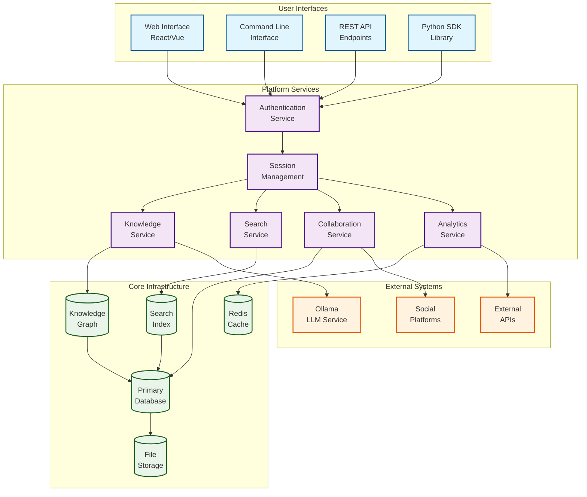
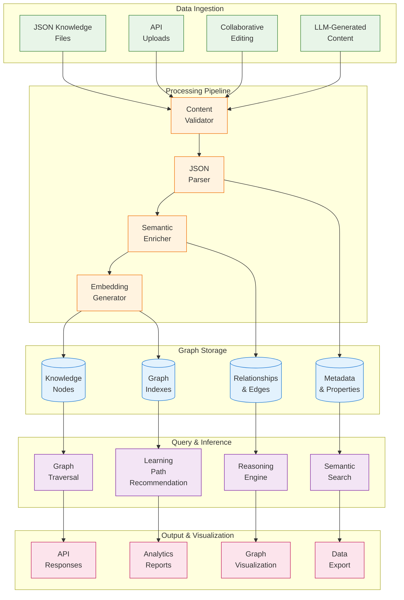
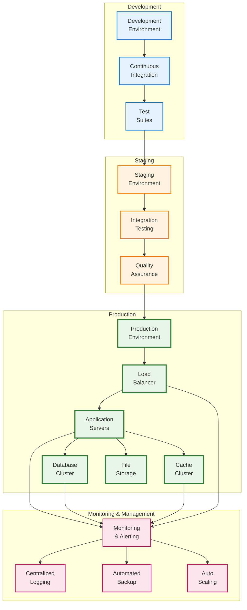

# Platform Infrastructure

This directory contains platform infrastructure components including web services, knowledge graph management, search capabilities, collaboration tools, and deployment infrastructure. The platform provides the foundation for the Active Inference Knowledge Environment's web presence and backend services.

## Overview

The Platform Infrastructure module provides a comprehensive backend infrastructure for the Active Inference Knowledge Environment, including REST APIs, web services, knowledge graph management, intelligent search, collaboration features, and deployment tools. All components are designed to be scalable, maintainable, and extensible.

## Directory Structure

```
platform/
├── serve.py              # Main platform server
├── knowledge_graph/      # Semantic knowledge representation
├── search/               # Intelligent search and retrieval
├── collaboration/        # Multi-user collaboration features
├── deployment/           # Deployment and scaling tools
└── infrastructure/       # Platform infrastructure components
```

## Platform Architecture Diagrams

### Platform Services Architecture


### Service Interaction Flow

```mermaid
flowchart TD
    subgraph "Request Processing"
        IN[Incoming<br/>Request]
        ROUTE[Route<br/>Request]
        AUTH[Authenticate<br/>& Authorize]
        VALIDATE[Validate<br/>Request]
    end

    subgraph "Service Processing"
        DISPATCH[Dispatch to<br/>Service]
        PROCESS[Process<br/>Request]
        QUERY_DB[Query<br/>Database]
        ENRICH[Enrich with<br/>LLM/Knowledge]
    end

    subgraph "Response Generation"
        FORMAT[Format<br/>Response]
        CACHE[Check<br/>Cache]
        GENERATE[Generate<br/>Response]
        LOG[Log<br/>Activity]
    end

    subgraph "External Integration"
        EXTERNAL_API[Call External<br/>APIs]
        WEBHOOK[Trigger<br/>Webhooks]
        NOTIFY[Send<br/>Notifications]
    end

    IN --> ROUTE
    ROUTE --> AUTH
    AUTH --> VALIDATE
    VALIDATE --> DISPATCH

    DISPATCH --> PROCESS
    PROCESS --> QUERY_DB
    QUERY_DB --> ENRICH
    ENRICH --> FORMAT

    FORMAT --> CACHE
    CACHE --> GENERATE
    GENERATE --> LOG

    LOG --> EXTERNAL_API
    EXTERNAL_API --> WEBHOOK
    WEBHOOK --> NOTIFY

    classDef processing fill:#e3f2fd,stroke:#1976d2
    classDef service fill:#fff3e0,stroke:#f57c00
    classDef response fill:#e8f5e8,stroke:#2e7d32
    classDef integration fill:#fce4ec,stroke:#c2185b

    class IN,ROUTE,AUTH,VALIDATE processing
    class DISPATCH,PROCESS,QUERY_DB,ENRICH service
    class FORMAT,CACHE,GENERATE,LOG response
    class EXTERNAL_API,WEBHOOK,NOTIFY integration
```


### Knowledge Graph Architecture


### Deployment Architecture


## 🔗 Platform Component Cross-References

### 🖥️ Platform Service Navigation
| Service Component | Implementation | API Endpoints | Configuration | Tests |
|-------------------|----------------|---------------|---------------|-------|
| **[Web Server](serve.py)** | [FastAPI App](serve.py) | [All Endpoints](serve.py#L50-L200) | [Server Config](serve.py#L10-L30) | [Server Tests](tests/integration/test_platform_server.py) |
| **[Knowledge Graph](knowledge_graph/)** | [Graph Engine](src/active_inference/platform/knowledge_graph.py) | [Graph API](knowledge_graph/) | [Graph Config](knowledge_graph/config.py) | [Graph Tests](tests/integration/test_knowledge_graph.py) |
| **[Search Engine](search/)** | [Search Service](src/active_inference/platform/search.py) | [Search API](search/) | [Index Config](search/config.py) | [Search Tests](tests/unit/test_search_engine.py) |
| **[Collaboration Hub](collaboration/)** | [Collaboration Service](src/active_inference/platform/collaboration.py) | [Collaboration API](collaboration/) | [User Config](collaboration/config.py) | [Collaboration Tests](tests/integration/test_collaboration.py) |

### 🔗 Inter-Service Dependencies
| Service | Depends On | Used By | External Integrations |
|---------|------------|---------|---------------------|
| **Knowledge Graph** | [Knowledge Repository](src/active_inference/knowledge/) | [Search Engine](search/), [Web Interface](serve.py) | [Ollama LLM](https://ollama.ai/) |
| **Search Engine** | [Knowledge Graph](knowledge_graph/), [Index Storage](search/index/) | [Web Interface](serve.py), [API Clients](src/active_inference/) | [Whoosh](https://whoosh.readthedocs.io/) |
| **Collaboration Hub** | [User Database](collaboration/users.db), [Session Store](collaboration/sessions/) | [Web Interface](serve.py), [Authentication](serve.py) | [Redis](https://redis.io/) |
| **Deployment System** | [Docker Images](deployment/docker/), [Config Files](deployment/config/) | [CI/CD Pipeline](.github/workflows/), [Production](deployment/production/) | [Docker](https://docker.com/), [Kubernetes](https://kubernetes.io/) |

### 📊 Data Flow Cross-References
| Data Type | Source | Processing | Storage | Access |
|-----------|--------|------------|---------|--------|
| **Knowledge Content** | [JSON Files](knowledge/foundations/) | [Content Parser](src/active_inference/knowledge/parser.py) | [Knowledge Graph](knowledge_graph/) | [REST API](serve.py), [Search](search/) |
| **User Sessions** | [Web Requests](serve.py) | [Auth Service](serve.py#L100-L150) | [Redis Cache](platform/cache/) | [Session Middleware](serve.py#L75-L95) |
| **Search Indexes** | [Knowledge Graph](knowledge_graph/) | [Indexing Pipeline](search/indexer.py) | [Whoosh Index](search/index/) | [Search API](search/search.py) |
| **Collaboration Data** | [User Actions](collaboration/) | [Event Processor](collaboration/processor.py) | [Database](collaboration/data/) | [Collaboration API](collaboration/api.py) |

### 🧪 Testing Cross-References
| Test Type | Component | Test Location | Configuration | CI Integration |
|-----------|-----------|---------------|---------------|----------------|
| **Unit Tests** | [Platform Services](src/active_inference/platform/) | [Unit Tests](tests/unit/test_platform_*.py) | [Test Config](tests/fixtures/platform_config.py) | [Unit Test Job](.github/workflows/unit-tests.yml) |
| **Integration Tests** | [Service Interactions](platform/) | [Integration Tests](tests/integration/test_platform_*.py) | [Integration Config](tests/fixtures/integration_config.py) | [Integration Job](.github/workflows/integration-tests.yml) |
| **Performance Tests** | [Platform Scalability](platform/) | [Performance Tests](tests/performance/test_platform_*.py) | [Load Config](tests/performance/load_config.py) | [Performance Job](.github/workflows/performance-tests.yml) |
| **Security Tests** | [Platform Security](platform/) | [Security Tests](tests/security/test_platform_*.py) | [Security Config](tests/security/security_config.py) | [Security Job](.github/workflows/security-tests.yml) |

### 📖 Documentation Cross-References
| Documentation Type | Location | Content Focus | Related Components |
|-------------------|----------|---------------|-------------------|
| **[Platform Architecture](docs/platform/architecture.md)** | [Platform Docs](docs/platform/) | System design, service interactions | [All Platform Services](src/active_inference/platform/) |
| **[API Reference](docs/api/platform.md)** | [API Docs](docs/api/) | REST API endpoints, parameters | [Web Server](serve.py), [Service APIs](platform/) |
| **[Deployment Guide](docs/platform/deployment.md)** | [Platform Docs](docs/platform/) | Production deployment, scaling | [Deployment Tools](deployment/), [Docker Config](deployment/docker/) |
| **[Security Guide](docs/platform/security.md)** | [Platform Docs](docs/platform/) | Authentication, authorization, data protection | [Auth Service](serve.py), [Security Tests](tests/security/) |

### 🔧 Development Tool Integration
| Tool | Purpose | Platform Integration | Configuration | Documentation |
|------|---------|---------------------|---------------|---------------|
| **[Black](https://black.readthedocs.io/)** | Code formatting | [Pre-commit hooks](.pre-commit-config.yaml) | [Format Config](pyproject.toml) | [Style Guide](docs/development/code_style.md) |
| **[MyPy](https://mypy.readthedocs.io/)** | Type checking | [CI Pipeline](.github/workflows/) | [Type Config](mypy.ini) | [Type Guide](docs/development/type_checking.md) |
| **[Pytest](https://pytest.org/)** | Testing framework | [Test Runner](tests/) | [Test Config](pytest.ini) | [Testing Guide](docs/development/testing.md) |
| **[Sphinx](https://sphinx-doc.org/)** | Documentation | [Docs Builder](docs/) | [Docs Config](docs/conf.py) | [Writing Docs](docs/development/documentation.md) |

## Core Components

### 🌐 Web Platform
- **REST API Server**: Comprehensive REST API for all platform services
- **Web Interface**: User-friendly web interface for the knowledge environment
- **Authentication**: User authentication and authorization system
- **Session Management**: User session and state management
- **API Documentation**: Auto-generated API documentation

### 🧠 Knowledge Graph
- **Semantic Representation**: Semantic knowledge graph implementation
- **Graph Operations**: Graph traversal and query operations
- **Knowledge Integration**: Integration with knowledge repository
- **Inference Engine**: Graph-based inference and reasoning
- **Visualization**: Knowledge graph visualization tools

### 🔍 Search System
- **Intelligent Search**: Semantic search across all content types
- **Indexing**: Automated content indexing and updates
- **Ranking**: Relevance ranking and result ordering
- **Filtering**: Advanced filtering and faceting
- **Suggestions**: Search suggestions and autocomplete

### 🤝 Collaboration Tools
- **User Management**: User account and profile management
- **Content Collaboration**: Collaborative content creation and editing
- **Version Control**: Content version control and history
- **Comments and Discussion**: Commenting and discussion features
- **Notifications**: Real-time notifications and updates

## Getting Started

### For Users
1. **Access Platform**: Navigate to the web platform interface
2. **Authentication**: Create account or log in if required
3. **Explore Content**: Browse knowledge repository and learning paths
4. **Search**: Use search functionality to find specific content
5. **Collaborate**: Engage with community features

### For Developers
1. **Platform Setup**: Set up platform development environment
2. **Service Development**: Develop new platform services
3. **API Integration**: Integrate with platform APIs
4. **Testing**: Test platform components thoroughly
5. **Deployment**: Deploy platform services

## Usage Examples

### Platform Server
```python
from active_inference.platform import PlatformServer

# Initialize platform server
server = PlatformServer(config={
    'host': '0.0.0.0',
    'port': 8000,
    'debug': True,
    'database_url': 'sqlite:///platform.db',
    'secret_key': 'your-secret-key'
})

# Add services
server.add_service('knowledge', KnowledgeService())
server.add_service('search', SearchService())
server.add_service('collaboration', CollaborationService())

# Start server
if __name__ == '__main__':
    server.run()
```

### Knowledge Graph Operations
```python
from active_inference.platform.knowledge_graph import KnowledgeGraph

# Initialize knowledge graph
kg = KnowledgeGraph(config={'database_url': 'sqlite:///knowledge_graph.db'})

# Add knowledge nodes
kg.add_node('active_inference', {
    'type': 'concept',
    'definition': 'A theoretical framework for understanding...',
    'related_concepts': ['free_energy_principle', 'bayesian_inference']
})

kg.add_node('free_energy_principle', {
    'type': 'theory',
    'definition': 'A theory that...',
    'mathematical_formulation': 'F = D_KL[q||p] + ...'
})

# Create relationships
kg.add_relationship('active_inference', 'based_on', 'free_energy_principle')
kg.add_relationship('free_energy_principle', 'mathematical_foundation', 'information_theory')

# Query knowledge graph
results = kg.query("MATCH (n:concept)-[:based_on]->(t:theory) RETURN n, t")
```

### Search Implementation
```python
from active_inference.platform.search import SearchEngine

# Initialize search engine
search_engine = SearchEngine(config={
    'index_path': './search_index',
    'content_sources': ['knowledge', 'research', 'applications'],
    'search_algorithms': ['semantic', 'keyword', 'fuzzy']
})

# Index content
search_engine.index_content('./knowledge')
search_engine.index_content('./research')
search_engine.index_content('./applications')

# Perform search
results = search_engine.search(
    query='active inference entropy',
    filters={'content_type': 'tutorial', 'difficulty': 'intermediate'},
    limit=10,
    ranking='relevance'
)

# Get search suggestions
suggestions = search_engine.get_suggestions('active infer')
```

## Platform Services

### Knowledge Service
- **Content Management**: CRUD operations for knowledge content
- **Learning Paths**: Learning path management and tracking
- **Content Search**: Full-text and semantic search
- **Content Export**: Export content in various formats
- **Content Validation**: Content validation and quality checks

### Search Service
- **Multi-Modal Search**: Text, semantic, and metadata search
- **Real-time Indexing**: Real-time content indexing
- **Search Analytics**: Search usage and performance analytics
- **Personalization**: Personalized search results
- **Advanced Filtering**: Complex filtering and faceting

### Collaboration Service
- **User Management**: User registration and profile management
- **Content Collaboration**: Collaborative editing and review
- **Discussion Forums**: Discussion and Q&A features
- **Notification System**: Real-time notifications
- **Activity Tracking**: User activity and engagement tracking

## Contributing

We welcome contributions to the platform infrastructure! See [CONTRIBUTING.md](../../CONTRIBUTING.md) for detailed guidelines.

### Contribution Types
- **New Services**: Implement new platform services
- **API Enhancements**: Enhance existing APIs
- **Performance Optimization**: Optimize platform performance
- **Security Improvements**: Enhance platform security
- **Scalability**: Improve platform scalability

### Quality Standards
- **Comprehensive Testing**: Extensive testing of all components
- **Performance**: Acceptable performance characteristics
- **Security**: Secure implementation following best practices
- **Documentation**: Complete API and usage documentation
- **Monitoring**: Platform monitoring and alerting

## Learning Resources

- **Platform Architecture**: Study platform architecture and design
- **API Documentation**: Learn platform APIs and services
- **Development Guide**: Platform development guidelines
- **Deployment Guide**: Platform deployment and scaling
- **Security Guide**: Platform security best practices

## Related Documentation

- **[Main README](../../README.md)**: Project overview and getting started
- **[Knowledge Repository](../../knowledge/)**: Educational content
- **[Research Tools](../../research/)**: Research methodologies
- **[Applications](../../applications/)**: Practical applications
- **[Visualization](../../visualization/)**: Visualization tools
- **[Contributing Guide](../../CONTRIBUTING.md)**: Contribution guidelines

## Platform Architecture

### Service Architecture
- **Microservices**: Modular service architecture
- **API Gateway**: Centralized API management
- **Service Discovery**: Dynamic service discovery
- **Load Balancing**: Load balancing and scaling
- **Monitoring**: Comprehensive monitoring and alerting

### Data Architecture
- **Knowledge Graph**: Semantic knowledge representation
- **Search Index**: Full-text and semantic search indexing
- **User Data**: User profiles and preferences
- **Content Storage**: Structured and unstructured content storage
- **Analytics**: Usage analytics and performance metrics

### Security Architecture
- **Authentication**: Multi-factor authentication
- **Authorization**: Role-based access control
- **Data Protection**: Data encryption and protection
- **Audit Logging**: Comprehensive audit logging
- **Compliance**: Compliance with security standards

---

*"Active Inference for, with, by Generative AI"* - Building robust platform infrastructure through scalable services, comprehensive APIs, and collaborative features.


