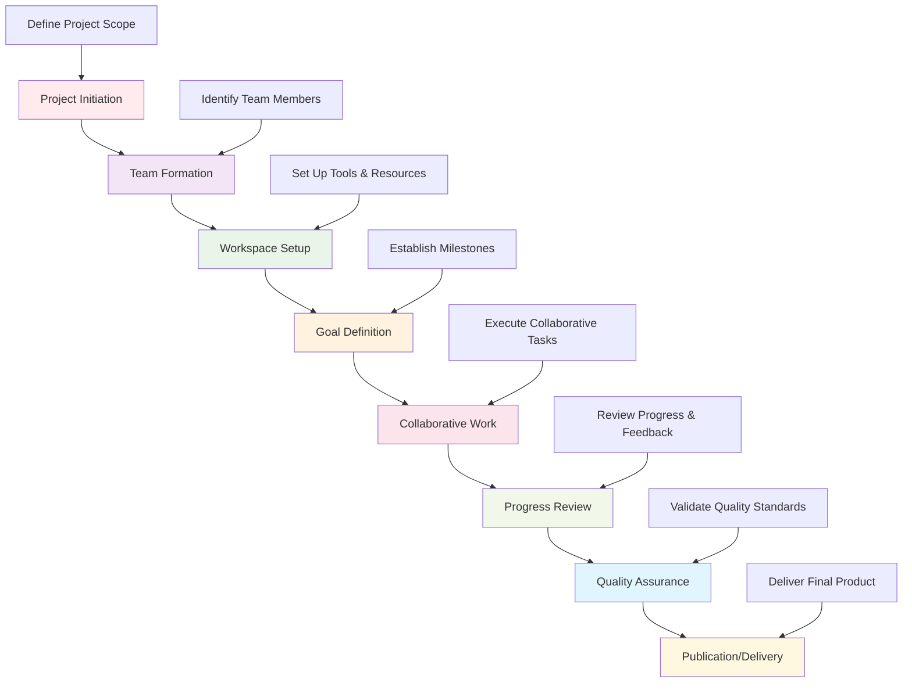

# Platform Collaboration Hub

This directory contains the collaboration and multi-user features for the Active Inference Knowledge Environment. It provides tools for community engagement, content collaboration, discussion forums, and collaborative research workflows.

## Overview

The platform collaboration hub enables researchers, educators, developers, and AI agents to work together effectively within the Active Inference ecosystem. It provides structured collaboration tools, discussion platforms, and community management features that support the platform's collaborative intelligence mission.

### Mission & Role

This collaboration system contributes to the platform mission by:

- **Community Building**: Fostering a vibrant community of Active Inference researchers and practitioners
- **Knowledge Sharing**: Enabling efficient sharing of research findings and educational content
- **Collaborative Research**: Supporting multi-institutional and interdisciplinary research projects
- **Educational Collaboration**: Enabling collaborative content creation and curriculum development
- **Platform Engagement**: Creating an engaging platform experience that encourages participation

## Architecture

### Collaboration System Structure

```
platform/collaboration/
├── forums/                   # Discussion forums and Q&A
├── workspaces/              # Collaborative workspaces and projects
├── reviews/                 # Peer review and content validation
├── notifications/           # Real-time notifications and alerts
├── permissions/             # Access control and permissions
└── README.md               # This file
```

### Integration Points

**Platform Integration:**
- **User Management**: Integration with authentication and user profile systems
- **Content Management**: Integration with knowledge base and content workflows
- **Search System**: Integration with platform search and discovery
- **Notification System**: Real-time updates and collaboration alerts

**External Systems:**
- **Communication Tools**: Email, Slack, Discord for external notifications
- **Version Control**: Git integration for collaborative content development
- **Project Management**: Integration with project management and issue tracking
- **Social Platforms**: Integration with academic social networks and communities

## Collaboration Categories

### Discussion Forums
Structured discussion and Q&A platforms:
- **Research Discussions**: Technical discussions about Active Inference research
- **Educational Q&A**: Questions and answers about learning content
- **Implementation Help**: Support for developers implementing Active Inference
- **General Community**: Open discussions about the platform and community

### Collaborative Workspaces
Shared workspaces for team collaboration:
- **Research Projects**: Collaborative research project workspaces
- **Content Development**: Team content creation and editing spaces
- **Educational Modules**: Collaborative curriculum development
- **Technical Projects**: Joint software development initiatives

### Peer Review System
Structured peer review and content validation:
- **Research Review**: Peer review of research contributions and papers
- **Content Review**: Review of educational content and documentation
- **Code Review**: Collaborative code review and quality assurance
- **Design Review**: Review of platform design and user experience

### Real-time Collaboration
Live collaboration features:
- **Live Editing**: Real-time collaborative editing of documents
- **Video Conferencing**: Integrated video meetings and discussions
- **Screen Sharing**: Collaborative debugging and development sessions
- **Whiteboarding**: Visual collaboration and brainstorming tools

## Getting Started

### Prerequisites
- **Collaboration Understanding**: Familiarity with collaborative work patterns
- **Community Guidelines**: Understanding of platform community standards
- **Technical Skills**: Basic understanding of collaborative tools and platforms
- **Communication Skills**: Effective written and verbal communication abilities

### Basic Setup

```bash
# Install collaboration dependencies
pip install flask-socketio python-socketio
pip install redis  # For real-time features
pip install celery  # For background tasks

# Set up collaboration environment
export COLLABORATION_ENV="development"
export REDIS_URL="redis://localhost:6379"
export WEBSOCKET_URL="ws://localhost:5000"
```

### Initial Collaboration Project

```python
# Basic collaboration workflow
from platform.collaboration import CollaborationManager
from platform.collaboration.workspaces import WorkspaceManager

# Initialize collaboration system
collab_manager = CollaborationManager(config)

# Create collaborative workspace
workspace_config = {
    "name": "Active Inference Research Project",
    "type": "research_collaboration",
    "members": ["researcher1", "researcher2", "educator1"],
    "goals": ["investigate_belief_dynamics", "develop_educational_content"]
}

workspace = collab_manager.create_workspace(workspace_config)

# Set up discussion forum
forum_config = {
    "workspace_id": workspace.id,
    "categories": ["research_questions", "methodology", "results", "publications"],
    "moderation_level": "community_guidelines"
}

forum = collab_manager.create_forum(forum_config)
```

## Usage Examples

### Example 1: Research Collaboration Workspace

```python
# Create collaborative research workspace
from platform.collaboration.workspaces import ResearchWorkspace

# Define research project
research_project = {
    "title": "Multi-scale Active Inference in Neural Systems",
    "description": "Investigate Active Inference at multiple scales in neural systems",
    "objectives": [
        "Analyze information flow across neural scales",
        "Develop multi-scale models of belief updating",
        "Validate models against neural data"
    ],
    "timeline": {
        "start_date": "2024-01-01",
        "milestones": [
            {"date": "2024-03-01", "description": "Literature review complete"},
            {"date": "2024-06-01", "description": "Initial model development"},
            {"date": "2024-09-01", "description": "Data analysis complete"},
            {"date": "2024-12-01", "description": "Paper submission"}
        ]
    }
}

# Initialize research workspace
workspace = ResearchWorkspace(research_project)

# Add team members
workspace.add_member("neuroscientist1", role="lead_researcher")
workspace.add_member("mathematician1", role="model_developer")
workspace.add_member("data_scientist1", role="data_analyst")

# Set up collaboration tools
workspace.create_document_repository()
workspace.create_data_sharing_system()
workspace.create_meeting_scheduler()

# Start collaborative work
workspace.open_for_collaboration()
```

### Example 2: Peer Review System

```python
# Implement peer review workflow
from platform.collaboration.reviews import PeerReviewSystem

# Set up review process
review_config = {
    "review_type": "research_paper",
    "review_stages": ["initial_screening", "technical_review", "educational_review", "final_decision"],
    "reviewer_assignment": "double_blind",
    "review_criteria": {
        "technical_accuracy": {"weight": 0.3, "required": True},
        "methodological_soundness": {"weight": 0.25, "required": True},
        "clarity": {"weight": 0.2, "required": True},
        "educational_value": {"weight": 0.15, "required": False},
        "originality": {"weight": 0.1, "required": False}
    },
    "timeline": {
        "submission_deadline": "2024-12-01",
        "review_deadline": "2024-12-15",
        "decision_date": "2024-12-20"
    }
}

# Initialize peer review system
review_system = PeerReviewSystem(review_config)

# Submit content for review
submission = {
    "title": "Active Inference in Decision Making Under Uncertainty",
    "authors": ["researcher1", "researcher2"],
    "content_type": "research_paper",
    "content": paper_content,
    "supplementary_materials": ["data", "code", "figures"]
}

review_id = review_system.submit_for_review(submission)

# Assign reviewers
reviewers = review_system.assign_reviewers(review_id, expertise_matching=True)
review_system.notify_reviewers(reviewers)

# Collect reviews
reviews = review_system.collect_reviews(review_id)
decision = review_system.make_decision(reviews)
```

### Example 3: Real-time Collaboration

```python
# Implement real-time collaborative features
from platform.collaboration.notifications import RealTimeManager

# Set up real-time collaboration
realtime_config = {
    "websocket_server": "ws://localhost:5000",
    "redis_channel": "collaboration_updates",
    "event_types": ["document_edit", "comment_added", "review_submitted", "member_joined"],
    "notification_preferences": {
        "email_notifications": True,
        "push_notifications": True,
        "in_app_notifications": True
    }
}

# Initialize real-time manager
realtime_manager = RealTimeManager(realtime_config)

# Create collaborative document
document_config = {
    "title": "Active Inference Tutorial",
    "content_type": "educational",
    "collaborators": ["educator1", "researcher1", "developer1"],
    "edit_permissions": "all_collaborators",
    "version_control": True
}

document = realtime_manager.create_collaborative_document(document_config)

# Enable real-time editing
realtime_manager.enable_live_editing(document.id)

# Set up notification system
realtime_manager.setup_collaboration_notifications(document.id)
```

## Configuration

### Collaboration Environment Configuration

```python
# Basic collaboration configuration
collaboration_config = {
    "system": {
        "environment": "development",  # development, staging, production
        "debug_mode": True,
        "logging_level": "INFO",
        "timezone": "UTC"
    },
    "workspace": {
        "max_members": 50,
        "max_workspaces_per_user": 10,
        "default_permissions": "read_write",
        "auto_backup": True,
        "version_retention_days": 90
    },
    "forum": {
        "max_posts_per_hour": 100,
        "max_post_length": 10000,
        "moderation_queue": True,
        "auto_thread_lock_days": 30,
        "search_enabled": True
    },
    "review": {
        "min_reviewers": 2,
        "max_reviewers": 5,
        "review_period_days": 14,
        "appeal_process": True,
        "double_blind_review": True
    }
}
```

### Advanced Collaboration Configuration

```python
# Advanced collaboration settings
advanced_config = {
    "real_time": {
        "websocket_heartbeat": 30,
        "reconnection_timeout": 10,
        "max_reconnect_attempts": 5,
        "conflict_resolution": "operational_transforms"
    },
    "permissions": {
        "role_based_access": True,
        "granular_permissions": True,
        "permission_inheritance": True,
        "audit_logging": True
    },
    "integration": {
        "git_integration": True,
        "ci_cd_integration": True,
        "external_tools": ["slack", "discord", "github"],
        "api_webhooks": True
    },
    "analytics": {
        "user_engagement_tracking": True,
        "collaboration_metrics": True,
        "content_quality_metrics": True,
        "community_health_monitoring": True
    }
}
```

## API Reference

### Core Collaboration Classes

#### `CollaborationManager`
Central management system for all collaboration features.

```python
class CollaborationManager:
    """Manage platform collaboration features"""

    def __init__(self, config: Dict[str, Any]):
        """Initialize collaboration manager with configuration"""

    def create_workspace(self, workspace_config: Dict[str, Any]) -> Workspace:
        """Create new collaborative workspace"""

    def create_forum(self, forum_config: Dict[str, Any]) -> Forum:
        """Create discussion forum for collaboration"""

    def setup_peer_review(self, review_config: Dict[str, Any]) -> PeerReviewSystem:
        """Set up peer review system"""

    def manage_notifications(self, notification_config: Dict[str, Any]) -> NotificationManager:
        """Manage real-time notifications and alerts"""

    def validate_collaboration(self, collaboration_id: str) -> ValidationReport:
        """Validate collaboration setup and functionality"""
```

#### `WorkspaceManager`
Management of collaborative workspaces and projects.

```python
class WorkspaceManager:
    """Manage collaborative workspaces and projects"""

    def __init__(self, config: Dict[str, Any]):
        """Initialize workspace manager with configuration"""

    def create_project_workspace(self, project_config: Dict[str, Any]) -> ProjectWorkspace:
        """Create workspace for collaborative project"""

    def add_workspace_member(self, workspace_id: str, user_id: str, role: str) -> bool:
        """Add member to workspace with specified role"""

    def manage_workspace_permissions(self, workspace_id: str, permissions: Dict[str, Any]) -> bool:
        """Manage workspace permissions and access control"""

    def archive_workspace(self, workspace_id: str, archive_config: Dict[str, Any]) -> bool:
        """Archive workspace with specified configuration"""

    def generate_workspace_report(self, workspace_id: str) -> WorkspaceReport:
        """Generate comprehensive workspace activity report"""
```

#### `PeerReviewManager`
Management of peer review processes and workflows.

```python
class PeerReviewManager:
    """Manage peer review processes and workflows"""

    def __init__(self, config: Dict[str, Any]):
        """Initialize peer review manager with configuration"""

    def submit_for_review(self, submission: Dict[str, Any], review_config: Dict[str, Any]) -> str:
        """Submit content for peer review"""

    def assign_reviewers(self, review_id: str, assignment_config: Dict[str, Any]) -> List[str]:
        """Assign reviewers based on expertise and availability"""

    def collect_reviews(self, review_id: str, collection_config: Dict[str, Any]) -> List[Review]:
        """Collect reviews from assigned reviewers"""

    def make_review_decision(self, review_id: str, decision_config: Dict[str, Any]) -> ReviewDecision:
        """Make review decision based on collected reviews"""

    def manage_review_appeals(self, appeal_config: Dict[str, Any]) -> AppealResult:
        """Manage review appeals and dispute resolution"""
```

## Collaboration Workflows

### Standard Collaboration Pipeline



### Advanced Collaboration Patterns

```python
# Multi-institutional collaboration workflow
def manage_multi_institutional_collaboration(project_config: Dict[str, Any]) -> CollaborationResult:
    """Manage collaboration across multiple institutions"""

    # Set up institutional workspaces
    institutional_workspaces = setup_institutional_workspaces(project_config)

    # Establish governance structure
    governance = establish_collaboration_governance(project_config)

    # Set up communication protocols
    communication_system = setup_cross_institutional_communication(institutional_workspaces)

    # Implement data sharing agreements
    data_sharing = implement_data_sharing_agreements(project_config)

    # Monitor collaboration health
    health_monitor = setup_collaboration_health_monitoring(governance, communication_system)

    # Generate collaboration reports
    report_generator = setup_collaboration_reporting(institutional_workspaces, health_monitor)

    return CollaborationResult(
        workspaces=institutional_workspaces,
        governance=governance,
        communication=communication_system,
        data_sharing=data_sharing,
        health_monitor=health_monitor,
        reporting=report_generator
    )

# Real-time collaborative development workflow
def manage_real_time_collaboration(document_id: str, collaborators: List[str]) -> RealTimeSession:
    """Manage real-time collaborative editing session"""

    # Initialize real-time session
    session = RealTimeSession(document_id, collaborators)

    # Set up operational transforms
    operational_transforms = setup_operational_transforms(session)

    # Implement conflict resolution
    conflict_resolution = implement_conflict_resolution(operational_transforms)

    # Set up user presence tracking
    presence_tracking = implement_user_presence_tracking(session)

    # Enable live notifications
    live_notifications = setup_live_notifications(session, presence_tracking)

    # Monitor session quality
    quality_monitor = setup_session_quality_monitoring(session)

    return RealTimeSession(
        session=session,
        operational_transforms=operational_transforms,
        conflict_resolution=conflict_resolution,
        presence_tracking=presence_tracking,
        notifications=live_notifications,
        quality_monitor=quality_monitor
    )
```

## Contributing

### Collaboration Documentation Standards

When contributing to collaboration documentation:

1. **Community Focus**: Ensure documentation supports community engagement and collaboration
2. **User Experience**: Provide clear guidance for collaborative workflows
3. **Technical Integration**: Document integration with platform systems
4. **Best Practices**: Include collaboration best practices and guidelines
5. **Accessibility**: Ensure collaboration tools are accessible to all users

### Collaboration Contribution Process

1. **Identify Collaboration Gap**: Find missing or inadequate collaboration features
2. **Design Collaboration Solution**: Create comprehensive collaboration design
3. **Implement Collaboration Tools**: Develop robust collaboration functionality
4. **Test User Experience**: Validate collaboration user experience and effectiveness
5. **Document Usage**: Provide complete documentation and examples
6. **Submit for Review**: Follow collaboration review and integration process

## Related Documentation

- **[Platform Services](../../../platform/README.md)**: Overview of platform infrastructure
- **[Search System](../../../platform/search/README.md)**: Search and discovery integration
- **[Knowledge Graph](../../../platform/knowledge_graph/README.md)**: Knowledge organization and navigation
- **[User Management](../../../platform/)**: User authentication and profile management
- **[Community Guidelines](../../../applications/best_practices/)**: Community standards and practices

---

**Platform Collaboration Hub Version**: 1.0.0 | **Last Updated**: October 2024 | **Development Status**: Active Development

*"Active Inference for, with, by Generative AI"* - Building collaborative intelligence through community engagement, shared knowledge, and cooperative research in the Active Inference ecosystem.