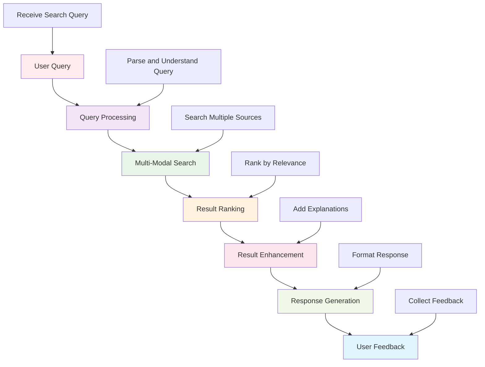

# Platform Search Engine

This directory contains the intelligent search and discovery system for the Active Inference Knowledge Environment. It provides advanced search capabilities, semantic understanding, and intelligent content discovery across all platform content including knowledge bases, research tools, applications, and documentation.

## Overview

The platform search engine delivers comprehensive search and discovery capabilities that help users find relevant Active Inference content, research, implementations, and educational materials. It combines traditional text search with semantic understanding, knowledge graph integration, and intelligent recommendation systems.

### Mission & Role

This search system contributes to the platform mission by:

- **Content Discovery**: Making all platform content easily discoverable and accessible
- **Knowledge Navigation**: Enabling intelligent navigation through complex knowledge structures
- **Research Acceleration**: Helping researchers quickly find relevant methods and implementations
- **Educational Support**: Guiding learners to appropriate educational content
- **Platform Usability**: Enhancing overall platform user experience through effective search

## Architecture

### Search System Structure

```
platform/search/
├── engine/                   # Core search engine implementation
├── indexing/                 # Content indexing and processing
├── semantic/                 # Semantic understanding and analysis
├── recommendations/          # Intelligent recommendation system
├── analytics/                # Search analytics and optimization
└── README.md                # This file
```

### Integration Points

**Platform Integration:**
- **Knowledge Graph**: Integration with semantic knowledge representation
- **Content Management**: Integration with all content creation and management systems
- **User Interface**: Search interface integration across all platform components
- **Analytics System**: Search behavior analytics and performance monitoring

**External Systems:**
- **Search Libraries**: Elasticsearch, Solr, Whoosh for full-text search capabilities
- **NLP Tools**: spaCy, NLTK, transformers for natural language processing
- **Vector Databases**: FAISS, Pinecone for semantic vector search
- **Machine Learning**: TensorFlow, PyTorch for recommendation systems

## Search Categories

### Full-Text Search
Traditional text-based search capabilities:
- **Keyword Search**: Search by keywords, phrases, and terms
- **Boolean Queries**: Complex queries with AND, OR, NOT operators
- **Field-Specific Search**: Search within specific content fields or metadata
- **Fuzzy Search**: Approximate matching for typos and variations

### Semantic Search
Understanding-based search capabilities:
- **Concept Search**: Search by concepts and ideas rather than exact terms
- **Contextual Understanding**: Understanding search context and intent
- **Related Content**: Finding semantically related content and concepts
- **Cross-Language Search**: Search across multiple languages and translations

### Knowledge Graph Search
Graph-based knowledge navigation:
- **Entity Search**: Search for specific concepts, methods, or implementations
- **Relationship Navigation**: Navigate between related concepts and methods
- **Path Discovery**: Find learning paths and concept progressions
- **Graph Queries**: Complex queries using graph relationships

### Intelligent Recommendations
AI-powered content recommendations:
- **Personalized Search**: Personalized results based on user behavior
- **Similar Content**: Finding similar research, implementations, or educational content
- **Trending Topics**: Surface trending and popular content
- **Learning Path Suggestions**: Recommend content based on learning objectives

## Getting Started

### Prerequisites
- **Search Technology**: Understanding of search engines and information retrieval
- **Natural Language Processing**: Basic knowledge of NLP concepts and techniques
- **Information Architecture**: Understanding of content organization and metadata
- **User Experience**: Knowledge of search user interface design

### Basic Setup

```bash
# Install search dependencies
pip install elasticsearch whoosh
pip install spacy nltk transformers
pip install faiss-cpu  # Vector search
pip install networkx  # Graph operations

# Install machine learning dependencies
pip install scikit-learn tensorflow
pip install torch  # For deep learning models

# Set up search environment
export SEARCH_BACKEND="elasticsearch"
export INDEXING_STRATEGY="incremental"
export SEMANTIC_ENABLED="true"
```

### Initial Search Implementation

```python
# Basic search implementation workflow
from platform.search import SearchManager
from platform.search.indexing import ContentIndexer

# Initialize search system
search_manager = SearchManager(config)

# Set up content indexing
indexer_config = {
    "content_sources": ["knowledge_base", "research_papers", "documentation", "applications"],
    "indexing_frequency": "real_time",
    "semantic_analysis": True,
    "vector_embeddings": True
}

indexer = ContentIndexer(indexer_config)

# Index platform content
indexing_result = indexer.index_all_content()

# Set up search interface
search_interface_config = {
    "search_types": ["full_text", "semantic", "graph", "recommendations"],
    "result_limit": 50,
    "ranking_algorithm": "hybrid",
    "personalization": True
}

search_interface = search_manager.create_search_interface(search_interface_config)
```

## Usage Examples

### Example 1: Semantic Search Implementation

```python
# Implement semantic search for Active Inference concepts
from platform.search.semantic import SemanticSearchEngine

# Define search domain
search_domain = {
    "content_types": ["research_papers", "educational_content", "implementations", "documentation"],
    "semantic_fields": ["concepts", "methods", "applications", "mathematical_formulations"],
    "embedding_model": "active_inference_bert",
    "similarity_threshold": 0.7
}

# Initialize semantic search
semantic_engine = SemanticSearchEngine(search_domain)

# Set up content embeddings
embedding_config = {
    "model_type": "transformer",
    "max_sequence_length": 512,
    "pooling_strategy": "mean",
    "normalization": True
}

semantic_engine.initialize_embeddings(embedding_config)

# Index content with semantic understanding
content_to_index = [
    "active_inference_theory.json",
    "belief_updating_algorithms.py",
    "neural_implementations.md",
    "research_papers/"
]

indexing_result = semantic_engine.index_content(content_to_index)

# Implement semantic search interface
def semantic_search(query: str, filters: Dict[str, Any] = None) -> List[SearchResult]:
    """Perform semantic search with optional filtering"""

    # Encode query semantically
    query_embedding = semantic_engine.encode_query(query)

    # Search semantic space
    semantic_results = semantic_engine.search_similar(query_embedding, filters)

    # Rank and filter results
    ranked_results = semantic_engine.rank_results(semantic_results, query)

    # Add explanations
    explained_results = semantic_engine.add_result_explanations(ranked_results)

    return explained_results
```

### Example 2: Knowledge Graph Search

```python
# Implement knowledge graph search for concept navigation
from platform.search.graph import KnowledgeGraphSearch

# Define knowledge graph structure
graph_config = {
    "nodes": ["concepts", "methods", "implementations", "applications"],
    "edges": ["prerequisites", "related_to", "implements", "applies_to"],
    "graph_algorithm": "hierarchical",
    "search_strategy": "path_finding"
}

# Initialize graph search
graph_search = KnowledgeGraphSearch(graph_config)

# Set up concept relationships
concept_relationships = {
    "active_inference": {
        "prerequisites": ["bayesian_inference", "information_theory"],
        "related_to": ["free_energy_principle", "predictive_coding"],
        "implementations": ["variational_inference", "particle_filtering"],
        "applications": ["robotics", "neuroscience", "ai"]
    }
}

graph_search.build_concept_graph(concept_relationships)

# Implement graph search interface
def graph_search_concept(concept: str, search_type: str = "related") -> List[ConceptResult]:
    """Search knowledge graph for related concepts"""

    if search_type == "related":
        # Find related concepts
        related_concepts = graph_search.find_related_concepts(concept)

        # Calculate relationship strengths
        strengthened_relations = graph_search.calculate_relationship_strengths(related_concepts)

        # Generate explanations
        explained_relations = graph_search.explain_relationships(strengthened_relations)

        return explained_relations

    elif search_type == "prerequisites":
        # Find prerequisite concepts
        prerequisites = graph_search.find_prerequisites(concept)

        # Validate learning order
        ordered_prerequisites = graph_search.order_by_learning_progression(prerequisites)

        return ordered_prerequisites

    elif search_type == "learning_path":
        # Generate learning path
        learning_path = graph_search.generate_learning_path(concept)

        # Add supporting resources
        enhanced_path = graph_search.add_supporting_resources(learning_path)

        return enhanced_path
```

### Example 3: Intelligent Recommendation System

```python
# Implement intelligent recommendation system
from platform.search.recommendations import RecommendationEngine

# Define recommendation context
recommendation_config = {
    "user_types": ["researcher", "educator", "developer", "student"],
    "content_types": ["research", "educational", "implementation", "documentation"],
    "recommendation_strategies": ["collaborative", "content_based", "knowledge_based", "hybrid"],
    "personalization_level": "high"
}

# Initialize recommendation engine
recommendation_engine = RecommendationEngine(recommendation_config)

# Set up user profiling
user_profiling_config = {
    "behavior_tracking": True,
    "preference_learning": True,
    "expertise_assessment": True,
    "learning_objective_inference": True
}

recommendation_engine.setup_user_profiling(user_profiling_config)

# Implement recommendation interface
def get_personalized_recommendations(user_id: str, context: Dict[str, Any]) -> List[Recommendation]:
    """Get personalized recommendations for user"""

    # Analyze user behavior and preferences
    user_profile = recommendation_engine.analyze_user_profile(user_id)

    # Get current context
    current_context = recommendation_engine.analyze_context(context)

    # Generate recommendations
    recommendations = recommendation_engine.generate_recommendations(user_profile, current_context)

    # Rank and filter recommendations
    ranked_recommendations = recommendation_engine.rank_recommendations(recommendations)

    # Add explanations
    explained_recommendations = recommendation_engine.explain_recommendations(ranked_recommendations)

    return explained_recommendations

# Example usage
user_recommendations = get_personalized_recommendations(
    user_id="researcher_123",
    context={"current_topic": "belief_updating", "experience_level": "intermediate"}
)
```

## Configuration

### Search System Configuration

```python
# Basic search configuration
search_config = {
    "engine": {
        "backend": "elasticsearch",  # elasticsearch, whoosh, custom
        "index_name": "active_inference_knowledge",
        "search_timeout": 30,
        "max_results": 100
    },
    "indexing": {
        "strategy": "incremental",  # incremental, full, hybrid
        "frequency": "real_time",  # real_time, hourly, daily
        "content_types": ["json", "md", "py", "pdf", "html"],
        "metadata_extraction": True
    },
    "semantic": {
        "enabled": True,
        "embedding_model": "sentence_transformers",
        "vector_dimensions": 768,
        "similarity_threshold": 0.7,
        "reranking": True
    },
    "recommendations": {
        "enabled": True,
        "algorithm": "hybrid",
        "personalization": True,
        "diversity_factor": 0.3,
        "explanation": True
    }
}
```

### Advanced Search Configuration

```python
# Advanced search settings
advanced_config = {
    "performance": {
        "indexing_parallelism": 4,
        "search_parallelism": 8,
        "caching_strategy": "intelligent",
        "memory_optimization": True
    },
    "quality": {
        "relevance_threshold": 0.8,
        "diversity_enabled": True,
        "freshness_boost": True,
        "user_feedback_integration": True
    },
    "analytics": {
        "search_analytics": True,
        "user_behavior_tracking": True,
        "performance_monitoring": True,
        "a_b_testing": True
    },
    "integration": {
        "knowledge_graph_integration": True,
        "cross_platform_search": True,
        "external_api_integration": True,
        "real_time_indexing": True
    }
}
```

## API Reference

### Core Search Classes

#### `SearchManager`
Central management system for all search functionality.

```python
class SearchManager:
    """Manage comprehensive search and discovery capabilities"""

    def __init__(self, config: Dict[str, Any]):
        """Initialize search manager with configuration"""

    def search_content(self, query: str, search_config: Dict[str, Any]) -> SearchResults:
        """Perform comprehensive search across all content"""

    def get_recommendations(self, user_context: Dict[str, Any]) -> List[Recommendation]:
        """Get personalized recommendations"""

    def navigate_knowledge_graph(self, concept: str, navigation_config: Dict[str, Any]) -> NavigationResults:
        """Navigate knowledge graph from concept"""

    def analyze_search_behavior(self, user_id: str) -> SearchAnalytics:
        """Analyze search behavior and patterns"""

    def optimize_search_performance(self, optimization_config: Dict[str, Any]) -> OptimizationReport:
        """Optimize search performance and relevance"""
```

#### `ContentIndexer`
Intelligent content indexing and processing system.

```python
class ContentIndexer:
    """Index and process platform content for search"""

    def __init__(self, config: Dict[str, Any]):
        """Initialize content indexer with configuration"""

    def index_content(self, content_path: str, metadata: Dict[str, Any]) -> IndexingResult:
        """Index specific content with metadata"""

    def update_index(self, content_path: str, update_type: str) -> UpdateResult:
        """Update index for content changes"""

    def extract_semantic_features(self, content: Any) -> SemanticFeatures:
        """Extract semantic features from content"""

    def create_content_embeddings(self, content: Any) -> VectorEmbeddings:
        """Create vector embeddings for content"""

    def validate_index_quality(self) -> IndexQualityReport:
        """Validate index completeness and quality"""
```

#### `RecommendationEngine`
AI-powered recommendation and personalization system.

```python
class RecommendationEngine:
    """Generate intelligent recommendations and personalizations"""

    def __init__(self, config: Dict[str, Any]):
        """Initialize recommendation engine with configuration"""

    def analyze_user_profile(self, user_id: str) -> UserProfile:
        """Analyze user behavior and preferences"""

    def generate_recommendations(self, user_profile: UserProfile, context: Dict[str, Any]) -> List[Recommendation]:
        """Generate personalized recommendations"""

    def update_user_model(self, user_id: str, feedback: Dict[str, Any]) -> UpdateResult:
        """Update user model based on feedback"""

    def evaluate_recommendation_quality(self, recommendations: List[Recommendation]) -> QualityReport:
        """Evaluate recommendation quality and effectiveness"""

    def optimize_recommendation_algorithm(self, performance_data: Dict[str, Any]) -> OptimizationResult:
        """Optimize recommendation algorithms based on performance"""
```

## Search Workflows

### Standard Search Pipeline



### Advanced Search Patterns

```python
# Multi-modal search workflow
def perform_multi_modal_search(query: str, search_config: Dict[str, Any]) -> MultiModalResults:
    """Perform search across multiple content types and modalities"""

    # Text-based search
    text_results = perform_text_search(query, search_config)

    # Semantic search
    semantic_results = perform_semantic_search(query, search_config)

    # Graph-based search
    graph_results = perform_graph_search(query, search_config)

    # Recommendation-based search
    recommendation_results = perform_recommendation_search(query, search_config)

    # Combine and rank results
    combined_results = combine_search_results([
        text_results, semantic_results, graph_results, recommendation_results
    ])

    # Apply multi-modal ranking
    ranked_results = apply_multi_modal_ranking(combined_results, search_config)

    # Add explanations and context
    enhanced_results = add_multi_modal_explanations(ranked_results)

    return enhanced_results

# Knowledge graph navigation workflow
def navigate_knowledge_graph(start_concept: str, navigation_goals: List[str]) -> NavigationPath:
    """Navigate knowledge graph to achieve learning or research goals"""

    # Identify navigation goals
    navigation_analysis = analyze_navigation_goals(navigation_goals)

    # Find optimal paths
    optimal_paths = find_optimal_navigation_paths(start_concept, navigation_goals)

    # Validate path quality
    path_validation = validate_navigation_paths(optimal_paths, navigation_analysis)

    # Select best path
    best_path = select_best_navigation_path(optimal_paths, path_validation)

    # Add educational enhancements
    enhanced_path = add_educational_enhancements(best_path, navigation_goals)

    # Generate navigation guidance
    navigation_guidance = generate_navigation_guidance(enhanced_path)

    return NavigationPath(
        path=best_path,
        validation=path_validation,
        enhancements=enhanced_path,
        guidance=navigation_guidance
    )
```

## Contributing

### Search Documentation Standards

When contributing to search documentation:

1. **Search Expertise**: Ensure deep understanding of search and information retrieval
2. **User Experience**: Focus on search user experience and discoverability
3. **Performance**: Optimize search performance and response times
4. **Accuracy**: Maintain high search accuracy and relevance
5. **Accessibility**: Ensure search interface is accessible to all users

### Search Contribution Process

1. **Search Gap Analysis**: Identify search functionality gaps and opportunities
2. **Search Design**: Design comprehensive search features and user experience
3. **Implementation Development**: Develop robust search functionality
4. **Performance Testing**: Validate search performance and scalability
5. **User Experience Testing**: Test search interface and user experience
6. **Documentation**: Provide comprehensive search documentation and examples

## Related Documentation

- **[Platform Services](../../../platform/README.md)**: Overview of platform infrastructure
- **[Knowledge Graph](../../../platform/knowledge_graph/README.md)**: Knowledge organization system
- **[Collaboration Hub](../../../platform/collaboration/README.md)**: Community and collaboration features
- **[Search Analytics](../../../platform/search/analytics/)**: Search performance and analytics
- **[Platform Integration](../../../platform/)**: Platform-wide service integration

---

**Platform Search Engine Version**: 1.0.0 | **Last Updated**: October 2024 | **Development Status**: Active Development

*"Active Inference for, with, by Generative AI"* - Enabling intelligent discovery of Active Inference knowledge through advanced search, semantic understanding, and personalized recommendations.