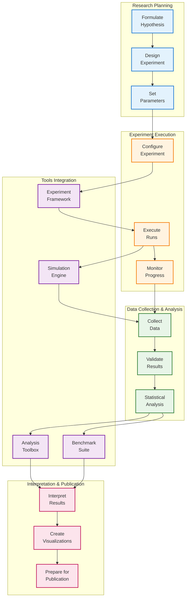
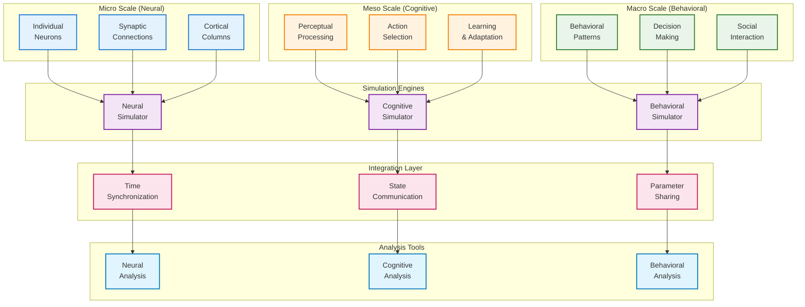
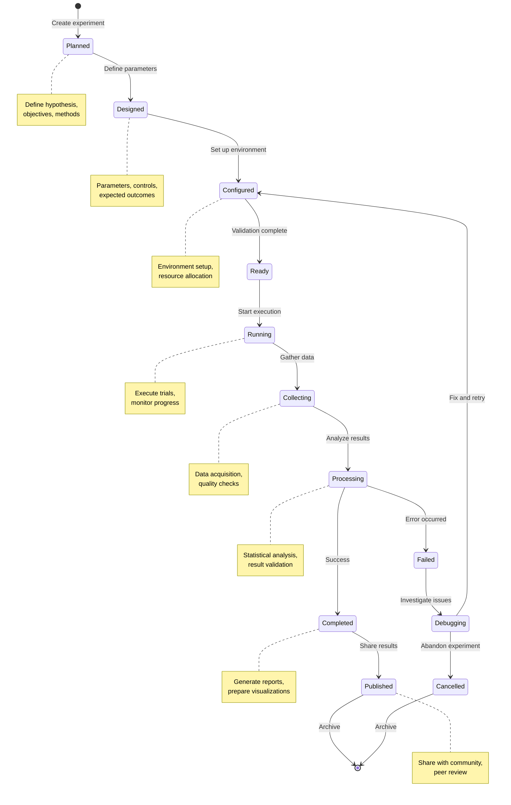
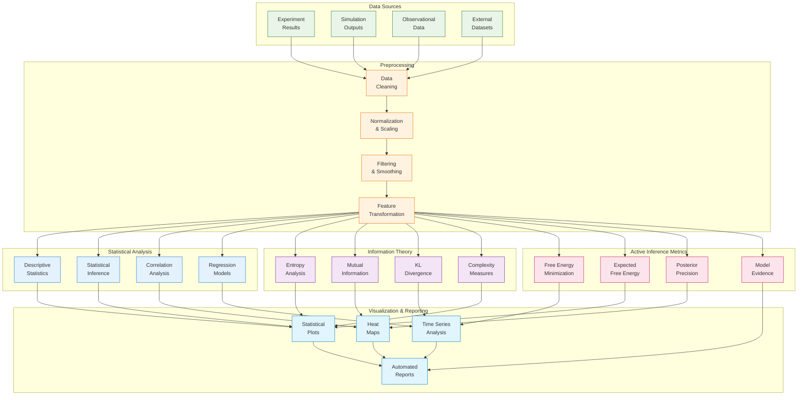

# Research Tools

This directory contains research tools, experimental frameworks, simulation engines, and analysis methods for Active Inference research. These tools provide a comprehensive platform for conducting reproducible research, running experiments, and analyzing results in Active Inference and related fields.

## Overview

The Research Tools module provides a complete research ecosystem for Active Inference, including experiment management, simulation capabilities, statistical analysis, benchmarking tools, and collaborative research features. All tools are designed to support reproducible, rigorous scientific research.

## Directory Structure

```
research/
├── experiments/          # Experiment management and execution
├── simulations/          # Multi-scale simulation capabilities
├── analysis/             # Statistical and information-theoretic analysis
├── benchmarks/           # Performance benchmarking and evaluation
├── tools/                # Research-specific utilities
└── collaboration/        # Collaborative research features
```

## Research Architecture Diagrams

### Research Workflow Architecture


### Multi-Scale Simulation Framework


### Experiment Lifecycle Management


### Analysis Pipeline Architecture


## Core Components

### 🔬 Experiment Framework
- **Experiment Design**: Tools for designing Active Inference experiments
- **Execution Engine**: Robust experiment execution and management
- **Result Collection**: Automated result collection and storage
- **Reproducibility**: Complete experiment reproducibility support

### 🧮 Simulation Engine
- **Multi-Scale Modeling**: Simulation across different time and spatial scales
- **Neural Models**: Detailed neural system simulations
- **Behavioral Models**: Cognitive and behavioral simulations
- **Real-time Simulation**: Real-time Active Inference simulations

### 📊 Analysis Tools
- **Statistical Analysis**: Comprehensive statistical analysis methods
- **Information Theory**: Information-theoretic analysis tools
- **Performance Metrics**: Active Inference-specific performance metrics
- **Visualization**: Research result visualization and plotting

### 🏆 Benchmarking Suite
- **Standard Benchmarks**: Established benchmarks for comparison
- **Performance Evaluation**: Quantitative performance evaluation
- **Comparative Analysis**: Side-by-side model comparisons
- **Result Validation**: Rigorous result validation methods

## Getting Started

### For Researchers
1. **Explore Tools**: Familiarize yourself with available research tools
2. **Design Experiment**: Use experiment design tools
3. **Run Simulations**: Execute simulations with appropriate parameters
4. **Analyze Results**: Apply statistical and information-theoretic analysis
5. **Benchmark Performance**: Compare with established benchmarks

### For Developers
1. **Understand Framework**: Learn the experiment framework architecture
2. **Study Examples**: Review existing experiment implementations
3. **Extend Tools**: Add new analysis or simulation capabilities
4. **Contribute**: Contribute new research tools and methods

## Usage Examples

### Running an Experiment
```python
from active_inference.research.experiments import ExperimentFramework

# Initialize experiment framework
framework = ExperimentFramework(config={'output_dir': './results'})

# Design experiment
experiment = framework.create_experiment(
    name='active_inference_study',
    type='simulation_study',
    parameters={
        'agents': 10,
        'environment': 'grid_world',
        'steps': 1000,
        'learning_rate': 0.01
    }
)

# Execute experiment
results = framework.run_experiment(experiment, repetitions=5)

# Analyze results
analysis = framework.analyze_results(results, methods=['statistical', 'information_theory'])
framework.generate_report(analysis)
```

### Creating a Simulation
```python
from active_inference.research.simulations import SimulationEngine

# Initialize simulation engine
engine = SimulationEngine(config={'time_scale': 'milliseconds'})

# Create neural simulation
neural_sim = engine.create_simulation(
    type='neural_network',
    model='hierarchical_active_inference',
    parameters={
        'layers': 3,
        'neurons_per_layer': [100, 50, 25],
        'connectivity': 'sparse',
        'dynamics': 'nonlinear'
    }
)

# Run simulation
results = engine.run_simulation(
    neural_sim,
    duration=10.0,  # seconds
    inputs={'sensory': 'time_series', 'context': 'experimental'}
)

# Analyze neural dynamics
dynamics_analysis = engine.analyze_dynamics(results)
```

### Statistical Analysis
```python
from active_inference.research.analysis import StatisticalAnalyzer

# Initialize analyzer
analyzer = StatisticalAnalyzer(methods=['bayesian', 'frequentist', 'information_theory'])

# Load experimental data
data = analyzer.load_data('./experiment_results/data.json')

# Perform comprehensive analysis
results = analyzer.analyze(
    data,
    hypotheses=['H1: Active Inference outperforms baseline',
                'H2: Performance improves with training'],
    alpha=0.05
)

# Generate analysis report
report = analyzer.generate_report(results, format='comprehensive')
```

## Research Methodologies

### Experiment Design
- **Hypothesis Testing**: Statistical hypothesis testing frameworks
- **Parameter Studies**: Systematic parameter variation studies
- **Comparative Analysis**: Side-by-side method comparisons
- **Reproducibility**: Complete experimental reproducibility

### Simulation Methods
- **Multi-scale Integration**: Integration across different scales
- **Neural Modeling**: Detailed neural system modeling
- **Behavioral Simulation**: Cognitive and behavioral modeling
- **Real-time Processing**: Real-time simulation capabilities

### Analysis Techniques
- **Information Theory**: Entropy, mutual information, KL divergence
- **Bayesian Analysis**: Bayesian inference and model comparison
- **Statistical Testing**: Comprehensive statistical test suite
- **Performance Metrics**: Domain-specific performance measures

## Contributing

We welcome contributions to the research tools module! See [CONTRIBUTING.md](../../CONTRIBUTING.md) for detailed guidelines.

### Contribution Types
- **New Methods**: Implement new research methods and algorithms
- **Analysis Tools**: Create new analysis and visualization tools
- **Simulation Engines**: Develop new simulation capabilities
- **Benchmarking**: Add new benchmarks and evaluation methods
- **Documentation**: Document research methodologies and results

### Quality Standards
- **Scientific Rigor**: All methods must meet scientific standards
- **Reproducibility**: All results must be reproducible
- **Validation**: Methods must be validated against known results
- **Documentation**: Comprehensive documentation required
- **Testing**: Extensive testing for reliability

## Learning Resources

- **Research Guide**: Learn research methodologies and best practices
- **Tool Documentation**: Study available research tools
- **Example Studies**: Review documented research examples
- **Analysis Methods**: Learn statistical and analytical methods
- **Community Research**: Engage with research community

## Related Documentation

- **[Main README](../../README.md)**: Project overview and getting started
- **[Knowledge Repository](../../knowledge/)**: Theoretical foundations
- **[Applications](../../applications/)**: Practical applications
- **[Visualization](../../visualization/)**: Research visualization tools
- **[Contributing Guide](../../CONTRIBUTING.md)**: Contribution guidelines

## Research Standards

### Reproducibility Standards
- **Complete Documentation**: All methods fully documented
- **Code Availability**: All code available and functional
- **Data Access**: Research data accessible for validation
- **Parameter Specification**: All parameters clearly specified
- **Result Validation**: Results validated by multiple methods

### Quality Assurance
- **Peer Review**: All major contributions peer reviewed
- **Testing**: Comprehensive testing of all components
- **Validation**: Validation against established benchmarks
- **Documentation**: Complete documentation of methods and results
- **Ethical Standards**: Adherence to research ethics

---

*"Active Inference for, with, by Generative AI"* - Advancing research through comprehensive tools, rigorous methods, and collaborative scientific inquiry.


