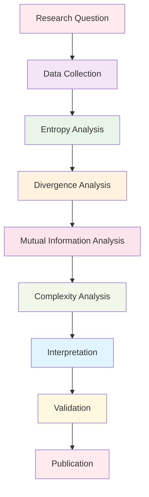

# Information Theory Analysis

This directory contains specialized tools and methods for information-theoretic analysis of Active Inference systems. It provides comprehensive frameworks for analyzing entropy, divergence measures, mutual information, and other information-theoretic quantities in the context of Active Inference research.

## Overview

The information theory analysis module offers rigorous mathematical tools for quantifying and analyzing information processing in Active Inference systems. This includes entropy analysis, divergence measures, information flow analysis, and complexity measures that are fundamental to understanding Active Inference dynamics.

### Mission & Role

This module contributes to the research mission by:

- **Information Quantification**: Providing precise measures of information content and flow
- **Model Analysis**: Enabling quantitative analysis of Active Inference model behavior
- **Theory Validation**: Supporting empirical validation of information-theoretic predictions
- **Research Advancement**: Facilitating cutting-edge research in Active Inference information dynamics
- **Educational Support**: Offering clear explanations of complex information-theoretic concepts

## Architecture

### Information Theory Structure

```
research/analysis/information_theory/
├── entropy/                  # Entropy analysis and estimation
├── divergence_measures/      # KL divergence and related measures
├── mutual_information/       # Mutual information and dependence analysis
├── complexity/               # Statistical and computational complexity
├── causal_analysis/          # Causal information flow analysis
└── README.md                # This file
```

### Integration Points

**Platform Integration:**
- **Analysis Framework**: Integration with statistical analysis tools
- **Simulation Engine**: Information analysis of simulated Active Inference systems
- **Visualization**: Information flow and entropy visualization tools
- **Knowledge Base**: Connection to information theory foundations

**External Systems:**
- **Information Theory Libraries**: PyInform, infotheory, specialized information theory packages
- **Statistical Computing**: SciPy, StatsModels for statistical information measures
- **Numerical Computing**: NumPy, CuPy for high-performance information calculations
- **Visualization**: Matplotlib, NetworkX for information flow visualization

## Analysis Categories

### Entropy Analysis
Comprehensive entropy estimation and analysis:
- **Shannon Entropy**: Classical entropy measures for discrete and continuous systems
- **Differential Entropy**: Entropy measures for continuous probability distributions
- **Relative Entropy**: Entropy differences and information content measures
- **Conditional Entropy**: Entropy in conditional probability contexts
- **Joint Entropy**: Entropy of multivariate systems and joint distributions

### Divergence Measures
Information divergence and distance measures:
- **Kullback-Leibler Divergence**: Classic KL divergence and variants
- **Jensen-Shannon Divergence**: Symmetric divergence measures
- **Wasserstein Distance**: Earth mover's distance and optimal transport
- **f-Divergences**: Generalized divergence measure framework
- **Cross-Entropy**: Cross-entropy measures and applications

### Mutual Information
Information dependence and correlation analysis:
- **Mutual Information**: Basic mutual information between variables
- **Conditional Mutual Information**: Mutual information in conditional contexts
- **Transfer Entropy**: Directed information flow and causality measures
- **Partial Mutual Information**: Mutual information controlling for other variables
- **Multivariate Mutual Information**: Information measures for multiple variables

### Complexity Measures
Statistical and computational complexity analysis:
- **Statistical Complexity**: Measures of system complexity and organization
- **Effective Measure Complexity**: Complexity of effective models
- **Causal Density**: Density of causal relationships in systems
- **Integrated Information**: Measures of system integration and information
- **Dimensionality Measures**: Intrinsic dimensionality and manifold analysis

## Getting Started

### Prerequisites
- **Information Theory**: Strong foundation in information theory concepts
- **Probability Theory**: Advanced probability and stochastic processes
- **Statistical Analysis**: Statistical inference and estimation methods
- **Programming Skills**: Python programming with scientific computing
- **Mathematical Computing**: Familiarity with numerical methods and optimization

### Basic Setup

```bash
# Install information theory dependencies
pip install numpy scipy matplotlib seaborn
pip install networkx scikit-learn statsmodels

# Install specialized information theory packages
pip install pyinform  # Information theory toolkit
pip install infotheory  # Additional information theory tools
pip install chaospy  # Uncertainty quantification

# Install performance computing
pip install numba cupy  # High-performance computing
pip install dask  # Parallel computing
```

### Initial Analysis Project

```python
# Basic information theory analysis workflow
import numpy as np
from active_inference.research.analysis.information_theory import EntropyAnalyzer
from active_inference.research.analysis.information_theory import DivergenceAnalyzer

# Load data for analysis
neural_data = np.load("neural_activity.npy")
belief_data = np.load("belief_trajectories.npy")

# Initialize analyzers
entropy_analyzer = EntropyAnalyzer(neural_data)
divergence_analyzer = DivergenceAnalyzer(belief_data)

# Perform comprehensive analysis
entropy_results = entropy_analyzer.calculate_all_entropy_measures()
divergence_results = divergence_analyzer.calculate_divergence_measures()

# Generate analysis report
report = generate_information_theory_report(entropy_results, divergence_results)
```

## Usage Examples

### Example 1: Neural Entropy Analysis

```python
# Analyze entropy in neural spike trains
import numpy as np
from active_inference.research.analysis.information_theory.entropy import NeuralEntropyAnalyzer

# Load neural spike data
spike_trains = load_spike_train_data("experiment_001.mat")
time_windows = create_analysis_windows(spike_trains, window_size=100)

# Initialize neural entropy analyzer
analyzer = NeuralEntropyAnalyzer(spike_trains, time_windows)

# Calculate comprehensive entropy measures
shannon_entropy = analyzer.calculate_shannon_entropy()
differential_entropy = analyzer.calculate_differential_entropy()
entropy_rate = analyzer.calculate_entropy_rate()

# Analyze entropy dynamics
entropy_dynamics = analyzer.analyze_entropy_dynamics()
spatiotemporal_entropy = analyzer.analyze_spatiotemporal_entropy()

# Visualize entropy patterns
analyzer.plot_entropy_time_series()
analyzer.plot_entropy_spatial_distribution()
analyzer.plot_entropy_rate_analysis()
```

### Example 2: Belief Divergence Analysis

```python
# Analyze divergence between belief states
from active_inference.research.analysis.information_theory.divergence_measures import BeliefDivergenceAnalyzer

# Define belief trajectories
prior_beliefs = load_prior_belief_trajectory()
posterior_beliefs = load_posterior_belief_trajectory()
predictive_beliefs = load_predictive_belief_trajectory()

# Initialize divergence analyzer
analyzer = BeliefDivergenceAnalyzer([prior_beliefs, posterior_beliefs, predictive_beliefs])

# Calculate various divergence measures
kl_divergence = analyzer.calculate_kl_divergence()
js_divergence = analyzer.calculate_js_divergence()
wasserstein_distance = analyzer.calculate_wasserstein_distance()

# Analyze divergence patterns
divergence_dynamics = analyzer.analyze_divergence_dynamics()
information_geometry = analyzer.analyze_information_geometry()

# Visualize divergence patterns
analyzer.plot_divergence_time_series()
analyzer.plot_information_geometry()
analyzer.plot_divergence_heatmap()
```

### Example 3: Information Flow Analysis

```python
# Analyze information flow in Active Inference systems
from active_inference.research.analysis.information_theory.mutual_information import InformationFlowAnalyzer

# Set up system for analysis
system_config = {
    "components": ["observations", "beliefs", "policies", "actions"],
    "connections": "hierarchical",
    "time_scale": "milliseconds"
}

# Load system data
system_data = load_active_inference_system_data("experiment_002.h5")

# Initialize information flow analyzer
analyzer = InformationFlowAnalyzer(system_data, system_config)

# Calculate mutual information measures
mutual_information = analyzer.calculate_mutual_information()
conditional_mutual_information = analyzer.calculate_conditional_mutual_information()
transfer_entropy = analyzer.calculate_transfer_entropy()

# Analyze information pathways
information_pathways = analyzer.identify_information_pathways()
causal_flow = analyzer.analyze_causal_flow()
information_efficiency = analyzer.analyze_information_efficiency()

# Visualize information flow
analyzer.plot_information_flow_network()
analyzer.plot_transfer_entropy_matrix()
analyzer.plot_causal_flow_diagram()
```

## Configuration

### Information Theory Analysis Configuration

```python
# Basic information theory configuration
info_theory_config = {
    "entropy": {
        "estimator": "maximum_likelihood",  # maximum_likelihood, bayesian, plugin
        "bias_correction": True,
        "confidence_intervals": True,
        "bootstrap_samples": 1000
    },
    "divergence": {
        "method": "k_nearest_neighbors",  # analytical, numerical, knn
        "k_neighbors": 5,
        "distance_metric": "euclidean",
        "regularization": 1e-8
    },
    "mutual_information": {
        "estimator": "kraskov",  # kraskov, ross, maximal
        "k_neighbors": 4,
        "noise_level": 1e-8,
        "surrogate_method": "shuffle"
    },
    "complexity": {
        "measure_type": "statistical_complexity",  # statistical, causal, integrated
        "window_size": 100,
        "overlap": 0.5,
        "normalization": True
    }
}
```

### Advanced Configuration

```python
# Advanced information theory settings
advanced_config = {
    "performance": {
        "parallel_processing": True,
        "max_workers": 8,
        "memory_limit": "16GB",
        "gpu_acceleration": True
    },
    "numerical": {
        "precision": "double",
        "tolerance": 1e-12,
        "max_iterations": 10000,
        "convergence_threshold": 1e-8
    },
    "statistical": {
        "significance_level": 0.05,
        "multiple_testing_correction": "bonferroni",
        "confidence_level": 0.95,
        "effect_size_threshold": 0.8
    },
    "validation": {
        "bootstrap_replications": 1000,
        "cross_validation_folds": 10,
        "permutation_tests": 1000,
        "sensitivity_analysis": True
    }
}
```

## API Reference

### Core Information Theory Classes

#### `EntropyAnalyzer`
Comprehensive entropy analysis toolkit.

```python
class EntropyAnalyzer:
    """Analyze entropy in various forms and contexts"""

    def __init__(self, data: Union[np.ndarray, torch.Tensor], config: Dict[str, Any]):
        """Initialize entropy analyzer with data and configuration"""

    def calculate_shannon_entropy(self) -> EntropyResult:
        """Calculate Shannon entropy for discrete data"""

    def calculate_differential_entropy(self) -> EntropyResult:
        """Calculate differential entropy for continuous data"""

    def calculate_relative_entropy(self, reference_distribution: Any) -> EntropyResult:
        """Calculate relative entropy (KL divergence)"""

    def analyze_entropy_dynamics(self) -> EntropyDynamics:
        """Analyze how entropy changes over time"""

    def estimate_entropy_rate(self) -> EntropyRateResult:
        """Estimate entropy rate for time series data"""
```

#### `DivergenceAnalyzer`
Information divergence and distance analysis.

```python
class DivergenceAnalyzer:
    """Analyze information divergence between distributions"""

    def __init__(self, distributions: List[Any], config: Dict[str, Any]):
        """Initialize with distributions to compare"""

    def calculate_kl_divergence(self) -> DivergenceResult:
        """Calculate Kullback-Leibler divergence"""

    def calculate_js_divergence(self) -> DivergenceResult:
        """Calculate Jensen-Shannon divergence"""

    def calculate_wasserstein_distance(self) -> DistanceResult:
        """Calculate Wasserstein distance between distributions"""

    def analyze_divergence_dynamics(self) -> DivergenceDynamics:
        """Analyze how divergence changes over time"""

    def compare_divergence_measures(self, measures: List[str]) -> ComparisonResult:
        """Compare different divergence measures"""
```

#### `MutualInformationAnalyzer`
Mutual information and dependence analysis.

```python
class MutualInformationAnalyzer:
    """Analyze mutual information and statistical dependence"""

    def __init__(self, variables: List[Any], config: Dict[str, Any]):
        """Initialize with variables to analyze"""

    def calculate_mutual_information(self) -> MutualInformationResult:
        """Calculate mutual information between variables"""

    def calculate_transfer_entropy(self) -> TransferEntropyResult:
        """Calculate transfer entropy for directed information flow"""

    def analyze_information_flow(self) -> InformationFlowResult:
        """Analyze information flow patterns in systems"""

    def identify_causal_relationships(self) -> CausalAnalysisResult:
        """Identify causal relationships using information measures"""

    def analyze_network_structure(self) -> NetworkAnalysisResult:
        """Analyze network structure using information theory"""
```

## Research Workflows

### Information Theory Research Pipeline



### Advanced Analysis Patterns

```python
# Multi-scale information analysis
def conduct_multiscale_information_analysis(data: Any, scales: List[float]) -> AnalysisReport:
    """Conduct information theory analysis across multiple scales"""

    # Scale-specific analysis
    scale_results = {}
    for scale in scales:
        scaled_data = preprocess_data_for_scale(data, scale)

        # Entropy analysis at this scale
        entropy_analysis = perform_entropy_analysis(scaled_data)

        # Divergence analysis at this scale
        divergence_analysis = perform_divergence_analysis(scaled_data)

        # Mutual information analysis at this scale
        mutual_info_analysis = perform_mutual_information_analysis(scaled_data)

        scale_results[scale] = {
            'entropy': entropy_analysis,
            'divergence': divergence_analysis,
            'mutual_information': mutual_info_analysis
        }

    # Cross-scale integration
    cross_scale_patterns = identify_cross_scale_patterns(scale_results)

    # Multi-scale validation
    multiscale_validation = validate_multiscale_consistency(scale_results)

    return generate_multiscale_report(scale_results, cross_scale_patterns, multiscale_validation)

# Information geometry analysis
def conduct_information_geometry_analysis(distributions: List[Any]) -> GeometryReport:
    """Analyze information geometry of belief distributions"""

    # Calculate Fisher information
    fisher_information = calculate_fisher_information(distributions)

    # Analyze geodesic paths
    geodesic_analysis = analyze_geodesic_paths(distributions)

    # Study curvature properties
    curvature_analysis = analyze_information_curvature(distributions)

    # Validate geometric structure
    geometry_validation = validate_information_geometry(distributions)

    return generate_geometry_report(fisher_information, geodesic_analysis, curvature_analysis, geometry_validation)
```

## Contributing

### Information Theory Documentation Standards

When contributing to information theory documentation:

1. **Mathematical Rigor**: Ensure all information-theoretic concepts are mathematically precise
2. **Implementation Accuracy**: Verify all algorithms implement the mathematical definitions correctly
3. **Computational Validation**: Validate implementations against known benchmarks
4. **Educational Clarity**: Provide clear explanations of complex information-theoretic concepts
5. **Research Relevance**: Connect methods to Active Inference research applications

### Information Theory Contribution Process

1. **Identify Theory Gap**: Find missing or inadequate information theory methods
2. **Research Implementation**: Implement robust information-theoretic algorithms
3. **Mathematical Validation**: Ensure mathematical correctness and numerical stability
4. **Computational Testing**: Validate against benchmarks and test cases
5. **Document Comprehensively**: Provide complete documentation and examples
6. **Submit for Review**: Follow peer review process for information theory contributions

## Related Documentation

- **[Analysis Framework](../../analysis/README.md)**: Overview of analysis tools and methods
- **[Entropy Analysis](../entropy/README.md)**: Specialized entropy estimation methods
- **[Divergence Measures](../divergence_measures/README.md)**: Information divergence analysis
- **[Mutual Information](../mutual_information/README.md)**: Mutual information analysis tools
- **[Complexity Analysis](../complexity/README.md)**: Statistical complexity measures
- **[Research Analysis Documentation](../../../docs/research/analysis/README.md)**: Analysis framework documentation

---

**Information Theory Analysis Version**: 1.0.0 | **Last Updated**: October 2024 | **Development Status**: Active Development

*"Active Inference for, with, by Generative AI"* - Advancing the mathematical foundations of Active Inference through rigorous information theory, precise divergence measures, and comprehensive information analysis.