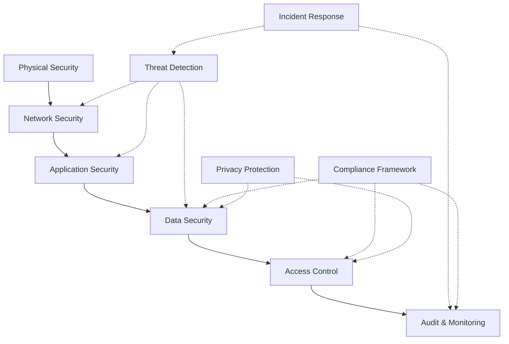
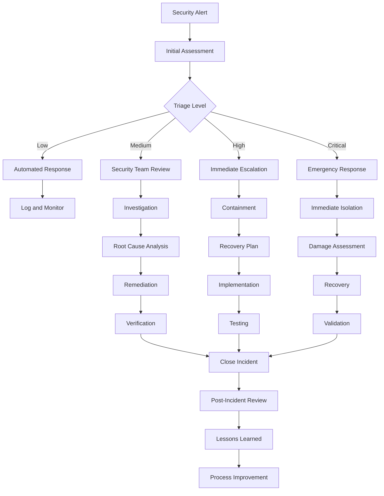

# Data Security & Privacy Protection Framework

This directory contains comprehensive security tools, privacy protection systems, access control mechanisms, and compliance frameworks for research data. The framework ensures data confidentiality, integrity, availability, and compliance with research ethics and regulatory requirements.

## Overview

The Data Security Framework provides enterprise-grade security and privacy protection for research data throughout the complete data lifecycle. It implements multiple layers of security, comprehensive access control, audit trails, and compliance monitoring to protect sensitive research data while maintaining usability for authorized researchers.

## Directory Structure

```
security/
├── encryption/           # Data encryption and key management
├── access_control/       # Authentication and authorization systems
├── audit_logging/        # Comprehensive audit and logging
├── privacy_protection/   # Privacy-preserving data processing
├── compliance/           # Regulatory compliance tools
└── README.md            # This file
```

## Core Components

### 🔐 Data Encryption & Key Management
Comprehensive encryption for data at rest and in transit:

```python
from active_inference.research.data_management.security.encryption import EncryptionManager

# Configure encryption system
encryption_config = {
    'algorithms': {
        'symmetric': {
            'primary': 'AES256_GCM',
            'fallback': 'ChaCha20_Poly1305',
            'key_rotation': 'automatic'
        },
        'asymmetric': {
            'primary': 'RSA4096',
            'key_exchange': 'ECDH_P384',
            'signature': 'ECDSA_P384'
        },
        'hashing': {
            'primary': 'SHA384',
            'integrity': 'HMAC_SHA384',
            'password': 'Argon2id'
        }
    },
    'key_management': {
        'key_storage': 'hardware_security_module',
        'rotation_policy': {
            'symmetric_keys': '90_days',
            'asymmetric_keys': '1_year',
            'master_keys': 'never'
        },
        'backup_keys': 3,
        'recovery_keys': 2
    },
    'data_classification': {
        'public': {'encryption': 'none', 'access': 'open'},
        'internal': {'encryption': 'AES256', 'access': 'authenticated'},
        'confidential': {'encryption': 'AES256_GCM', 'access': 'role_based'},
        'restricted': {'encryption': 'end_to_end', 'access': 'attribute_based'}
    }
}

# Initialize encryption manager
encryption_manager = EncryptionManager(encryption_config)

# Encrypt research data
def encrypt_research_data(data, classification='confidential'):
    """Encrypt research data with appropriate security level"""
    print(f"🔐 Encrypting {classification} data...")
    print("=" * 35)

    # Determine encryption requirements
    requirements = encryption_config['data_classification'][classification]

    # Generate encryption key
    encryption_key = encryption_manager.generate_key(
        algorithm=requirements['encryption'],
        purpose=f'{classification}_data'
    )

    # Encrypt data
    encrypted_data = encryption_manager.encrypt_data(
        data=data,
        key=encryption_key,
        algorithm=requirements['encryption'],
        metadata={
            'classification': classification,
            'encryption_time': datetime.now(),
            'algorithm': requirements['encryption'],
            'key_id': encryption_key.id
        }
    )

    # Store encryption metadata
    encryption_manager.store_encryption_metadata(
        data_id=encrypted_data.id,
        metadata=encrypted_data.metadata
    )

    print(f"✅ Data encrypted successfully")
    print(f"   Algorithm: {requirements['encryption']}")
    print(f"   Key ID: {encryption_key.id}")
    print(f"   Encrypted size: {len(encrypted_data.encrypted_content)} bytes")

    return encrypted_data, encryption_key

# Decrypt research data
def decrypt_research_data(encrypted_data, key_id):
    """Decrypt research data with proper authorization"""
    print(f"🔓 Decrypting data...")

    # Verify access permissions
    access_granted = encryption_manager.verify_access(
        data_id=encrypted_data.id,
        user_id=current_user.id,
        operation='decrypt'
    )

    if not access_granted:
        print("❌ Access denied: insufficient permissions")
        return None

    # Retrieve decryption key
    decryption_key = encryption_manager.retrieve_key(key_id)

    # Decrypt data
    decrypted_data = encryption_manager.decrypt_data(
        encrypted_data=encrypted_data,
        key=decryption_key
    )

    # Log decryption activity
    encryption_manager.log_activity(
        activity_type='decryption',
        data_id=encrypted_data.id,
        user_id=current_user.id,
        timestamp=datetime.now()
    )

    print(f"✅ Data decrypted successfully")
    return decrypted_data

# Encrypt and decrypt research data
encrypted_data, key = encrypt_research_data(sensitive_experiment_data, 'restricted')
decrypted_data = decrypt_research_data(encrypted_data, key.id)
```

### 🛡️ Access Control & Authentication
Role-based and attribute-based access control:

```python
from active_inference.research.data_management.security.access_control import AccessControlManager

# Configure access control system
access_config = {
    'authentication': {
        'methods': [
            'password',
            'two_factor',
            'biometric',
            'certificate',
            'api_key'
        ],
        'password_policy': {
            'min_length': 12,
            'complexity': 'high',
            'rotation_days': 90,
            'history_count': 5
        },
        'session_management': {
            'timeout_minutes': 60,
            'max_sessions': 3,
            'require_reauth': ['sensitive_operations']
        }
    },
    'authorization': {
        'model': 'hybrid',  # rbac, abac, hybrid
        'roles': [
            'data_admin',
            'research_lead',
            'researcher',
            'analyst',
            'viewer',
            'guest'
        ],
        'permissions': [
            'read_data',
            'write_data',
            'modify_data',
            'delete_data',
            'export_data',
            'share_data',
            'admin_access'
        ]
    },
    'audit': {
        'log_all_access': True,
        'log_data_changes': True,
        'log_admin_actions': True,
        'retention_days': 2555  # 7 years
    }
}

# Initialize access control manager
access_manager = AccessControlManager(access_config)

# Define role permissions
def setup_role_permissions():
    """Set up role-based permissions for research team"""
    permissions_matrix = {
        'data_admin': [
            'read_data', 'write_data', 'modify_data', 'delete_data',
            'export_data', 'share_data', 'admin_access'
        ],
        'research_lead': [
            'read_data', 'write_data', 'modify_data', 'export_data', 'share_data'
        ],
        'researcher': [
            'read_data', 'write_data', 'modify_data', 'export_data'
        ],
        'analyst': [
            'read_data', 'export_data'
        ],
        'viewer': [
            'read_data'
        ],
        'guest': []
    }

    for role, permissions in permissions_matrix.items():
        access_manager.assign_role_permissions(role, permissions)
        print(f"✅ Set permissions for role: {role}")

# Authenticate user
def authenticate_user(username, password, two_factor_code=None):
    """Authenticate user with multi-factor authentication"""
    print(f"🔐 Authenticating user: {username}")

    # Primary authentication
    auth_result = access_manager.authenticate_password(username, password)

    if not auth_result['success']:
        print(f"❌ Authentication failed: {auth_result['reason']}")
        return None

    # Two-factor authentication
    if access_config['authentication']['methods'].__contains__('two_factor'):
        mfa_result = access_manager.authenticate_mfa(username, two_factor_code)

        if not mfa_result['success']:
            print(f"❌ MFA failed: {mfa_result['reason']}")
            return None

    # Create authenticated session
    session = access_manager.create_session(
        user_id=auth_result['user_id'],
        permissions=auth_result['permissions'],
        session_timeout=3600  # 1 hour
    )

    print(f"✅ Authentication successful")
    print(f"   Session ID: {session.id}")
    print(f"   Permissions: {session.permissions}")
    print(f"   Expires: {session.expires_at}")

    return session

# Authorize data access
def authorize_data_access(session, data_id, operation='read'):
    """Authorize access to specific data"""
    print(f"🛡️  Authorizing {operation} access to data {data_id}")

    # Check permissions
    authorization = access_manager.check_authorization(
        user_id=session.user_id,
        permissions=session.permissions,
        resource_id=data_id,
        operation=operation,
        context={
            'time': datetime.now(),
            'ip_address': get_client_ip(),
            'user_agent': get_user_agent()
        }
    )

    if not authorization['granted']:
        print(f"❌ Access denied: {authorization['reason']}")
        # Log access denial
        access_manager.log_access_denial(session.user_id, data_id, operation, authorization['reason'])
        return False

    # Log successful authorization
    access_manager.log_authorization(session.user_id, data_id, operation)

    print(f"✅ Access granted for {operation}")
    print(f"   Reason: {authorization['reason']}")

    return True

# Set up authentication and authorization
setup_role_permissions()
user_session = authenticate_user('researcher_smith', 'secure_password_123', '123456')
access_granted = authorize_data_access(user_session, 'experiment_001_data', 'read')
```

### 📋 Audit Logging & Monitoring
Comprehensive audit trails and security monitoring:

```python
from active_inference.research.data_management.security.audit_logging import AuditLogger

# Configure audit system
audit_config = {
    'logging_levels': {
        'data_access': 'detailed',
        'authentication': 'detailed',
        'authorization': 'detailed',
        'data_modification': 'detailed',
        'system_events': 'summary',
        'security_events': 'detailed'
    },
    'retention': {
        'data_access_logs': '7_years',
        'authentication_logs': '2_years',
        'system_logs': '1_year',
        'security_logs': '10_years'
    },
    'real_time_monitoring': {
        'enabled': True,
        'alert_thresholds': {
            'failed_logins': 5,
            'suspicious_activity': 3,
            'unauthorized_access': 1,
            'data_export': 10  # large exports
        },
        'response_times': {
            'alert_seconds': 30,
            'investigate_minutes': 5,
            'escalate_minutes': 15
        }
    },
    'anomaly_detection': {
        'enabled': True,
        'algorithms': ['isolation_forest', 'one_class_svm', 'statistical'],
        'training_period': '30_days',
        'sensitivity': 'medium'
    }
}

# Initialize audit logger
audit_logger = AuditLogger(audit_config)

# Comprehensive audit logging
def log_research_activity(activity_type, details, context=None):
    """Log research activity with comprehensive context"""
    # Create audit entry
    audit_entry = {
        'timestamp': datetime.now(),
        'activity_type': activity_type,
        'user_id': context.get('user_id') if context else 'system',
        'session_id': context.get('session_id') if context else None,
        'ip_address': context.get('ip_address') if context else get_client_ip(),
        'user_agent': context.get('user_agent') if context else None,
        'resource_id': details.get('resource_id'),
        'operation': details.get('operation'),
        'status': details.get('status', 'success'),
        'details': details,
        'security_relevant': details.get('security_relevant', False),
        'compliance_relevant': details.get('compliance_relevant', False)
    }

    # Log to appropriate level
    if audit_entry['security_relevant']:
        audit_logger.log_security_event(audit_entry)
    elif audit_entry['compliance_relevant']:
        audit_logger.log_compliance_event(audit_entry)
    else:
        audit_logger.log_activity(audit_entry)

    # Real-time anomaly detection
    anomaly_score = audit_logger.detect_anomaly(audit_entry)

    if anomaly_score > 0.7:
        audit_logger.alert_security_team(audit_entry, anomaly_score)

    return audit_entry

# Monitor security events
def monitor_security_dashboard():
    """Real-time security monitoring dashboard"""
    print("🔒 Security Monitoring Dashboard")
    print("=" * 35)

    while True:
        # Get recent security metrics
        security_metrics = audit_logger.get_security_metrics(hours=24)

        print(f"🔐 Authentication Events: {security_metrics['auth_events']}")
        print(f"🚫 Failed Logins: {security_metrics['failed_logins']}")
        print(f"📊 Data Access Events: {security_metrics['data_access_events']}")
        print(f"⚠️  Security Alerts: {security_metrics['security_alerts']}")
        print(f"🔍 Anomalies Detected: {security_metrics['anomalies_detected']}")

        # Show recent security events
        recent_events = audit_logger.get_recent_security_events(limit=5)
        if recent_events:
            print("
🚨 Recent Security Events:"            for event in recent_events:
                severity = "🔴 HIGH" if event['severity'] == 'high' else "🟡 MEDIUM" if event['severity'] == 'medium' else "🔵 LOW"
                print(f"   {severity} {event['timestamp']}: {event['description']}")
        else:
            print("\n✅ No recent security events")

        # Check for active threats
        active_threats = audit_logger.get_active_threats()
        if active_threats:
            print("
🚨 ACTIVE THREATS:"            for threat in active_threats:
                print(f"   {threat['type']}: {threat['description']}")
                print(f"   Risk Level: {threat['risk_level']}")
                print(f"   Recommended Action: {threat['recommended_action']}")

        print(f"\nLast updated: {datetime.now()}")
        time.sleep(60)  # Update every minute

# Start security monitoring
monitor_security_dashboard()
```

## Privacy Protection

### Privacy-Preserving Data Processing

```python
from active_inference.research.data_management.security.privacy_protection import PrivacyManager

# Configure privacy protection
privacy_config = {
    'data_minimization': {
        'enabled': True,
        'retention_periods': {
            'personal_data': '2_years',
            'research_data': '7_years',
            'anonymized_data': 'indefinite'
        },
        'automatic_deletion': True
    },
    'anonymization': {
        'methods': ['k_anonymity', 'l_diversity', 't_closeness', 'differential_privacy'],
        'parameters': {
            'k_anonymity': {'k': 5},
            'l_diversity': {'l': 3},
            'differential_privacy': {'epsilon': 0.1, 'delta': 1e-5}
        }
    },
    'consent_management': {
        'consent_types': ['research', 'data_sharing', 'publication', 'commercial'],
        'withdrawal_process': 'automated',
        'consent_expiry': True,
        'reminder_schedule': 'annual'
    },
    'data_subject_rights': {
        'access_requests': 'automated',
        'rectification': 'supported',
        'erasure': 'automated',
        'portability': 'supported',
        'objection': 'supported'
    }
}

# Initialize privacy manager
privacy_manager = PrivacyManager(privacy_config)

# Anonymize research data
def anonymize_research_data(data, anonymization_level='high'):
    """Anonymize research data for privacy protection"""
    print(f"🔒 Anonymizing data (level: {anonymization_level})...")
    print("=" * 40)

    # Apply k-anonymity
    k_anonymous_data = privacy_manager.apply_k_anonymity(
        data,
        quasi_identifiers=['age', 'gender', 'location'],
        k=privacy_config['anonymization']['parameters']['k_anonymity']['k']
    )

    # Apply l-diversity
    l_diverse_data = privacy_manager.apply_l_diversity(
        k_anonymous_data,
        sensitive_attributes=['diagnosis', 'treatment'],
        l=privacy_config['anonymization']['parameters']['l_diversity']['l']
    )

    # Apply differential privacy
    dp_data = privacy_manager.apply_differential_privacy(
        l_diverse_data,
        epsilon=privacy_config['anonymization']['parameters']['differential_privacy']['epsilon'],
        mechanism='gaussian'
    )

    # Validate anonymization
    validation_results = privacy_manager.validate_anonymization(dp_data)
    print(f"✅ Anonymization validation: {'PASS' if validation_results['valid'] else 'FAIL'}")
    print(f"   Privacy risk score: {validation_results['privacy_risk']:.3f}")
    print(f"   Utility preservation: {validation_results['utility_preservation']:.1%}")

    # Generate privacy report
    privacy_report = privacy_manager.generate_privacy_report(dp_data, validation_results)

    return dp_data, privacy_report

# Manage data subject consent
def manage_consent_process(participant_id, consent_data):
    """Manage participant consent throughout research lifecycle"""
    print(f"📋 Managing consent for participant {participant_id}")

    # Record initial consent
    consent_record = privacy_manager.record_consent(
        participant_id=participant_id,
        consent_types=consent_data['consent_types'],
        consent_date=consent_data['date'],
        expiry_date=consent_data.get('expiry'),
        conditions=consent_data.get('conditions', [])
    )

    # Set up consent reminders
    privacy_manager.schedule_consent_reminders(
        participant_id=participant_id,
        reminder_schedule=privacy_config['consent_management']['reminder_schedule']
    )

    # Enable data subject rights
    privacy_manager.enable_data_rights(
        participant_id=participant_id,
        rights=privacy_config['data_subject_rights']
    )

    print(f"✅ Consent recorded and rights enabled")
    return consent_record

# Anonymize and manage consent
anonymized_data, privacy_report = anonymize_research_data(sensitive_data, 'high')
consent_record = manage_consent_process('subject_001', participant_consent_data)
```

## Compliance & Ethics

### Regulatory Compliance Framework

```python
from active_inference.research.data_management.security.compliance import ComplianceManager

# Configure compliance monitoring
compliance_config = {
    'regulations': {
        'gdpr': {
            'enabled': True,
            'data_controller': 'Research Institution',
            'dpo_contact': 'dpo@research-institution.edu',
            'legal_basis': 'scientific_research',
            'retention_periods': {
                'personal_data': '2_years_post_publication',
                'research_data': '7_years',
                'anonymized_data': 'indefinite'
            }
        },
        'hipaa': {
            'enabled': True,
            'covered_entity': True,
            'phi_identification': True,
            'minimum_necessary': True,
            'accounting_of_disclosures': True
        },
        'research_ethics': {
            'irb_approval_required': True,
            'informed_consent': 'comprehensive',
            'vulnerable_populations': 'enhanced_protection',
            'data_sharing_restrictions': 'controlled_access'
        }
    },
    'monitoring': {
        'continuous_compliance': True,
        'automated_audits': True,
        'risk_assessment': 'quarterly',
        'compliance_reporting': 'monthly'
    },
    'breach_response': {
        'detection_time': '<24_hours',
        'notification_time': '<72_hours',
        'containment_time': '<1_week',
        'recovery_time': '<1_month'
    }
}

# Initialize compliance manager
compliance_manager = ComplianceManager(compliance_config)

# Comprehensive compliance checking
def validate_research_compliance(data_processing_activity):
    """Validate research activity for regulatory compliance"""
    print(f"⚖️  Compliance Validation: {data_processing_activity['name']}")
    print("=" * 45)

    # GDPR compliance check
    gdpr_compliance = compliance_manager.check_gdpr_compliance(data_processing_activity)
    print(f"🇪🇺 GDPR Compliance: {'✅ COMPLIANT' if gdpr_compliance['compliant'] else '❌ NON-COMPLIANT'}")

    if not gdpr_compliance['compliant']:
        for issue in gdpr_compliance['issues']:
            print(f"   - {issue['article']}: {issue['description']}")
            print(f"     Required action: {issue['remediation']}")

    # HIPAA compliance check
    hipaa_compliance = compliance_manager.check_hipaa_compliance(data_processing_activity)
    print(f"🇺🇸 HIPAA Compliance: {'✅ COMPLIANT' if hipaa_compliance['compliant'] else '❌ NON-COMPLIANT'}")

    # Research ethics compliance
    ethics_compliance = compliance_manager.check_research_ethics(data_processing_activity)
    print(f"🧪 Research Ethics: {'✅ COMPLIANT' if ethics_compliance['compliant'] else '❌ NON-COMPLIANT'}")

    # Overall compliance assessment
    overall_compliance = compliance_manager.assess_overall_compliance([
        gdpr_compliance,
        hipaa_compliance,
        ethics_compliance
    ])

    print(f"\n🎯 Overall Compliance: {'✅ COMPLIANT' if overall_compliance['compliant'] else '❌ NON-COMPLIANT'}")
    print(f"   Risk Level: {overall_compliance['risk_level']}")
    print(f"   Compliance Score: {overall_compliance['score']:.1%}")

    # Generate compliance report
    compliance_report = compliance_manager.generate_compliance_report(overall_compliance)

    # Schedule compliance review if needed
    if overall_compliance['risk_level'] in ['high', 'medium']:
        compliance_manager.schedule_compliance_review(data_processing_activity)

    return overall_compliance, compliance_report

# Validate research compliance
compliance_results, report = validate_research_compliance(active_inference_study)
```

## Integration Examples

### Secure Research Pipeline

```python
from active_inference.research.experiments import ExperimentManager
from active_inference.research.data_management.security import SecureDataManager

# Set up secure research pipeline
experiment = ExperimentManager()
secure_data_manager = SecureDataManager(security_config)

# Configure security for experiment
secure_data_manager.configure_experiment_security(
    experiment_id='sensitive_medical_study',
    security_requirements={
        'data_classification': 'medical_restricted',
        'encryption_level': 'end_to_end',
        'access_control': 'attribute_based',
        'audit_level': 'comprehensive',
        'privacy_protection': 'enhanced',
        'compliance_frameworks': ['gdpr', 'hipaa', 'research_ethics']
    }
)

# Secure experiment execution
def run_secure_experiment(experiment_config):
    """Run experiment with comprehensive security"""
    print("🔒 Secure Experiment Execution")
    print("=" * 30)

    # Pre-experiment security setup
    security_setup = secure_data_manager.setup_experiment_security(experiment_config['id'])

    # Authenticate all participants
    participants = authenticate_research_participants(experiment_config['participants'])

    # Secure data collection
    secure_collector = secure_data_manager.create_secure_collector(experiment_config['id'])

    # Run experiment with security monitoring
    experiment_results = experiment.run_experiment(
        config=experiment_config,
        data_collector=secure_collector,
        security_monitor=secure_data_manager.create_security_monitor()
    )

    # Post-experiment security validation
    security_validation = secure_data_manager.validate_post_experiment_security(experiment_results)

    # Generate security report
    security_report = secure_data_manager.generate_security_report(experiment_results)

    # Archive with security
    archival_result = secure_data_manager.secure_archive(experiment_results)

    print("✅ Secure experiment completed successfully")
    return experiment_results, security_report

# Execute secure experiment
results, security_report = run_secure_experiment(confidential_medical_experiment)
```

## Contributing

We welcome contributions to the security framework! See [CONTRIBUTING.md](../../../CONTRIBUTING.md) for detailed guidelines.

### Development Setup
```bash
# Install security dependencies
pip install -e ".[data_security,dev]"

# Set up test security environment
python tools/setup_test_security.py

# Run security tests
pytest tests/data_management/security/ -v

# Test security scenarios
python examples/test_security_scenarios.py
```

### Priority Areas
- **Advanced Encryption**: Post-quantum cryptography and homomorphic encryption
- **Privacy Enhancement**: Differential privacy and federated learning
- **Access Control**: Zero-trust architecture and continuous authentication
- **Compliance Automation**: Automated compliance monitoring and reporting
- **Threat Detection**: Advanced threat detection and response systems

## Learning Resources

### Security Best Practices
- **Information Security**: Comprehensive information security methodologies
- **Privacy by Design**: Privacy-preserving system design principles
- **Regulatory Compliance**: GDPR, HIPAA, and research ethics compliance
- **Risk Management**: Security risk assessment and mitigation strategies

### Technical Documentation
- **Security Architecture**: Security system design and implementation
- **Encryption Guide**: Cryptographic methods and key management
- **Access Control Design**: Authentication and authorization patterns
- **Compliance Implementation**: Regulatory compliance implementation guides

## Related Documentation

- **[Data Management README](../README.md)**: Data management module overview
- **[Security AGENTS.md](./AGENTS.md)**: Security development guidelines
- **[Main AGENTS.md](../../../AGENTS.md)**: Project-wide agent guidelines
- **[Research AGENTS.md](../../AGENTS.md)**: Research tools module guidelines
- **[Contributing Guide](../../../CONTRIBUTING.md)**: Contribution processes

## Security Architecture

### Multi-Layer Security Architecture



### Security Incident Response



## Security Benchmarks

### Security Performance Metrics
- **Encryption Speed**: 1GB/s for AES256 encryption
- **Access Control Response**: <10ms authorization decisions
- **Audit Log Retrieval**: <100ms for recent events
- **Compliance Check Time**: <30 seconds for full compliance validation
- **Incident Response Time**: <15 minutes for critical incidents

### Security Reliability
- **Data Breach Incidents**: Zero target for sensitive data
- **Access Control Accuracy**: 99.999% correct authorization decisions
- **Audit Coverage**: 100% of security-relevant events logged
- **Compliance Rate**: 100% adherence to applicable regulations
- **System Availability**: 99.9% uptime including security maintenance

---

*"Active Inference for, with, by Generative AI"* - Advancing research through comprehensive data security, privacy protection, and regulatory compliance.
