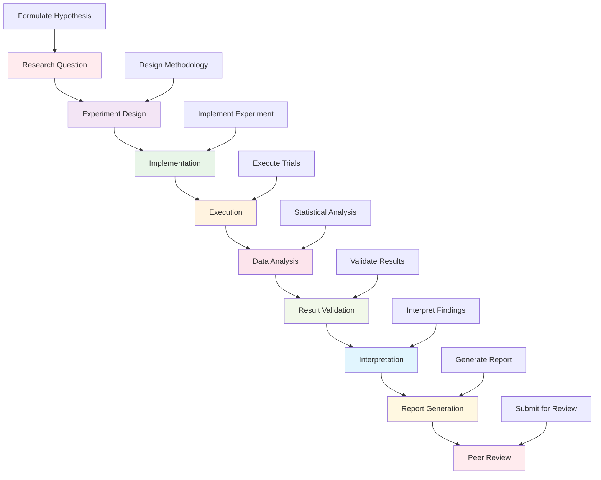

# Research Experiments Framework

This directory contains comprehensive tools and frameworks for conducting reproducible research experiments in Active Inference. It provides experiment design, execution, analysis, and reporting capabilities that ensure scientific rigor and reproducibility in Active Inference research.

## Overview

The research experiments framework offers a complete ecosystem for designing, executing, and analyzing Active Inference experiments. This includes experiment templates, automated execution pipelines, statistical analysis tools, and comprehensive reporting systems that support the full research lifecycle.

### Mission & Role

This experiments framework contributes to the research mission by:

- **Scientific Rigor**: Ensuring experiments follow rigorous scientific methodology
- **Reproducibility**: Enabling complete reproduction of research results
- **Experimentation Efficiency**: Streamlining the experiment design and execution process
- **Result Validation**: Providing comprehensive validation and statistical analysis
- **Research Collaboration**: Supporting collaborative and multi-institutional research

## Architecture

### Experiments Framework Structure

```
research/experiments/
├── templates/                # Experiment design templates
├── execution/                # Experiment execution engines
├── analysis/                 # Post-experiment analysis tools
├── validation/               # Experiment validation frameworks
├── reporting/                # Automated report generation
└── README.md                # This file
```

### Integration Points

**Platform Integration:**
- **Research Tools**: Integration with simulation and analysis frameworks
- **Data Management**: Connection with research data storage and processing
- **Visualization**: Integration with experiment visualization and monitoring
- **Knowledge Base**: Connection to theoretical foundations and educational content

**External Systems:**
- **Experiment Management**: Lab management software and experiment tracking systems
- **Data Analysis**: R, MATLAB, specialized statistical analysis software
- **Version Control**: Git integration for experiment versioning and reproducibility
- **Publication Systems**: Integration with academic writing and publication tools

## Experiment Categories

### Computational Experiments
Numerical and simulation-based experiments:
- **Model Comparison**: Systematic comparison of different Active Inference models
- **Parameter Studies**: Sensitivity analysis and parameter optimization
- **Scalability Testing**: Performance analysis with varying system sizes
- **Algorithm Validation**: Validation of inference algorithms and methods

### Simulation Experiments
Multi-scale simulation-based research:
- **Neural Simulations**: Experiments with neural implementations of Active Inference
- **Behavioral Simulations**: Models of behavior and decision-making
- **System Dynamics**: Complex system behavior analysis
- **Multi-Agent Simulations**: Experiments with multiple interacting agents

### Empirical Experiments
Real-world data and empirical validation:
- **Behavioral Studies**: Human subject experiments and behavioral analysis
- **Neural Recording**: Analysis of neural data using Active Inference models
- **Clinical Studies**: Clinical applications and treatment evaluation
- **Field Studies**: Real-world applications and deployment evaluation

### Validation Experiments
Comprehensive validation and benchmarking:
- **Benchmark Comparisons**: Validation against established benchmarks
- **Cross-Validation**: Robust validation using multiple methods
- **Robustness Testing**: Testing model robustness and generalization
- **Reproducibility Studies**: Verification of published results

## Getting Started

### Prerequisites
- **Research Methodology**: Understanding of experimental design and statistical analysis
- **Active Inference Theory**: Solid foundation in Active Inference concepts
- **Programming Skills**: Python programming with scientific computing
- **Statistical Knowledge**: Statistical analysis and hypothesis testing

### Basic Setup

```bash
# Install experiment framework dependencies
pip install numpy scipy pandas matplotlib seaborn
pip install scikit-learn statsmodels
pip install jupyter notebook  # For experiment notebooks

# Install specialized experiment tools
pip install mlflow  # Experiment tracking
pip install sacred  # Experiment configuration
pip install optuna  # Hyperparameter optimization

# Set up experiment environment
export EXPERIMENT_ENV="research"
export DATA_DIR="./experiment_data"
export RESULTS_DIR="./experiment_results"
```

### Initial Experiment Project

```python
# Basic experiment workflow
from research.experiments import ExperimentManager
from research.experiments.templates import ExperimentTemplate

# Initialize experiment system
experiment_manager = ExperimentManager(config)

# Select experiment template
template_config = {
    "experiment_type": "model_comparison",
    "domain": "active_inference",
    "validation_method": "cross_validation",
    "statistical_analysis": True
}

template = experiment_manager.get_experiment_template(template_config)

# Customize experiment for specific research question
research_question = {
    "hypothesis": "Active Inference improves multi-agent coordination",
    "independent_variables": ["model_type", "communication_level", "task_complexity"],
    "dependent_variables": ["coordination_efficiency", "task_performance", "communication_cost"]
}

experiment = template.customize_for_research(research_question)
```

## Usage Examples

### Example 1: Model Comparison Experiment

```python
# Conduct systematic model comparison experiment
from research.experiments.execution import ModelComparisonExperiment

# Define models to compare
models_config = {
    "baseline": {"model": "random_policy", "parameters": {}},
    "active_inference_basic": {"model": "active_inference", "parameters": {"inference_precision": 1.0}},
    "active_inference_advanced": {"model": "active_inference", "parameters": {"inference_precision": 5.0, "planning_horizon": 10}},
    "optimal_control": {"model": "optimal_control", "parameters": {"discount_factor": 0.95}}
}

# Set up comparison scenarios
scenarios_config = {
    "simple_task": {"environment": "grid_world", "complexity": "low", "duration": 100},
    "complex_task": {"environment": "continuous_control", "complexity": "high", "duration": 500},
    "multi_agent": {"environment": "multi_agent_coordination", "agents": 4, "duration": 200}
}

# Initialize comparison experiment
comparison_experiment = ModelComparisonExperiment(models_config, scenarios_config)

# Define evaluation metrics
evaluation_metrics = [
    "task_performance",
    "learning_efficiency",
    "computational_cost",
    "robustness",
    "interpretability"
]

comparison_experiment.set_evaluation_metrics(evaluation_metrics)

# Run comprehensive comparison
comparison_results = comparison_experiment.run_comparison(
    execution_config={
        "repetitions": 50,
        "parallel_execution": True,
        "statistical_validation": True,
        "cross_validation": True
    }
)

# Analyze and report results
analysis = comparison_experiment.analyze_results(comparison_results)
report = comparison_experiment.generate_comparison_report(analysis)
```

### Example 2: Parameter Sensitivity Analysis

```python
# Conduct parameter sensitivity analysis
from research.experiments.analysis import ParameterSensitivityAnalyzer

# Define parameter space
parameter_space = {
    "inference_precision": {"range": [0.1, 10.0], "type": "log", "steps": 20},
    "learning_rate": {"range": [0.001, 0.1], "type": "log", "steps": 15},
    "planning_horizon": {"range": [1, 50], "type": "linear", "steps": 10},
    "observation_noise": {"range": [0.01, 1.0], "type": "log", "steps": 12}
}

# Set up sensitivity analysis
sensitivity_config = {
    "method": "sobol",  # sobol, morris, fast
    "sample_size": 1000,
    "performance_metric": "expected_free_energy_minimization",
    "significance_threshold": 0.05
}

# Initialize sensitivity analyzer
sensitivity_analyzer = ParameterSensitivityAnalyzer(parameter_space, sensitivity_config)

# Define base experiment
base_experiment = {
    "model": "active_inference",
    "environment": "continuous_control",
    "task": "target_reaching",
    "evaluation_metric": "task_success_rate"
}

# Run sensitivity analysis
sensitivity_results = sensitivity_analyzer.run_sensitivity_analysis(base_experiment)

# Analyze parameter importance
importance_analysis = sensitivity_analyzer.analyze_parameter_importance(sensitivity_results)

# Identify critical parameters
critical_parameters = sensitivity_analyzer.identify_critical_parameters(importance_analysis)

# Generate sensitivity report
report = sensitivity_analyzer.generate_sensitivity_report(
    sensitivity_results, importance_analysis, critical_parameters
)
```

### Example 3: Multi-Agent Experiment

```python
# Conduct multi-agent Active Inference experiment
from research.experiments.execution import MultiAgentExperiment

# Define agent configurations
agent_configs = [
    {"id": "agent_1", "type": "explorer", "capabilities": ["navigation", "mapping"]},
    {"id": "agent_2", "type": "exploiter", "capabilities": ["resource_collection", "optimization"]},
    {"id": "agent_3", "type": "coordinator", "capabilities": ["communication", "planning"]},
    {"id": "agent_4", "type": "specialist", "capabilities": ["analysis", "prediction"]}
]

# Set up multi-agent environment
environment_config = {
    "type": "complex_environment",
    "size": [100, 100],
    "resources": 25,
    "dynamic_elements": True,
    "communication_channels": True
}

# Initialize multi-agent experiment
experiment = MultiAgentExperiment(agent_configs, environment_config)

# Define experimental conditions
experimental_conditions = [
    {"name": "no_communication", "communication_enabled": False},
    {"name": "limited_communication", "communication_enabled": True, "bandwidth": "low"},
    {"name": "full_communication", "communication_enabled": True, "bandwidth": "high"}
]

# Set up evaluation framework
evaluation_framework = {
    "individual_metrics": ["task_performance", "learning_rate", "adaptability"],
    "collective_metrics": ["coordination_efficiency", "resource_utilization", "system_stability"],
    "emergent_properties": ["collective_intelligence", "system_resilience", "adaptation_rate"]
}

experiment.set_evaluation_framework(evaluation_framework)

# Run experiment across conditions
results = experiment.run_experimental_conditions(experimental_conditions)

# Analyze emergent behaviors
emergence_analysis = experiment.analyze_emergent_behaviors(results)

# Generate comprehensive report
report = experiment.generate_multi_agent_report(results, emergence_analysis)
```

## Configuration

### Experiment Framework Configuration

```python
# Basic experiment configuration
experiment_config = {
    "system": {
        "environment": "research",  # research, production, educational
        "random_seed": 42,
        "reproducibility_level": "strict",
        "version_control": True
    },
    "execution": {
        "parallel_execution": True,
        "max_workers": 8,
        "timeout": 3600,  # seconds
        "auto_save": True,
        "checkpoint_frequency": 100
    },
    "validation": {
        "statistical_significance": 0.05,
        "power_analysis": True,
        "multiple_testing_correction": "bonferroni",
        "cross_validation_folds": 10
    },
    "reporting": {
        "auto_generate": True,
        "format": ["html", "pdf", "jupyter"],
        "include_code": True,
        "include_data": False
    }
}
```

### Advanced Experiment Configuration

```python
# Advanced experiment settings
advanced_config = {
    "performance": {
        "optimization_target": "throughput",
        "resource_monitoring": True,
        "distributed_execution": True,
        "gpu_utilization": True
    },
    "quality": {
        "validation_level": "comprehensive",
        "benchmark_comparison": True,
        "peer_review_integration": True,
        "reproducibility_checks": True
    },
    "integration": {
        "data_pipeline_integration": True,
        "result_database": True,
        "publication_system": True,
        "collaboration_tools": True
    },
    "compliance": {
        "ethical_review": True,
        "data_privacy": True,
        "safety_standards": True,
        "regulatory_compliance": True
    }
}
```

## API Reference

### Core Experiment Classes

#### `ExperimentManager`
Central management system for research experiments.

```python
class ExperimentManager:
    """Manage research experiments and experimental workflows"""

    def __init__(self, config: Dict[str, Any]):
        """Initialize experiment manager with configuration"""

    def create_experiment(self, experiment_config: Dict[str, Any]) -> Experiment:
        """Create new research experiment"""

    def run_experiment(self, experiment: Experiment, execution_config: Dict[str, Any]) -> ExperimentResults:
        """Execute experiment with specified configuration"""

    def analyze_results(self, results: ExperimentResults, analysis_config: Dict[str, Any]) -> AnalysisResults:
        """Analyze experiment results"""

    def validate_experiment(self, experiment: Experiment) -> ValidationReport:
        """Validate experiment design and methodology"""

    def generate_report(self, results: ExperimentResults, report_config: Dict[str, Any]) -> ExperimentReport:
        """Generate comprehensive experiment report"""
```

#### `ExperimentTemplate`
Template system for standardized experiments.

```python
class ExperimentTemplate:
    """Template for standardized research experiments"""

    def __init__(self, template_type: str, config: Dict[str, Any]):
        """Initialize experiment template"""

    def customize_for_domain(self, domain_config: Dict[str, Any]) -> CustomizedTemplate:
        """Customize template for specific research domain"""

    def validate_template(self, validation_config: Dict[str, Any]) -> ValidationResult:
        """Validate template completeness and correctness"""

    def generate_experiment(self, research_question: Dict[str, Any]) -> Experiment:
        """Generate complete experiment from research question"""

    def add_validation_framework(self, experiment: Experiment) -> ValidatedExperiment:
        """Add comprehensive validation framework"""

    def optimize_for_reproducibility(self, experiment: Experiment) -> ReproducibleExperiment:
        """Optimize experiment for maximum reproducibility"""
```

#### `ResultAnalyzer`
Comprehensive analysis of experimental results.

```python
class ResultAnalyzer:
    """Analyze and interpret experimental results"""

    def __init__(self, config: Dict[str, Any]):
        """Initialize result analyzer with configuration"""

    def perform_statistical_analysis(self, results: ExperimentResults) -> StatisticalAnalysis:
        """Perform comprehensive statistical analysis"""

    def calculate_effect_sizes(self, results: ExperimentResults) -> EffectSizeAnalysis:
        """Calculate and interpret effect sizes"""

    def analyze_power_and_sensitivity(self, results: ExperimentResults) -> PowerAnalysis:
        """Analyze statistical power and sensitivity"""

    def validate_reproducibility(self, results: ExperimentResults) -> ReproducibilityReport:
        """Validate experiment reproducibility"""

    def generate_interpretation(self, analysis: StatisticalAnalysis) -> InterpretationReport:
        """Generate scientific interpretation of results"""
```

## Experiment Workflows

### Standard Experiment Pipeline



### Advanced Experiment Patterns

```python
# Multi-stage experiment workflow
def conduct_multi_stage_experiment(experiment_plan: Dict[str, Any]) -> MultiStageResults:
    """Conduct experiment with multiple stages and validation"""

    # Stage 1: Pilot study
    pilot_results = conduct_pilot_study(experiment_plan)

    # Stage 2: Power analysis and refinement
    power_analysis = analyze_statistical_power(pilot_results)
    refined_plan = refine_experiment_design(experiment_plan, power_analysis)

    # Stage 3: Main experiment
    main_results = conduct_main_experiment(refined_plan)

    # Stage 4: Validation study
    validation_results = conduct_validation_study(main_results)

    # Stage 5: Meta-analysis
    meta_analysis = perform_meta_analysis([pilot_results, main_results, validation_results])

    # Generate comprehensive report
    comprehensive_report = generate_comprehensive_experiment_report(meta_analysis)

    return MultiStageResults(
        pilot=pilot_results,
        power_analysis=power_analysis,
        main=main_results,
        validation=validation_results,
        meta_analysis=meta_analysis,
        report=comprehensive_report
    )

# Reproducibility validation workflow
def validate_experiment_reproducibility(original_experiment: Experiment, replication_config: Dict[str, Any]) -> ReproducibilityReport:
    """Validate experiment reproducibility through systematic replication"""

    # Set up replication environment
    replication_environment = setup_replication_environment(replication_config)

    # Attempt exact replication
    exact_replication = attempt_exact_replication(original_experiment, replication_environment)

    # Attempt conceptual replication
    conceptual_replication = attempt_conceptual_replication(original_experiment, replication_environment)

    # Analyze replication results
    replication_analysis = analyze_replication_results(exact_replication, conceptual_replication)

    # Validate statistical consistency
    statistical_validation = validate_statistical_consistency(replication_analysis)

    # Generate reproducibility report
    reproducibility_report = generate_reproducibility_report(
        exact_replication, conceptual_replication, replication_analysis, statistical_validation
    )

    return reproducibility_report
```

## Contributing

### Experiment Framework Standards

When contributing to the experiment framework:

1. **Scientific Rigor**: Ensure all experiments follow rigorous scientific methodology
2. **Reproducibility**: Implement complete reproducibility from the start
3. **Statistical Soundness**: Use appropriate statistical methods and validation
4. **Documentation Completeness**: Provide comprehensive experiment documentation
5. **Ethical Compliance**: Follow research ethics and responsible conduct guidelines

### Experiment Framework Contribution Process

1. **Identify Research Gap**: Find missing or inadequate experimental frameworks
2. **Design Experiment System**: Create comprehensive experiment design and execution
3. **Implement Validation**: Develop robust validation and analysis methods
4. **Test Reproducibility**: Ensure complete reproducibility of results
5. **Document Methods**: Provide comprehensive documentation and examples
6. **Submit for Review**: Follow scientific review process for experiment frameworks

## Related Documentation

- **[Research Framework](../../research/README.md)**: Overview of research tools and methods
- **[Analysis Tools](../../research/analysis/README.md)**: Statistical analysis and validation
- **[Simulation Systems](../../research/simulations/README.md)**: Multi-scale simulation frameworks
- **[Benchmarking](../../research/benchmarks/README.md)**: Performance evaluation and comparison
- **[Data Management](../../research/data_management/README.md)**: Research data handling and validation

---

**Research Experiments Framework Version**: 1.0.0 | **Last Updated**: October 2024 | **Development Status**: Active Development

*"Active Inference for, with, by Generative AI"* - Advancing Active Inference research through rigorous experimentation, comprehensive validation, and reproducible scientific methods.