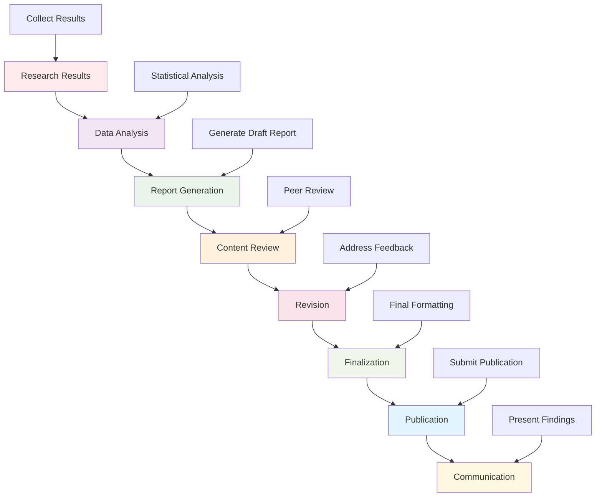

# Research Reporting Framework

This directory contains comprehensive tools and frameworks for scientific reporting, publication, and communication in the Active Inference Knowledge Environment. It provides automated report generation, publication workflows, and presentation systems that ensure high-quality scientific communication.

## Overview

The research reporting framework offers a complete ecosystem for transforming research results into professional publications, presentations, and communications. This includes automated report generation, publication workflows, visualization tools, and presentation systems that support the full lifecycle of scientific communication.

### Mission & Role

This reporting framework contributes to the research mission by:

- **Scientific Communication**: Enabling clear, professional scientific communication
- **Publication Efficiency**: Streamlining the publication and dissemination process
- **Impact Maximization**: Maximizing research impact through effective communication
- **Reproducibility**: Ensuring research reports are complete and reproducible
- **Collaboration**: Supporting collaborative writing and review processes

## Architecture

### Reporting Framework Structure

```
research/reporting/
├── generation/             # Automated report generation
├── documentation/          # Technical documentation generation
├── publication/            # Publication workflow management
├── presentation/           # Presentation and visualization tools
├── templates/             # Report and publication templates
└── README.md             # This file
```

### Integration Points

**Platform Integration:**
- **Research Framework**: Integration with experiment execution and analysis results
- **Knowledge Base**: Connection to research findings and educational content
- **Visualization**: Integration with scientific visualization and presentation tools
- **Collaboration**: Support for collaborative writing and review processes

**External Systems:**
- **Publication Platforms**: Integration with academic journals and preprint servers
- **Document Systems**: LaTeX, Markdown, and professional document generation
- **Presentation Tools**: Integration with presentation software and visualization platforms
- **Reference Management**: Citation and bibliography management systems

## Reporting Categories

### Automated Report Generation
Intelligent report creation from research results:
- **Experiment Reports**: Automated generation from experimental results
- **Analysis Reports**: Statistical analysis and interpretation reports
- **Validation Reports**: Model validation and benchmarking reports
- **Progress Reports**: Research progress and milestone reports

### Scientific Documentation
Technical documentation and methodology reporting:
- **Method Documentation**: Detailed methodology and implementation documentation
- **Code Documentation**: Automated code documentation and API generation
- **Data Documentation**: Dataset documentation and provenance tracking
- **Process Documentation**: Research process and workflow documentation

### Publication Workflows
Professional publication and dissemination:
- **Manuscript Preparation**: Automated manuscript formatting and preparation
- **Peer Review Integration**: Integration with peer review processes and feedback
- **Revision Management**: Version control and revision tracking for manuscripts
- **Submission Automation**: Automated submission to journals and conferences

### Presentation Systems
Visual communication and presentation tools:
- **Slide Generation**: Automated slide deck creation from research content
- **Poster Creation**: Research poster generation and design
- **Visualization Integration**: Integration of research visualizations into presentations
- **Interactive Presentations**: Interactive presentation and demonstration tools

## Getting Started

### Prerequisites
- **Scientific Writing**: Understanding of scientific writing and publication standards
- **Document Generation**: Knowledge of document formatting and publication tools
- **Visualization**: Understanding of scientific visualization and presentation
- **Research Methods**: Familiarity with research methodology and reporting standards

### Basic Setup

```bash
# Install reporting framework dependencies
pip install jinja2 pypandoc reportlab
pip install sphinx sphinx-rtd-theme  # Documentation generation
pip install jupyter-book  # Interactive documentation
pip install matplotlib seaborn plotly  # Visualization

# Install publication tools
pip install pandoc-citeproc bibtexparser  # Citation management
pip install manubot  # Collaborative manuscript writing
pip install jupyterlab  # Interactive environments

# Set up reporting environment
export REPORTING_ENV="research"
export TEMPLATE_DIR="./research/reporting/templates"
export OUTPUT_DIR="./research_outputs"
```

### Initial Reporting Project

```python
# Basic reporting workflow
from research.reporting import ReportingManager
from research.reporting.generation import ReportGenerator

# Initialize reporting system
reporting_manager = ReportingManager(config)

# Generate research report
report_config = {
    "report_type": "experiment_summary",
    "research_data": experiment_results,
    "analysis_results": statistical_analysis,
    "visualizations": generated_plots,
    "template": "scientific_paper"
}

report = reporting_manager.generate_report(report_config)

# Export in multiple formats
reporting_manager.export_report(report, formats=["pdf", "html", "latex"])
```

## Usage Examples

### Example 1: Automated Experiment Report Generation

```python
# Generate comprehensive experiment report
from research.reporting.generation import ExperimentReportGenerator

# Define experiment results
experiment_results = {
    "experiment_id": "aif_model_comparison_001",
    "hypothesis": "Active Inference improves multi-agent coordination",
    "methods": {
        "models": ["baseline", "active_inference_basic", "active_inference_advanced"],
        "environments": ["simple_grid", "complex_maze", "dynamic_environment"],
        "metrics": ["task_performance", "coordination_efficiency", "learning_rate"]
    },
    "results": {
        "performance_data": performance_measurements,
        "statistical_analysis": statistical_results,
        "significance_tests": hypothesis_tests
    },
    "conclusions": experiment_conclusions
}

# Initialize report generator
report_generator = ExperimentReportGenerator()

# Generate comprehensive report
report = report_generator.generate_experiment_report(
    experiment_results,
    report_config={
        "template": "scientific_manuscript",
        "sections": ["abstract", "introduction", "methods", "results", "discussion", "conclusion"],
        "include_code": True,
        "include_data": False,
        "citations": True,
        "peer_review_format": True
    }
)

# Add visualizations
report.add_visualizations([
    "performance_comparison.png",
    "statistical_analysis.png",
    "learning_curves.png"
])

# Export report
report.export("experiment_report.pdf")
```

### Example 2: Scientific Publication Workflow

```python
# Manage scientific publication workflow
from research.reporting.publication import PublicationManager

# Initialize publication workflow
publication_manager = PublicationManager()

# Prepare manuscript for submission
manuscript_config = {
    "title": "Active Inference in Multi-Agent Systems",
    "authors": ["Researcher A", "Researcher B", "Researcher C"],
    "abstract": manuscript_abstract,
    "keywords": ["active inference", "multi-agent systems", "coordination"],
    "content": manuscript_content,
    "references": reference_list,
    "figures": manuscript_figures,
    "supplementary_materials": supplementary_data
}

manuscript = publication_manager.prepare_manuscript(manuscript_config)

# Format for journal submission
journal_config = {
    "journal": "Nature Machine Intelligence",
    "format": "single_column",
    "word_limit": 8000,
    "figure_limit": 6,
    "reference_style": "nature"
}

formatted_manuscript = publication_manager.format_for_journal(manuscript, journal_config)

# Generate submission package
submission_package = publication_manager.create_submission_package(
    formatted_manuscript,
    package_config={
        "cover_letter": True,
        "conflict_of_interest": True,
        "data_availability": True,
        "code_availability": True,
        "peer_review_history": False
    }
)

# Submit to journal (metadata only)
submission_result = publication_manager.submit_manuscript(submission_package, journal_config)
```

### Example 3: Interactive Presentation Generation

```python
# Generate interactive research presentation
from research.reporting.presentation import PresentationGenerator

# Define presentation content
presentation_content = {
    "title": "Active Inference: A Unified Theory of Intelligence",
    "sections": [
        {
            "title": "Introduction",
            "content": introduction_content,
            "visualizations": ["aif_overview_diagram.png"]
        },
        {
            "title": "Theoretical Foundations",
            "content": theory_content,
            "visualizations": ["free_energy_principle.png", "active_inference_diagram.png"]
        },
        {
            "title": "Applications",
            "content": applications_content,
            "visualizations": ["robotics_application.png", "neuroscience_application.png"]
        },
        {
            "title": "Results",
            "content": results_content,
            "visualizations": ["performance_comparison.png", "validation_results.png"]
        },
        {
            "title": "Future Directions",
            "content": future_content,
            "visualizations": ["research_roadmap.png"]
        }
    ],
    "style": "scientific_presentation",
    "duration": 45,  # minutes
    "audience": "expert_researchers"
}

# Initialize presentation generator
presentation_generator = PresentationGenerator()

# Generate presentation
presentation = presentation_generator.generate_presentation(
    presentation_content,
    generation_config={
        "format": "powerpoint",
        "interactive_elements": True,
        "animation_timing": "automatic",
        "speaker_notes": True,
        "handout_version": True
    }
)

# Add interactive elements
presentation.add_interactive_elements([
    {"type": "model_explorer", "section": "Theoretical Foundations"},
    {"type": "results_dashboard", "section": "Results"},
    {"type": "simulation_demo", "section": "Applications"}
])

# Export presentation
presentation.export("active_inference_presentation.pptx")
presentation.export("presentation_handout.pdf")
```

## Configuration

### Reporting Framework Configuration

```python
# Basic reporting configuration
reporting_config = {
    "system": {
        "environment": "research",  # research, publication, presentation
        "output_directory": "./research_outputs",
        "template_directory": "./research/reporting/templates",
        "cache_directory": "./report_cache"
    },
    "generation": {
        "default_format": "pdf",
        "supported_formats": ["pdf", "html", "latex", "docx", "markdown"],
        "quality_settings": "high",
        "compression": "optimal"
    },
    "templates": {
        "style_guide": "scientific",
        "citation_style": "apa",
        "language": "english",
        "accessibility": True
    },
    "automation": {
        "auto_save": True,
        "version_control": True,
        "backup_frequency": "daily",
        "error_recovery": True
    }
}
```

### Advanced Reporting Configuration

```python
# Advanced reporting settings
advanced_config = {
    "intelligence": {
        "content_analysis": True,
        "style_optimization": True,
        "impact_prediction": True,
        "peer_review_integration": True
    },
    "collaboration": {
        "multi_author_support": True,
        "version_control_integration": True,
        "review_workflow": True,
        "comment_system": True
    },
    "analytics": {
        "usage_tracking": True,
        "impact_measurement": True,
        "publication_metrics": True,
        "engagement_analytics": True
    },
    "integration": {
        "research_platform_integration": True,
        "publication_system_integration": True,
        "presentation_platform_integration": True,
        "collaboration_tool_integration": True
    }
}
```

## API Reference

### Core Reporting Classes

#### `ReportingManager`
Central management system for all reporting functionality.

```python
class ReportingManager:
    """Manage comprehensive scientific reporting and communication"""

    def __init__(self, config: Dict[str, Any]):
        """Initialize reporting manager with configuration"""

    def generate_report(self, content: Any, report_config: Dict[str, Any]) -> Report:
        """Generate comprehensive report from research content"""

    def export_report(self, report: Report, formats: List[str]) -> Dict[str, str]:
        """Export report in multiple formats"""

    def manage_publication(self, manuscript: Manuscript, workflow_config: Dict[str, Any]) -> PublicationWorkflow:
        """Manage publication workflow for manuscript"""

    def create_presentation(self, content: Any, presentation_config: Dict[str, Any]) -> Presentation:
        """Create presentation from research content"""

    def validate_report(self, report: Report) -> ValidationReport:
        """Validate report quality and completeness"""
```

#### `ReportGenerator`
Automated report generation from research data.

```python
class ReportGenerator:
    """Generate automated reports from research results"""

    def __init__(self, config: Dict[str, Any]):
        """Initialize report generator with configuration"""

    def generate_experiment_report(self, experiment_data: Dict[str, Any]) -> ExperimentReport:
        """Generate comprehensive experiment report"""

    def generate_analysis_report(self, analysis_data: Dict[str, Any]) -> AnalysisReport:
        """Generate statistical analysis report"""

    def generate_validation_report(self, validation_data: Dict[str, Any]) -> ValidationReport:
        """Generate model validation report"""

    def generate_progress_report(self, progress_data: Dict[str, Any]) -> ProgressReport:
        """Generate research progress report"""

    def customize_report_template(self, template: str, customizations: Dict[str, Any]) -> CustomTemplate:
        """Customize report template for specific needs"""
```

#### `PublicationManager`
Professional publication workflow management.

```python
class PublicationManager:
    """Manage scientific publication workflows and processes"""

    def __init__(self, config: Dict[str, Any]):
        """Initialize publication manager with configuration"""

    def prepare_manuscript(self, content: Dict[str, Any]) -> Manuscript:
        """Prepare manuscript for publication"""

    def format_for_journal(self, manuscript: Manuscript, journal_config: Dict[str, Any]) -> FormattedManuscript:
        """Format manuscript for specific journal requirements"""

    def create_submission_package(self, manuscript: Manuscript, package_config: Dict[str, Any]) -> SubmissionPackage:
        """Create complete submission package"""

    def manage_revisions(self, manuscript: Manuscript, revision_config: Dict[str, Any]) -> RevisionHistory:
        """Manage manuscript revisions and version control"""

    def track_publication_metrics(self, publication_id: str) -> PublicationMetrics:
        """Track publication impact and metrics"""
```

## Reporting Workflows

### Standard Scientific Reporting Pipeline



### Advanced Publication Patterns

```python
# Collaborative manuscript development workflow
def manage_collaborative_manuscript(manuscript_config: Dict[str, Any]) -> CollaborativeManuscript:
    """Manage collaborative manuscript development with multiple authors"""

    # Initialize collaborative environment
    collaboration_env = setup_collaboration_environment(manuscript_config)

    # Set up version control and conflict resolution
    version_control = setup_manuscript_version_control(manuscript_config)

    # Enable real-time collaboration
    real_time_collaboration = enable_real_time_editing(manuscript_config)

    # Set up review and feedback system
    review_system = setup_peer_review_system(manuscript_config)

    # Integrate with research platform
    platform_integration = integrate_with_research_platform(manuscript_config)

    # Generate collaborative manuscript
    collaborative_manuscript = generate_collaborative_manuscript({
        "collaboration_env": collaboration_env,
        "version_control": version_control,
        "real_time": real_time_collaboration,
        "review_system": review_system,
        "platform_integration": platform_integration
    })

    # Validate collaboration quality
    collaboration_validation = validate_collaboration_quality(collaborative_manuscript)

    return CollaborativeManuscript(
        manuscript=collaborative_manuscript,
        collaboration=collaboration_env,
        validation=collaboration_validation
    )

# Automated publication workflow
def execute_automated_publication_workflow(manuscript: Manuscript, publication_config: Dict[str, Any]) -> PublicationResult:
    """Execute complete automated publication workflow"""

    # Pre-submission preparation
    prepared_manuscript = prepare_manuscript_for_submission(manuscript, publication_config)

    # Journal selection and formatting
    formatted_manuscript = format_for_target_journal(prepared_manuscript, publication_config)

    # Automated submission
    submission_result = submit_manuscript_automatically(formatted_manuscript, publication_config)

    # Post-submission monitoring
    monitoring_system = setup_submission_monitoring(submission_result, publication_config)

    # Revision management
    revision_manager = setup_revision_management(submission_result, publication_config)

    # Publication tracking
    publication_tracker = setup_publication_tracking(submission_result, publication_config)

    # Generate comprehensive publication report
    publication_report = generate_publication_workflow_report({
        "prepared_manuscript": prepared_manuscript,
        "formatted_manuscript": formatted_manuscript,
        "submission_result": submission_result,
        "monitoring_system": monitoring_system,
        "revision_manager": revision_manager,
        "publication_tracker": publication_tracker
    })

    return PublicationResult(
        manuscript=prepared_manuscript,
        submission=submission_result,
        monitoring=monitoring_system,
        revisions=revision_manager,
        tracking=publication_tracker,
        report=publication_report
    )
```

## Contributing

### Reporting Framework Standards

When contributing to the reporting framework:

1. **Scientific Standards**: Ensure all reporting meets scientific publication standards
2. **Reproducibility**: Include complete reproducibility information and code
3. **Accessibility**: Make reports accessible to diverse audiences and formats
4. **Automation**: Focus on automation while maintaining scientific rigor
5. **Integration**: Ensure seamless integration with research and publication workflows

### Reporting Framework Contribution Process

1. **Identify Communication Gap**: Find missing or inadequate scientific communication tools
2. **Design Reporting Solution**: Create comprehensive reporting and publication workflows
3. **Implement Automation**: Develop automated report generation and formatting systems
4. **Validate Scientific Quality**: Ensure reports meet scientific standards and reproducibility requirements
5. **Document Usage**: Provide comprehensive documentation for reporting workflows
6. **Submit for Review**: Follow scientific review process for reporting framework contributions

## Related Documentation

- **[Research Framework](../../research/README.md)**: Overview of research tools and methods
- **[Analysis Framework](../../research/analysis/README.md)**: Statistical analysis and validation
- **[Experiment Framework](../../research/experiments/README.md)**: Experimental design and execution
- **[Visualization Framework](../../../src/active_inference/visualization/README.md)**: Scientific visualization tools
- **[Collaboration Framework](../../../platform/collaboration/README.md)**: Collaborative research and writing

---

**Research Reporting Framework Version**: 1.0.0 | **Last Updated**: October 2024 | **Development Status**: Active Development

*"Active Inference for, with, by Generative AI"* - Enabling professional scientific communication through automated reporting, comprehensive publication workflows, and effective research dissemination.