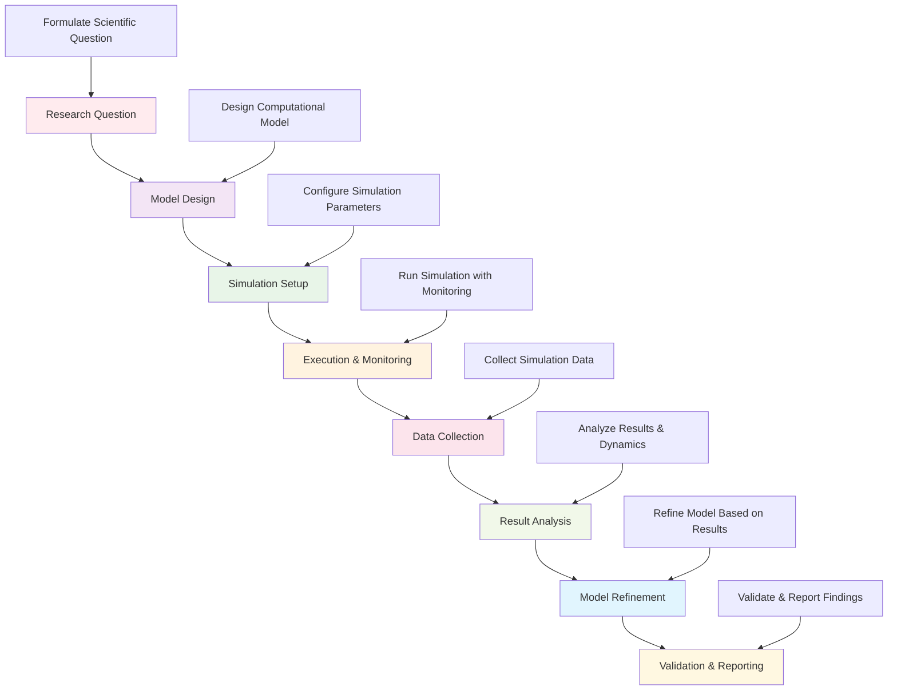

# Research Simulations Framework

This directory contains comprehensive simulation frameworks and tools for the Active Inference Knowledge Environment. It provides multi-scale simulation capabilities for neural, cognitive, and behavioral modeling, enabling rigorous testing and validation of Active Inference theories and implementations.

## Overview

The research simulations framework offers a complete ecosystem for creating, executing, and analyzing simulations of Active Inference systems. This includes neural network simulations, cognitive process modeling, behavioral simulations, and multi-agent systems that support the full spectrum of Active Inference research from theory to application.

### Mission & Role

This simulations framework contributes to the research mission by:

- **Theoretical Validation**: Providing simulation environments for testing Active Inference theories
- **Implementation Testing**: Enabling comprehensive testing of Active Inference implementations
- **Multi-Scale Modeling**: Supporting simulations across neural, cognitive, and behavioral scales
- **Research Acceleration**: Enabling rapid prototyping and iteration of research ideas
- **Educational Demonstration**: Providing interactive demonstrations of Active Inference principles

## Architecture

### Simulations Framework Structure

```
research/simulations/
├── neural/                 # Neural network and brain-inspired simulations
├── cognitive/              # Cognitive process and mental model simulations
├── behavioral/             # Behavioral and decision-making simulations
├── multi_agent/            # Multi-agent and social simulation systems
├── environments/           # Simulation environments and scenarios
└── analysis/               # Simulation analysis and visualization tools
```

### Integration Points

**Platform Integration:**
- **Research Framework**: Integration with theoretical models and research questions
- **Experiment Framework**: Support for experimental design and hypothesis testing
- **Analysis Tools**: Integration with statistical analysis and result interpretation
- **Visualization**: Connection with simulation visualization and monitoring tools

**External Systems:**
- **Simulation Engines**: Brian2, NEST, NEURON for neural simulations
- **Scientific Computing**: NumPy, SciPy, PyTorch for computational simulations
- **Multi-Agent Platforms**: Mesa, NetLogo for agent-based simulations
- **Visualization Tools**: Matplotlib, Mayavi, Paraview for simulation visualization

## Simulation Categories

### Neural Simulations
Brain-inspired and neural network simulations:
- **Neural Dynamics**: Simulations of neural activity and synaptic plasticity
- **Predictive Coding**: Implementation of predictive coding networks
- **Active Inference Networks**: Neural implementations of Active Inference
- **Brain Area Models**: Simulations of specific brain regions and functions

### Cognitive Simulations
Mental processes and cognitive modeling:
- **Perception Models**: Models of sensory processing and perception
- **Decision Making**: Cognitive models of decision-making processes
- **Learning Models**: Simulations of learning and adaptation mechanisms
- **Memory Systems**: Models of memory formation and retrieval

### Behavioral Simulations
Behavioral and action-oriented simulations:
- **Motor Control**: Simulations of motor planning and execution
- **Action Selection**: Models of action selection and policy optimization
- **Goal-Directed Behavior**: Simulations of goal-directed and purposeful behavior
- **Behavioral Adaptation**: Models of behavioral learning and adaptation

### Multi-Agent Simulations
Social and multi-agent system simulations:
- **Agent Interactions**: Simulations of multiple interacting agents
- **Social Learning**: Models of social learning and cultural transmission
- **Collective Behavior**: Emergent collective behaviors and coordination
- **Communication Models**: Simulations of communication and information sharing

## Getting Started

### Prerequisites
- **Active Inference Theory**: Understanding of Active Inference principles and mathematics
- **Simulation Methods**: Knowledge of simulation techniques and modeling approaches
- **Scientific Computing**: Proficiency in scientific computing and numerical methods
- **Research Methods**: Understanding of experimental design and validation

### Basic Setup

```bash
# Install simulation framework dependencies
pip install numpy scipy matplotlib seaborn
pip install torch tensorflow brian2  # Neural simulations
pip install mesa networkx  # Multi-agent simulations
pip install mayavi pyvista  # 3D visualization

# Install specialized simulation libraries
pip install neurolib  # Neural simulation library
pip install pymdp  # Active Inference simulation toolkit
pip install dm_control  # Control and robotics simulations

# Set up simulation environment
export SIMULATION_ENV="research"
export BACKEND="torch"  # or tensorflow
export VISUALIZATION="enabled"
```

### Initial Simulation Project

```python
# Basic simulation workflow
from research.simulations import SimulationManager
from research.simulations.neural import NeuralSimulator

# Initialize simulation system
simulation_manager = SimulationManager(config)

# Set up neural simulation
neural_config = {
    "model_type": "active_inference_network",
    "network_architecture": "hierarchical_predictive_coding",
    "learning_rule": "surprise_minimization",
    "plasticity_mechanism": "spike_timing_dependent"
}

neural_simulator = NeuralSimulator(neural_config)

# Define simulation scenario
simulation_scenario = {
    "duration": 1000,  # time steps
    "input_sequence": "sensory_stimuli",
    "task": "perceptual_inference",
    "evaluation_metrics": ["prediction_accuracy", "surprise_reduction", "learning_efficiency"]
}

# Run simulation
simulation_result = neural_simulator.run_simulation(simulation_scenario)

# Analyze results
analysis = neural_simulator.analyze_simulation_results(simulation_result)
```

## Usage Examples

### Example 1: Neural Active Inference Simulation

```python
# Implement neural simulation of Active Inference
from research.simulations.neural import ActiveInferenceNeuralNetwork
from research.simulations.analysis import SimulationAnalyzer

# Define neural network architecture
network_config = {
    "layers": [
        {"type": "sensory", "neurons": 100, "plasticity": "hebbian"},
        {"type": "predictive", "neurons": 50, "plasticity": "predictive_coding"},
        {"type": "action", "neurons": 20, "plasticity": "reinforcement_learning"}
    ],
    "connections": {
        "feedforward": "hierarchical",
        "feedback": "predictive",
        "lateral": "competitive"
    },
    "learning_rules": {
        "prediction_error": "delta_rule",
        "precision_weighting": "attention_modulated",
        "policy_optimization": "expected_free_energy"
    }
}

# Initialize Active Inference neural network
active_inference_network = ActiveInferenceNeuralNetwork(network_config)

# Set up simulation environment
environment_config = {
    "sensory_input": "time_varying_signals",
    "task_structure": "sequential_decision_making",
    "uncertainty_level": "moderate",
    "feedback_delay": "variable"
}

active_inference_network.setup_environment(environment_config)

# Run learning simulation
learning_config = {
    "episodes": 1000,
    "trial_length": 100,
    "learning_rate": 0.01,
    "exploration_rate": 0.1,
    "evaluation_interval": 50
}

learning_results = active_inference_network.run_learning_simulation(learning_config)

# Analyze learning dynamics
analyzer = SimulationAnalyzer()
learning_analysis = analyzer.analyze_learning_dynamics(learning_results)

# Generate simulation report
report = analyzer.generate_simulation_report(learning_results, learning_analysis)
```

### Example 2: Cognitive Decision-Making Simulation

```python
# Implement cognitive simulation of decision making
from research.simulations.cognitive import CognitiveDecisionMaker
from research.simulations.environments import DecisionEnvironment

# Define cognitive architecture
cognitive_config = {
    "belief_system": {
        "representation": "probabilistic_graphical_model",
        "inference_engine": "variational_message_passing",
        "memory_system": "working_memory_buffer"
    },
    "decision_system": {
        "policy_representation": "expected_free_energy_minimization",
        "planning_horizon": 5,
        "risk_sensitivity": "adaptive",
        "learning_mechanism": "policy_gradient"
    },
    "attention_system": {
        "precision_weighting": "uncertainty_driven",
        "resource_allocation": "value_based",
        "salience_detection": "surprise_based"
    }
}

# Initialize cognitive decision maker
decision_maker = CognitiveDecisionMaker(cognitive_config)

# Set up decision environment
environment = DecisionEnvironment({
    "task_type": "multi_attribute_decision",
    "options": ["option_a", "option_b", "option_c"],
    "attributes": ["reward_probability", "effort_cost", "time_delay"],
    "uncertainty": "stochastic_outcomes",
    "feedback": "delayed_partial"
})

# Run decision-making simulation
simulation_config = {
    "trials": 500,
    "decision_horizon": 10,
    "learning_enabled": True,
    "adaptation_enabled": True,
    "performance_tracking": True
}

decision_simulation = decision_maker.run_decision_simulation(environment, simulation_config)

# Analyze decision patterns
decision_analysis = decision_maker.analyze_decision_patterns(decision_simulation)

# Evaluate decision quality
quality_metrics = decision_maker.evaluate_decision_quality(decision_simulation)
```

### Example 3: Multi-Agent Social Simulation

```python
# Implement multi-agent social simulation
from research.simulations.multi_agent import MultiAgentSimulator
from research.simulations.environments import SocialEnvironment

# Define agent populations
agent_populations = {
    "explorers": {
        "count": 20,
        "behavior_model": "curiosity_driven",
        "communication_style": "information_sharing",
        "learning_objective": "environmental_mapping"
    },
    "exploiters": {
        "count": 15,
        "behavior_model": "efficiency_optimized",
        "communication_style": "resource_coordination",
        "learning_objective": "resource_maximization"
    },
    "coordinators": {
        "count": 10,
        "behavior_model": "social_cooperation",
        "communication_style": "consensus_building",
        "learning_objective": "group_optimization"
    }
}

# Initialize multi-agent simulator
multi_agent_simulator = MultiAgentSimulator(agent_populations)

# Set up social environment
social_environment = SocialEnvironment({
    "spatial_layout": "grid_world",
    "resources": "distributed_scarce",
    "communication_channels": "local_broadcast",
    "social_norms": "cooperation_encouraged",
    "environmental_dynamics": "changing_conditions"
})

# Configure simulation parameters
simulation_parameters = {
    "duration": 2000,
    "time_step": 0.1,
    "parallel_execution": True,
    "real_time_monitoring": True,
    "data_collection": "comprehensive"
}

# Run multi-agent simulation
multi_agent_simulation = multi_agent_simulator.run_simulation(
    social_environment, simulation_parameters
)

# Analyze emergent behaviors
emergence_analysis = multi_agent_simulator.analyze_emergent_behaviors(multi_agent_simulation)

# Evaluate social dynamics
social_evaluation = multi_agent_simulator.evaluate_social_dynamics(multi_agent_simulation)
```

## Configuration

### Simulation Framework Configuration

```python
# Basic simulation configuration
simulation_config = {
    "system": {
        "environment": "research",  # research, development, educational
        "backend": "torch",  # torch, tensorflow, numpy
        "parallel_processing": True,
        "gpu_acceleration": True
    },
    "execution": {
        "time_stepping": "adaptive",
        "numerical_precision": "double",
        "stability_checking": True,
        "checkpointing": True
    },
    "analysis": {
        "real_time_analysis": True,
        "statistical_validation": True,
        "convergence_monitoring": True,
        "performance_tracking": True
    },
    "visualization": {
        "real_time_visualization": True,
        "interactive_controls": True,
        "data_export": True,
        "publication_quality": True
    }
}
```

### Advanced Simulation Configuration

```python
# Advanced simulation settings
advanced_config = {
    "performance": {
        "optimization_target": "accuracy",  # accuracy, speed, memory
        "precision_adaptation": True,
        "memory_optimization": True,
        "computational_scaling": "adaptive"
    },
    "validation": {
        "mathematical_correctness": True,
        "scientific_accuracy": True,
        "numerical_stability": True,
        "reproducibility_checks": True
    },
    "scalability": {
        "distributed_simulation": True,
        "multi_scale_modeling": True,
        "hierarchical_simulation": True,
        "adaptive_resolution": True
    },
    "integration": {
        "experiment_framework": True,
        "analysis_tools": True,
        "visualization_system": True,
        "data_management": True
    }
}
```

## API Reference

### Core Simulation Classes

#### `SimulationManager`
Central management system for all simulation types.

```python
class SimulationManager:
    """Manage comprehensive simulation frameworks and execution"""

    def __init__(self, config: Dict[str, Any]):
        """Initialize simulation manager with configuration"""

    def create_simulation(self, simulation_type: str, config: Dict[str, Any]) -> BaseSimulation:
        """Create simulation of specified type"""

    def run_simulation(self, simulation: BaseSimulation, execution_config: Dict[str, Any]) -> SimulationResults:
        """Execute simulation with specified configuration"""

    def analyze_results(self, results: SimulationResults, analysis_config: Dict[str, Any]) -> AnalysisResults:
        """Analyze simulation results"""

    def validate_simulation(self, simulation: BaseSimulation) -> ValidationReport:
        """Validate simulation setup and configuration"""

    def visualize_simulation(self, simulation: BaseSimulation, visualization_config: Dict[str, Any]) -> Visualization:
        """Create visualization of simulation"""
```

#### `NeuralSimulator`
Specialized simulator for neural and brain-inspired systems.

```python
class NeuralSimulator:
    """Simulate neural systems and brain-inspired computation"""

    def __init__(self, config: Dict[str, Any]):
        """Initialize neural simulator with configuration"""

    def create_neural_network(self, architecture_config: Dict[str, Any]) -> NeuralNetwork:
        """Create neural network with specified architecture"""

    def simulate_neural_dynamics(self, network: NeuralNetwork, simulation_config: Dict[str, Any]) -> NeuralDynamics:
        """Simulate neural dynamics and activity"""

    def implement_learning_rules(self, network: NeuralNetwork, learning_config: Dict[str, Any]) -> LearningDynamics:
        """Implement and simulate learning rules"""

    def analyze_neural_activity(self, simulation_results: NeuralDynamics) -> NeuralAnalysis:
        """Analyze neural activity patterns and dynamics"""

    def validate_neural_model(self, network: NeuralNetwork, validation_config: Dict[str, Any]) -> ValidationResults:
        """Validate neural model against biological and theoretical constraints"""
```

#### `MultiAgentSimulator`
Simulator for multi-agent systems and social simulations.

```python
class MultiAgentSimulator:
    """Simulate multi-agent systems and social interactions"""

    def __init__(self, agent_config: Dict[str, Any]):
        """Initialize multi-agent simulator with agent configuration"""

    def create_agent_population(self, population_config: Dict[str, Any]) -> AgentPopulation:
        """Create population of agents with specified characteristics"""

    def setup_social_environment(self, environment_config: Dict[str, Any]) -> SocialEnvironment:
        """Set up social environment for agent interactions"""

    def simulate_social_dynamics(self, agents: AgentPopulation, environment: SocialEnvironment, simulation_config: Dict[str, Any]) -> SocialDynamics:
        """Simulate social dynamics and agent interactions"""

    def analyze_emergent_behaviors(self, simulation_results: SocialDynamics) -> EmergenceAnalysis:
        """Analyze emergent behaviors and collective phenomena"""

    def evaluate_social_outcomes(self, simulation_results: SocialDynamics, evaluation_config: Dict[str, Any]) -> SocialEvaluation:
        """Evaluate social outcomes and system performance"""
```

## Simulation Workflows

### Standard Simulation Pipeline



### Advanced Simulation Patterns

```python
# Multi-scale simulation workflow
def run_multi_scale_simulation(simulation_config: Dict[str, Any]) -> MultiScaleResults:
    """Run simulation across multiple scales (neural, cognitive, behavioral)"""

    # Neural scale simulation
    neural_simulation = run_neural_scale_simulation(simulation_config["neural"])

    # Cognitive scale simulation
    cognitive_simulation = run_cognitive_scale_simulation(
        simulation_config["cognitive"],
        neural_inputs=neural_simulation["outputs"]
    )

    # Behavioral scale simulation
    behavioral_simulation = run_behavioral_scale_simulation(
        simulation_config["behavioral"],
        cognitive_inputs=cognitive_simulation["outputs"]
    )

    # Multi-scale integration and analysis
    multi_scale_integration = integrate_multi_scale_results({
        "neural": neural_simulation,
        "cognitive": cognitive_simulation,
        "behavioral": behavioral_simulation
    })

    # Cross-scale validation
    cross_scale_validation = validate_cross_scale_consistency(multi_scale_integration)

    # Generate integrated report
    integrated_report = generate_multi_scale_simulation_report(
        multi_scale_integration, cross_scale_validation
    )

    return MultiScaleResults(
        neural=neural_simulation,
        cognitive=cognitive_simulation,
        behavioral=behavioral_simulation,
        integration=multi_scale_integration,
        validation=cross_scale_validation,
        report=integrated_report
    )

# Real-time adaptive simulation workflow
def run_adaptive_simulation(initial_config: Dict[str, Any], adaptation_criteria: Dict[str, Any]) -> AdaptiveSimulationResults:
    """Run simulation with real-time adaptation and optimization"""

    # Initialize simulation
    simulation = initialize_adaptive_simulation(initial_config)

    # Set up adaptation monitoring
    adaptation_monitor = setup_adaptation_monitoring(simulation, adaptation_criteria)

    # Run initial simulation phase
    initial_results = run_simulation_phase(simulation, "initial")

    # Adaptive simulation loop
    adaptation_results = []
    for phase in range(adaptation_criteria["max_phases"]):
        # Evaluate current performance
        performance_evaluation = evaluate_simulation_performance(initial_results)

        # Check adaptation criteria
        if meets_adaptation_criteria(performance_evaluation, adaptation_criteria):
            # Adapt simulation parameters
            adapted_config = adapt_simulation_parameters(simulation, performance_evaluation)

            # Run adapted simulation phase
            adapted_results = run_simulation_phase(simulation, f"adapted_{phase}", adapted_config)

            adaptation_results.append(adapted_results)

            # Check convergence
            if check_simulation_convergence(adaptation_results):
                break
        else:
            break

    # Analyze adaptation trajectory
    adaptation_analysis = analyze_adaptation_trajectory([initial_results] + adaptation_results)

    # Generate adaptation report
    adaptation_report = generate_adaptation_simulation_report(adaptation_analysis)

    return AdaptiveSimulationResults(
        initial=initial_results,
        adaptations=adaptation_results,
        analysis=adaptation_analysis,
        report=adaptation_report
    )
```

## Contributing

### Simulation Framework Standards

When contributing to the simulation framework:

1. **Scientific Accuracy**: Ensure simulations accurately represent Active Inference principles
2. **Numerical Stability**: Implement numerically stable simulation algorithms
3. **Scalability**: Design simulations that scale with problem complexity
4. **Validation**: Provide comprehensive validation against theoretical and empirical benchmarks
5. **Documentation**: Include detailed documentation of simulation methods and parameters

### Simulation Framework Contribution Process

1. **Identify Simulation Gap**: Find missing or inadequate simulation capabilities
2. **Design Simulation System**: Create comprehensive simulation architecture and methods
3. **Implement Numerical Methods**: Develop robust numerical simulation algorithms
4. **Validate Scientific Accuracy**: Ensure simulations match theoretical predictions
5. **Document Simulation Methods**: Provide comprehensive documentation and examples
6. **Submit for Scientific Review**: Follow scientific review process for simulation frameworks

## Related Documentation

- **[Research Framework](../../research/README.md)**: Overview of research tools and methods
- **[Experiment Framework](../../research/experiments/README.md)**: Experimental validation of simulations
- **[Analysis Framework](../../research/analysis/README.md)**: Statistical analysis of simulation results
- **[Visualization Framework](../../../src/active_inference/visualization/README.md)**: Simulation visualization and monitoring
- **[Neural Simulations](../../research/simulations/neural/)**: Neural simulation implementations

---

**Research Simulations Framework Version**: 1.0.0 | **Last Updated**: October 2024 | **Development Status**: Active Development

*"Active Inference for, with, by Generative AI"* - Providing comprehensive simulation frameworks for testing, validating, and demonstrating Active Inference theories across neural, cognitive, and behavioral scales.