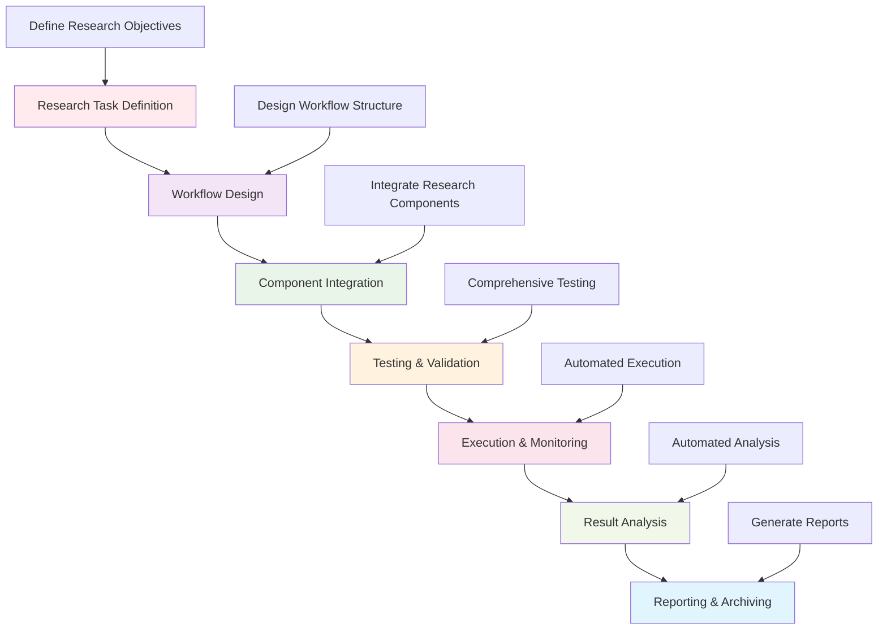

# Research Tools Framework

This directory contains comprehensive research tools and utilities for the Active Inference Knowledge Environment. It provides automation, orchestration, testing, and utility functions that support the full research lifecycle from ideation to publication.

## Overview

The research tools framework offers a complete toolkit for research automation and efficiency. This includes orchestration components for managing complex research workflows, testing frameworks for validating research implementations, documentation tools for maintaining research quality, and utility functions for common research tasks.

### Mission & Role

This tools framework contributes to the research mission by:

- **Research Efficiency**: Automating repetitive research tasks and workflows
- **Quality Assurance**: Providing comprehensive testing and validation tools
- **Workflow Orchestration**: Managing complex multi-step research processes
- **Documentation Excellence**: Maintaining high-quality research documentation
- **Collaboration Support**: Enabling collaborative research workflows and tools

## Architecture

### Research Tools Structure

```
research/tools/
├── automation/                # Research automation and workflow tools
├── orchestrators/             # Thin orchestration components for research workflows
├── testing/                   # Research testing and validation frameworks
├── utilities/                 # General research utility functions
└── README.md                 # This file
```

### Integration Points

**Platform Integration:**
- **Research Framework**: Integration with core research methods and workflows
- **Experiment Framework**: Support for experimental design and execution
- **Analysis Tools**: Integration with statistical analysis and validation
- **Documentation Systems**: Connection with documentation generation and maintenance

**External Systems:**
- **Development Tools**: Integration with version control, CI/CD, and development environments
- **Cloud Platforms**: Support for cloud-based research computing and storage
- **Scientific Libraries**: Integration with specialized scientific computing libraries
- **Research Platforms**: Connection with research collaboration and sharing platforms

## Tool Categories

### Automation Tools
Research automation and efficiency tools:
- **Workflow Automation**: Automated execution of research pipelines and workflows
- **Data Processing**: Automated data collection, cleaning, and preprocessing
- **Model Training**: Automated model training and hyperparameter optimization
- **Result Analysis**: Automated analysis and interpretation of research results

### Orchestration Components
Thin orchestration for research workflows:
- **Pipeline Orchestration**: Managing complex multi-step research pipelines
- **Resource Management**: Coordinating computational resources and dependencies
- **Workflow Monitoring**: Real-time monitoring of research workflow execution
- **Error Handling**: Robust error handling and recovery in research workflows

### Testing Frameworks
Comprehensive research testing and validation:
- **Unit Testing**: Testing individual research components and functions
- **Integration Testing**: Testing research component interactions and workflows
- **Validation Testing**: Scientific validation of research methods and results
- **Performance Testing**: Testing research implementation performance and scalability

### Utility Functions
General research utility and helper functions:
- **Data Utilities**: Common data manipulation and processing functions
- **Mathematical Utilities**: Mathematical helper functions for research implementations
- **Visualization Utilities**: Helper functions for research data visualization
- **File Management**: Research data and file management utilities

## Getting Started

### Prerequisites
- **Research Methods**: Understanding of research methodologies and workflows
- **Programming Skills**: Python programming with scientific computing capabilities
- **Automation Concepts**: Knowledge of workflow automation and orchestration
- **Testing Practices**: Understanding of software testing and validation principles

### Basic Setup

```bash
# Install research tools dependencies
pip install pytest pytest-cov  # Testing frameworks
pip install prefect dask  # Workflow orchestration
pip install ray modin  # Parallel processing
pip install hydra omegaconf  # Configuration management

# Install utility libraries
pip install numpy scipy pandas  # Data processing
pip install matplotlib seaborn plotly  # Visualization utilities
pip install tqdm rich  # Progress and display utilities

# Set up research tools environment
export RESEARCH_TOOLS_ENV="development"
export TESTING_FRAMEWORK="pytest"
export ORCHESTRATION_BACKEND="prefect"
```

### Initial Research Tools Project

```python
# Basic research tools workflow
from research.tools import ResearchToolsManager
from research.tools.orchestrators import WorkflowOrchestrator

# Initialize research tools system
tools_manager = ResearchToolsManager(config)

# Set up workflow orchestration
orchestrator_config = {
    "workflow_type": "research_pipeline",
    "parallel_execution": True,
    "monitoring_enabled": True,
    "error_recovery": True
}

orchestrator = WorkflowOrchestrator(orchestrator_config)

# Define research workflow
research_workflow = {
    "steps": [
        {"name": "data_collection", "function": collect_research_data},
        {"name": "data_processing", "function": process_research_data},
        {"name": "model_training", "function": train_research_model},
        {"name": "result_analysis", "function": analyze_research_results},
        {"name": "report_generation", "function": generate_research_report}
    ],
    "dependencies": {
        "data_processing": ["data_collection"],
        "model_training": ["data_processing"],
        "result_analysis": ["model_training"],
        "report_generation": ["result_analysis"]
    }
}

# Execute research workflow
workflow_execution = orchestrator.execute_workflow(research_workflow)
```

## Usage Examples

### Example 1: Automated Research Pipeline

```python
# Implement automated research pipeline using orchestration tools
from research.tools.orchestrators import ResearchPipelineOrchestrator
from research.tools.automation import DataAutomation, ModelAutomation

# Initialize pipeline orchestrator
pipeline_orchestrator = ResearchPipelineOrchestrator()

# Set up data automation
data_automation = DataAutomation({
    "data_sources": ["database", "api", "files"],
    "processing_steps": ["cleaning", "normalization", "feature_extraction"],
    "quality_checks": True,
    "monitoring": True
})

# Set up model automation
model_automation = ModelAutomation({
    "model_types": ["active_inference", "baseline_models"],
    "hyperparameter_optimization": True,
    "cross_validation": True,
    "performance_monitoring": True
})

# Define complete research pipeline
research_pipeline = {
    "name": "automated_active_inference_research",
    "steps": [
        {
            "name": "data_pipeline",
            "component": data_automation,
            "inputs": ["raw_data"],
            "outputs": ["processed_data"]
        },
        {
            "name": "model_training",
            "component": model_automation,
            "inputs": ["processed_data"],
            "outputs": ["trained_models", "performance_metrics"]
        },
        {
            "name": "result_analysis",
            "component": ResultAnalyzer(),
            "inputs": ["trained_models", "performance_metrics"],
            "outputs": ["analysis_report"]
        }
    ],
    "monitoring": {
        "progress_tracking": True,
        "performance_metrics": True,
        "error_alerting": True,
        "completion_notifications": True
    }
}

# Execute automated research pipeline
pipeline_result = pipeline_orchestrator.execute_pipeline(research_pipeline)

# Generate execution report
execution_report = pipeline_orchestrator.generate_execution_report(pipeline_result)
```

### Example 2: Comprehensive Testing Framework

```python
# Implement comprehensive testing framework for research implementations
from research.tools.testing import ResearchTestingFramework
from research.tools.testing.validators import ScientificValidator, PerformanceValidator

# Initialize testing framework
testing_framework = ResearchTestingFramework({
    "testing_levels": ["unit", "integration", "validation", "performance"],
    "automated_execution": True,
    "coverage_reporting": True,
    "continuous_integration": True
})

# Set up scientific validator
scientific_validator = ScientificValidator({
    "validation_criteria": ["mathematical_correctness", "scientific_accuracy", "methodological_soundness"],
    "benchmark_comparison": True,
    "peer_review_readiness": True
})

# Set up performance validator
performance_validator = PerformanceValidator({
    "performance_metrics": ["execution_time", "memory_usage", "scalability"],
    "benchmark_standards": True,
    "optimization_analysis": True
})

# Define comprehensive test suite
test_suite = {
    "name": "active_inference_implementation_tests",
    "components": [
        {
            "name": "mathematical_core",
            "tests": ["test_free_energy_computation", "test_inference_algorithms", "test_mathematical_correctness"],
            "validator": scientific_validator
        },
        {
            "name": "implementation_performance",
            "tests": ["test_execution_efficiency", "test_memory_usage", "test_scalability"],
            "validator": performance_validator
        },
        {
            "name": "integration_tests",
            "tests": ["test_component_integration", "test_workflow_execution", "test_error_handling"],
            "validator": IntegrationValidator()
        }
    ],
    "execution_config": {
        "parallel_execution": True,
        "coverage_threshold": 95,
        "performance_benchmarks": True,
        "automated_reporting": True
    }
}

# Execute comprehensive test suite
test_results = testing_framework.execute_test_suite(test_suite)

# Generate detailed test report
test_report = testing_framework.generate_test_report(test_results)

# Validate research implementation quality
quality_validation = testing_framework.validate_research_quality(test_results)
```

### Example 3: Research Utility Toolkit

```python
# Implement research utility toolkit for common research tasks
from research.tools.utilities import ResearchUtilityToolkit
from research.tools.utilities.data_utils import DataUtilities
from research.tools.utilities.math_utils import MathematicalUtilities
from research.tools.utilities.viz_utils import VisualizationUtilities

# Initialize research utility toolkit
utility_toolkit = ResearchUtilityToolkit()

# Set up data utilities
data_utils = DataUtilities({
    "supported_formats": ["csv", "json", "hdf5", "pickle"],
    "data_validation": True,
    "memory_optimization": True,
    "parallel_processing": True
})

# Set up mathematical utilities
math_utils = MathematicalUtilities({
    "precision": "high",
    "numerical_stability": True,
    "symbolic_computation": True,
    "optimization_methods": ["gradient_descent", "newton_method", "quasi_newton"]
})

# Set up visualization utilities
viz_utils = VisualizationUtilities({
    "plot_types": ["line", "scatter", "histogram", "heatmap", "network"],
    "interactive_plots": True,
    "publication_quality": True,
    "export_formats": ["png", "svg", "pdf"]
})

# Demonstrate utility toolkit usage
def demonstrate_research_utilities():
    """Demonstrate common research utility functions"""

    # Data processing utilities
    raw_data = data_utils.load_data("experiment_data.csv")
    processed_data = data_utils.preprocess_data(raw_data, {"normalization": True, "outlier_removal": True})
    validated_data = data_utils.validate_data_quality(processed_data)

    # Mathematical utilities
    statistical_summary = math_utils.compute_statistical_summary(validated_data)
    optimization_result = math_utils.optimize_function(objective_function, initial_guess)
    symbolic_derivative = math_utils.compute_symbolic_derivative("x^2 + 2*x + 1", "x")

    # Visualization utilities
    performance_plot = viz_utils.create_performance_plot(experiment_results)
    statistical_plot = viz_utils.create_statistical_plot(statistical_summary)
    interactive_dashboard = viz_utils.create_interactive_dashboard(analysis_results)

    return {
        "processed_data": validated_data,
        "statistical_summary": statistical_summary,
        "optimization_result": optimization_result,
        "symbolic_derivative": symbolic_derivative,
        "visualizations": [performance_plot, statistical_plot, interactive_dashboard]
    }

# Execute utility demonstration
utility_results = demonstrate_research_utilities()
```

## Configuration

### Research Tools Configuration

```python
# Basic research tools configuration
research_tools_config = {
    "system": {
        "environment": "research",  # research, development, production
        "parallel_processing": True,
        "monitoring_enabled": True,
        "logging_level": "INFO"
    },
    "orchestration": {
        "backend": "prefect",  # prefect, airflow, custom
        "execution_engine": "dask",  # dask, ray, multiprocessing
        "monitoring_dashboard": True,
        "error_recovery": True
    },
    "testing": {
        "framework": "pytest",
        "coverage_tool": "pytest-cov",
        "continuous_integration": True,
        "performance_testing": True
    },
    "automation": {
        "workflow_scheduling": True,
        "resource_management": True,
        "result_archiving": True,
        "notification_system": True
    }
}
```

### Advanced Research Tools Configuration

```python
# Advanced research tools settings
advanced_config = {
    "performance": {
        "optimization_target": "throughput",
        "memory_management": "intelligent",
        "parallel_scaling": "automatic",
        "resource_monitoring": True
    },
    "quality": {
        "validation_level": "comprehensive",
        "benchmarking_enabled": True,
        "peer_review_integration": False,
        "reproducibility_tracking": True
    },
    "integration": {
        "cloud_platforms": ["aws", "gcp", "azure"],
        "container_support": True,
        "version_control_integration": True,
        "collaboration_tools": True
    },
    "monitoring": {
        "performance_metrics": True,
        "error_tracking": True,
        "usage_analytics": True,
        "alert_system": True
    }
}
```

## API Reference

### Core Research Tools Classes

#### `ResearchToolsManager`
Central management system for all research tools.

```python
class ResearchToolsManager:
    """Manage comprehensive research tools and utilities"""

    def __init__(self, config: Dict[str, Any]):
        """Initialize research tools manager with configuration"""

    def setup_workflow_orchestration(self, orchestration_config: Dict[str, Any]) -> WorkflowOrchestrator:
        """Set up workflow orchestration system"""

    def initialize_testing_framework(self, testing_config: Dict[str, Any]) -> TestingFramework:
        """Initialize comprehensive testing framework"""

    def configure_automation_tools(self, automation_config: Dict[str, Any]) -> AutomationManager:
        """Configure research automation tools"""

    def setup_utility_toolkit(self, utility_config: Dict[str, Any]) -> UtilityToolkit:
        """Set up research utility toolkit"""

    def validate_research_setup(self, validation_config: Dict[str, Any]) -> ValidationReport:
        """Validate research tools setup and configuration"""
```

#### `WorkflowOrchestrator`
Thin orchestration system for research workflows.

```python
class WorkflowOrchestrator:
    """Orchestrate research workflows with minimal overhead"""

    def __init__(self, config: Dict[str, Any]):
        """Initialize workflow orchestrator with configuration"""

    def define_workflow(self, workflow_definition: Dict[str, Any]) -> Workflow:
        """Define research workflow with steps and dependencies"""

    def execute_workflow(self, workflow: Workflow, execution_config: Dict[str, Any]) -> WorkflowResult:
        """Execute defined research workflow"""

    def monitor_workflow_execution(self, workflow_id: str) -> MonitoringReport:
        """Monitor ongoing workflow execution"""

    def handle_workflow_errors(self, workflow_id: str, error_config: Dict[str, Any]) -> ErrorHandlingResult:
        """Handle errors and exceptions in workflow execution"""

    def generate_workflow_report(self, workflow_result: WorkflowResult) -> WorkflowReport:
        """Generate comprehensive workflow execution report"""
```

#### `ResearchTestingFramework`
Comprehensive testing framework for research implementations.

```python
class ResearchTestingFramework:
    """Comprehensive testing framework for research implementations"""

    def __init__(self, config: Dict[str, Any]):
        """Initialize research testing framework with configuration"""

    def define_test_suite(self, test_suite_definition: Dict[str, Any]) -> TestSuite:
        """Define comprehensive test suite for research components"""

    def execute_test_suite(self, test_suite: TestSuite, execution_config: Dict[str, Any]) -> TestResults:
        """Execute defined test suite"""

    def validate_scientific_correctness(self, test_results: TestResults) -> ScientificValidation:
        """Validate scientific correctness of test results"""

    def assess_performance_characteristics(self, test_results: TestResults) -> PerformanceAssessment:
        """Assess performance characteristics from test results"""

    def generate_testing_report(self, test_results: TestResults, report_config: Dict[str, Any]) -> TestingReport:
        """Generate comprehensive testing report"""
```

## Research Tools Workflows

### Standard Research Automation Pipeline



### Advanced Research Tools Patterns

```python
# Automated research discovery and execution workflow
def automated_research_discovery_workflow(research_config: Dict[str, Any]) -> AutomatedResearchResult:
    """Execute automated research discovery and implementation workflow"""

    # Research problem identification
    problem_identification = identify_research_problems(research_config)

    # Automated literature review
    literature_review = perform_automated_literature_review(problem_identification)

    # Research gap analysis
    gap_analysis = analyze_research_gaps(literature_review)

    # Automated implementation generation
    implementation_generation = generate_research_implementations(gap_analysis)

    # Automated testing and validation
    testing_validation = perform_automated_testing(implementation_generation)

    # Automated result analysis
    result_analysis = perform_automated_analysis(testing_validation)

    # Automated report generation
    report_generation = generate_automated_reports(result_analysis)

    return AutomatedResearchResult(
        problems=problem_identification,
        literature=literature_review,
        gaps=gap_analysis,
        implementations=implementation_generation,
        testing=testing_validation,
        analysis=result_analysis,
        reports=report_generation
    )

# Research collaboration and sharing workflow
def research_collaboration_workflow(collaboration_config: Dict[str, Any]) -> CollaborationResult:
    """Manage research collaboration and knowledge sharing workflow"""

    # Set up collaboration environment
    collaboration_env = setup_collaboration_environment(collaboration_config)

    # Initialize shared research workspace
    shared_workspace = initialize_shared_workspace(collaboration_config)

    # Set up version control for research artifacts
    version_control = setup_research_version_control(shared_workspace)

    # Enable real-time collaboration
    real_time_collaboration = enable_real_time_collaboration(shared_workspace)

    # Set up automated synchronization
    automated_sync = setup_automated_synchronization(real_time_collaboration)

    # Implement conflict resolution
    conflict_resolution = implement_conflict_resolution(automated_sync)

    # Set up collaborative testing
    collaborative_testing = setup_collaborative_testing(conflict_resolution)

    return CollaborationResult(
        environment=collaboration_env,
        workspace=shared_workspace,
        version_control=version_control,
        real_time=real_time_collaboration,
        synchronization=automated_sync,
        conflict_resolution=conflict_resolution,
        testing=collaborative_testing
    )
```

## Contributing

### Research Tools Standards

When contributing to the research tools framework:

1. **Research Focus**: Ensure tools specifically support research workflows and methodologies
2. **Automation Priority**: Focus on automation while maintaining research flexibility
3. **Quality Assurance**: Implement comprehensive testing and validation capabilities
4. **Documentation Excellence**: Provide clear documentation for research tool usage
5. **Performance Optimization**: Optimize for research-scale computations and workflows

### Research Tools Contribution Process

1. **Research Gap Analysis**: Identify missing research automation and tooling capabilities
2. **Tool Design**: Design tools that enhance research efficiency and quality
3. **Implementation Development**: Develop robust research tools with comprehensive testing
4. **Research Integration**: Ensure tools integrate seamlessly with research workflows
5. **Documentation Creation**: Provide comprehensive documentation for research tool usage
6. **Validation Testing**: Validate tools against real research use cases and workflows

## Related Documentation

- **[Research Framework](../../research/README.md)**: Overview of research tools and methods
- **[Experiment Framework](../../research/experiments/README.md)**: Experimental design and execution tools
- **[Analysis Framework](../../research/analysis/README.md)**: Statistical analysis and validation tools
- **[Platform Tools](../../../../tools/README.md)**: General development and utility tools
- **[Testing Framework](../../../../tests/README.md)**: Comprehensive testing and validation framework

---

**Research Tools Framework Version**: 1.0.0 | **Last Updated**: October 2024 | **Development Status**: Active Development

*"Active Inference for, with, by Generative AI"* - Providing comprehensive research automation, orchestration, testing, and utility tools to accelerate Active Inference research and ensure scientific rigor.