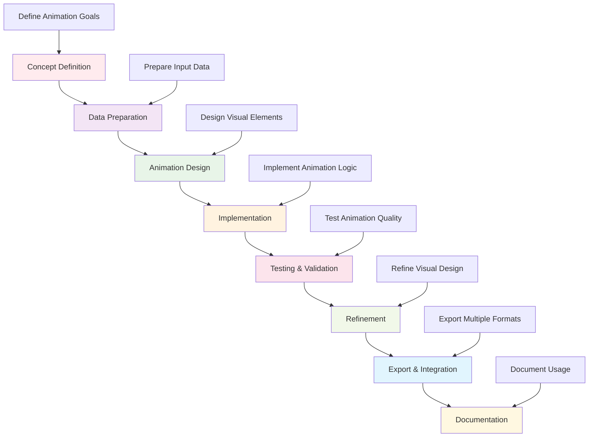

# Active Inference Animations

This directory contains animation implementations for visualizing Active Inference processes, concepts, and dynamics. It provides interactive and dynamic visualizations that help users understand the temporal evolution and behavior of Active Inference systems.

## Overview

The animations module creates engaging visual representations of Active Inference concepts, from simple belief updating animations to complex multi-agent system interactions. These animations serve both educational and research purposes, making abstract concepts more accessible and intuitive.

### Mission & Role

This module contributes to the platform mission by:

- **Educational Visualization**: Making complex Active Inference concepts accessible through animation
- **Research Communication**: Helping researchers communicate findings through dynamic visualizations
- **Interactive Learning**: Providing hands-on exploration of Active Inference dynamics
- **Concept Illustration**: Demonstrating theoretical concepts through visual examples
- **User Engagement**: Creating engaging interfaces for exploring Active Inference systems

## Architecture

### Animation System Structure

```
src/active_inference/visualization/animations/
├── belief_dynamics/        # Belief updating and inference animations
├── policy_execution/       # Policy selection and execution animations
├── multi_agent/           # Multi-agent system interaction animations
├── neural_networks/       # Neural implementation animations
├── information_flow/      # Information flow visualization
└── README.md             # This file
```

### Integration Points

**Platform Integration:**
- **Visualization Engine**: Core animation rendering and display systems
- **Knowledge Base**: Connection between animated concepts and educational content
- **Research Tools**: Integration with simulation and analysis frameworks
- **User Interface**: Animation integration with user-facing interfaces

**External Systems:**
- **Animation Libraries**: Matplotlib animation, Plotly, D3.js, WebGL
- **Mathematical Computing**: NumPy, SciPy for dynamic system computation
- **Visualization Tools**: Blender, Unity for advanced 3D animations
- **Web Technologies**: HTML5 Canvas, WebGL for browser-based animations

## Animation Categories

### Belief Dynamics Animations
Visualizing belief updating and inference processes:
- **Bayesian Updating**: Real-time visualization of belief revision
- **Evidence Integration**: Animation of how new evidence affects beliefs
- **Uncertainty Evolution**: Visual representation of uncertainty over time
- **Convergence Patterns**: Animation of belief stabilization and convergence

### Policy Execution Animations
Dynamic visualization of decision-making and action:
- **Policy Selection**: Animation of policy evaluation and selection
- **Action Execution**: Real-time visualization of action implementation
- **Expected Free Energy**: Dynamic representation of EFE minimization
- **Behavioral Sequences**: Animation of complete behavioral trajectories

### Multi-Agent Animations
Interactive visualization of multi-agent Active Inference:
- **Agent Interactions**: Visualization of agent-agent communication
- **Collective Behavior**: Animation of emergent collective dynamics
- **Social Inference**: Dynamic representation of social belief updating
- **Coordination Patterns**: Animation of coordinated multi-agent behavior

### Neural Network Animations
Visualization of neural implementations of Active Inference:
- **Predictive Coding**: Animation of prediction error minimization
- **Neural Dynamics**: Real-time visualization of neural state evolution
- **Learning Processes**: Animation of neural network learning
- **Hierarchical Processing**: Visualization of hierarchical neural computation

## Getting Started

### Prerequisites
- **Animation Knowledge**: Understanding of animation principles and techniques
- **Active Inference Theory**: Familiarity with core Active Inference concepts
- **Programming Skills**: Python programming with visualization libraries
- **Mathematical Understanding**: Knowledge of dynamical systems and optimization

### Basic Setup

```bash
# Install animation dependencies
pip install matplotlib plotly seaborn
pip install numpy scipy pandas
pip install jupyter notebook  # For interactive animations

# Install specialized animation libraries
pip install celluloid  # For matplotlib animations
pip install plotly-express  # For interactive animations
pip install ipywidgets  # For interactive controls
```

### Initial Animation Project

```python
# Basic animation workflow
import numpy as np
from active_inference.visualization.animations import AnimationManager
from active_inference.visualization.animations.belief_dynamics import BeliefAnimator

# Initialize animation system
animation_manager = AnimationManager(config)

# Create belief dynamics animation
belief_animator = BeliefAnimator()

# Set up initial beliefs and evidence
initial_beliefs = np.array([0.5, 0.3, 0.2])
evidence_sequence = generate_evidence_sequence()

# Create animation
animation = belief_animator.create_belief_update_animation(
    initial_beliefs, evidence_sequence, time_steps=100
)

# Display animation
animation_manager.display_animation(animation)
```

## Usage Examples

### Example 1: Belief Updating Animation

```python
# Animate belief updating in response to evidence
import numpy as np
from active_inference.visualization.animations.belief_dynamics import BeliefUpdateAnimator

# Set up belief updating scenario
prior_beliefs = np.array([0.7, 0.2, 0.1])
likelihood_matrix = np.array([
    [0.8, 0.1, 0.1],
    [0.1, 0.8, 0.1],
    [0.1, 0.1, 0.8]
])

# Create evidence sequence
evidence_sequence = [0, 1, 0, 2, 1]  # Observed outcomes

# Initialize animator
animator = BeliefUpdateAnimator(prior_beliefs, likelihood_matrix)

# Create animation
animation = animator.create_belief_evolution_animation(
    evidence_sequence,
    animation_config={
        "time_step": 0.5,
        "smoothing": True,
        "confidence_bands": True
    }
)

# Customize visualization
animation.set_style("scientific")
animation.add_legend()
animation.set_title("Belief Updating in Active Inference")

# Export animation
animation.save("belief_updating.gif")
```

### Example 2: Multi-Agent Interaction Animation

```python
# Animate multi-agent Active Inference interactions
from active_inference.visualization.animations.multi_agent import MultiAgentAnimator

# Define agent configurations
agent_configs = [
    {"id": "agent_1", "position": [0, 0], "goals": ["resource_1", "cooperation"]},
    {"id": "agent_2", "position": [1, 1], "goals": ["resource_2", "cooperation"]},
    {"id": "agent_3", "position": [2, 0], "goals": ["resource_1", "competition"]}
]

# Set up environment
environment_config = {
    "size": [10, 10],
    "resources": ["resource_1", "resource_2"],
    "obstacles": [(3, 3), (7, 7)]
}

# Initialize multi-agent animator
animator = MultiAgentAnimator(agent_configs, environment_config)

# Define interaction scenario
interaction_scenario = {
    "time_steps": 200,
    "events": [
        {"time": 50, "type": "resource_appears", "location": [5, 5]},
        {"time": 100, "type": "agent_communication", "agents": ["agent_1", "agent_2"]},
        {"time": 150, "type": "environment_change", "change": "resource_depleted"}
    ]
}

# Create animation
animation = animator.create_interaction_animation(interaction_scenario)

# Add visualization features
animation.show_belief_states()
animation.show_policy_execution()
animation.show_communication_flows()

# Display results
animator.display_animation(animation)
```

### Example 3: Neural Predictive Coding Animation

```python
# Animate predictive coding in neural networks
from active_inference.visualization.animations.neural_networks import PredictiveCodingAnimator

# Define neural network architecture
network_config = {
    "layers": [
        {"type": "sensory", "size": 100, "activation": "linear"},
        {"type": "hidden", "size": 50, "activation": "relu"},
        {"type": "prediction", "size": 100, "activation": "linear"}
    ],
    "connections": "hierarchical",
    "learning_rate": 0.01
}

# Set up sensory input sequence
sensory_input = generate_sensory_sequence(
    pattern="oscillatory",
    frequency=0.1,
    duration=10,
    noise_level=0.1
)

# Initialize animator
animator = PredictiveCodingAnimator(network_config)

# Create predictive coding animation
animation = animator.create_predictive_coding_animation(
    sensory_input,
    animation_config={
        "show_predictions": True,
        "show_errors": True,
        "show_weights": False,
        "show_learning": True,
        "time_scale": "real_time"
    }
)

# Customize visualization
animation.set_neural_style("scientific")
animation.add_error_magnification()
animation.show_prediction_confidence()

# Export detailed animation
animation.save("predictive_coding_dynamics.mp4", fps=30)
```

## Configuration

### Animation Environment Configuration

```python
# Basic animation configuration
animation_config = {
    "system": {
        "backend": "matplotlib",  # matplotlib, plotly, or webgl
        "interactive": True,
        "real_time": False,
        "save_formats": ["gif", "mp4", "html"]
    },
    "visualization": {
        "style": "scientific",
        "color_scheme": "active_inference",
        "resolution": "high",
        "frame_rate": 30,
        "duration": "auto"
    },
    "animation": {
        "interpolation": "smooth",
        "easing": "natural",
        "transitions": True,
        "highlighting": True,
        "annotations": True
    },
    "export": {
        "quality": "high",
        "compression": "optimal",
        "metadata": True,
        "accessibility": True
    }
}
```

### Advanced Animation Configuration

```python
# Advanced animation settings
advanced_config = {
    "performance": {
        "max_particles": 10000,
        "rendering_engine": "gpu_accelerated",
        "memory_optimization": True,
        "parallel_computation": True
    },
    "interactivity": {
        "user_controls": True,
        "parameter_sliders": True,
        "playback_controls": True,
        "zoom_and_pan": True,
        "selection_tools": True
    },
    "accessibility": {
        "color_blind_friendly": True,
        "high_contrast": False,
        "reduced_motion": False,
        "screen_reader_support": True,
        "keyboard_navigation": True
    },
    "scientific": {
        "precision_display": True,
        "error_bars": True,
        "confidence_intervals": True,
        "statistical_annotations": True,
        "reference_lines": True
    }
}
```

## API Reference

### Core Animation Classes

#### `AnimationManager`
Central management system for all animations.

```python
class AnimationManager:
    """Manage and coordinate animation creation and display"""

    def __init__(self, config: Dict[str, Any]):
        """Initialize animation manager with configuration"""

    def create_animation(self, animation_type: str, config: Dict[str, Any]) -> BaseAnimation:
        """Create animation of specified type"""

    def display_animation(self, animation: BaseAnimation, display_config: Dict[str, Any]) -> None:
        """Display animation with specified configuration"""

    def export_animation(self, animation: BaseAnimation, export_config: Dict[str, Any]) -> str:
        """Export animation to file with specified format"""

    def validate_animation(self, animation: BaseAnimation) -> ValidationReport:
        """Validate animation correctness and performance"""
```

#### `BeliefUpdateAnimator`
Specialized animator for belief dynamics visualization.

```python
class BeliefUpdateAnimator:
    """Animate belief updating and inference processes"""

    def __init__(self, prior_beliefs: np.ndarray, likelihood_model: Any):
        """Initialize with belief parameters"""

    def create_belief_evolution_animation(self, evidence_sequence: List[int],
                                        animation_config: Dict[str, Any]) -> Animation:
        """Create animation of belief evolution over time"""

    def create_belief_comparison_animation(self, belief_sets: List[np.ndarray],
                                         labels: List[str]) -> Animation:
        """Create animation comparing multiple belief trajectories"""

    def add_uncertainty_visualization(self, animation: Animation) -> Animation:
        """Add uncertainty bands and confidence intervals"""

    def customize_visual_style(self, animation: Animation, style_config: Dict[str, Any]) -> Animation:
        """Customize visual appearance of animation"""
```

#### `MultiAgentAnimator`
Animator for multi-agent system interactions.

```python
class MultiAgentAnimator:
    """Animate multi-agent Active Inference interactions"""

    def __init__(self, agent_configs: List[Dict[str, Any]], environment_config: Dict[str, Any]):
        """Initialize with agent and environment configurations"""

    def create_interaction_animation(self, scenario: Dict[str, Any]) -> Animation:
        """Create animation of multi-agent interactions"""

    def create_communication_animation(self, communication_events: List[Dict[str, Any]]) -> Animation:
        """Create animation of agent communication patterns"""

    def create_emergence_animation(self, collective_behavior: Dict[str, Any]) -> Animation:
        """Create animation of emergent collective behavior"""

    def add_social_network_visualization(self, animation: Animation) -> Animation:
        """Add social network and relationship visualization"""
```

## Animation Workflows

### Standard Animation Pipeline



### Advanced Animation Patterns

```python
# Complex animation workflow
def create_comprehensive_animation(concept_config: Dict[str, Any]) -> AnimationSuite:
    """Create comprehensive animation suite for complex concept"""

    # Phase 1: Basic concept animation
    basic_animation = create_basic_concept_animation(concept_config)

    # Phase 2: Detailed process animation
    detailed_animation = create_detailed_process_animation(concept_config)

    # Phase 3: Interactive exploration animation
    interactive_animation = create_interactive_animation(concept_config)

    # Phase 4: Multi-perspective animation
    multi_perspective_animation = create_multi_perspective_animation(concept_config)

    # Combine into comprehensive suite
    animation_suite = combine_animations([
        basic_animation, detailed_animation,
        interactive_animation, multi_perspective_animation
    ])

    # Validate complete suite
    validation_result = validate_animation_suite(animation_suite)
    if not validation_result["valid"]:
        raise AnimationError(f"Animation suite validation failed: {validation_result['errors']}")

    return animation_suite

# Real-time animation workflow
def create_real_time_animation(data_stream: Iterator[Any], animation_config: Dict[str, Any]) -> Animation:
    """Create real-time animation from streaming data"""

    # Initialize real-time animator
    animator = RealTimeAnimator(animation_config)

    # Set up data processing pipeline
    data_processor = setup_data_processing_pipeline()

    # Create animation loop
    animation = animator.create_streaming_animation(data_stream, data_processor)

    # Add real-time features
    animation.add_live_updates()
    animation.add_performance_monitoring()
    animation.add_interactive_controls()

    return animation
```

## Contributing

### Animation Documentation Standards

When contributing to animation documentation:

1. **Visual Clarity**: Ensure animations clearly communicate intended concepts
2. **Scientific Accuracy**: Maintain mathematical and conceptual accuracy
3. **Educational Value**: Provide clear learning objectives and guidance
4. **Performance Optimization**: Ensure animations run smoothly and efficiently
5. **Accessibility**: Make animations accessible to diverse users

### Animation Contribution Process

1. **Identify Visualization Gap**: Find concepts needing visual explanation
2. **Design Animation Concept**: Create detailed animation design and storyboard
3. **Implement Animation**: Develop robust animation implementation
4. **Validate Effectiveness**: Test animation educational and visual effectiveness
5. **Document Usage**: Provide comprehensive documentation and examples
6. **Submit for Review**: Follow animation review and integration process

## Related Documentation

- **[Visualization Framework](../../visualization/README.md)**: Overview of visualization systems
- **[Animation Tools](../../visualization/animations/)**: Animation implementation tools
- **[Interactive Visualization](../../visualization/dashboards/)**: Interactive visualization interfaces
- **[Diagramming System](../../visualization/diagrams/)**: Static diagram generation
- **[Platform Visualization](../../../platform/)**: Platform-wide visualization integration

---

**Active Inference Animations Version**: 1.0.0 | **Last Updated**: October 2024 | **Development Status**: Active Development

*"Active Inference for, with, by Generative AI"* - Bringing Active Inference concepts to life through engaging animations, dynamic visualizations, and interactive educational experiences.
