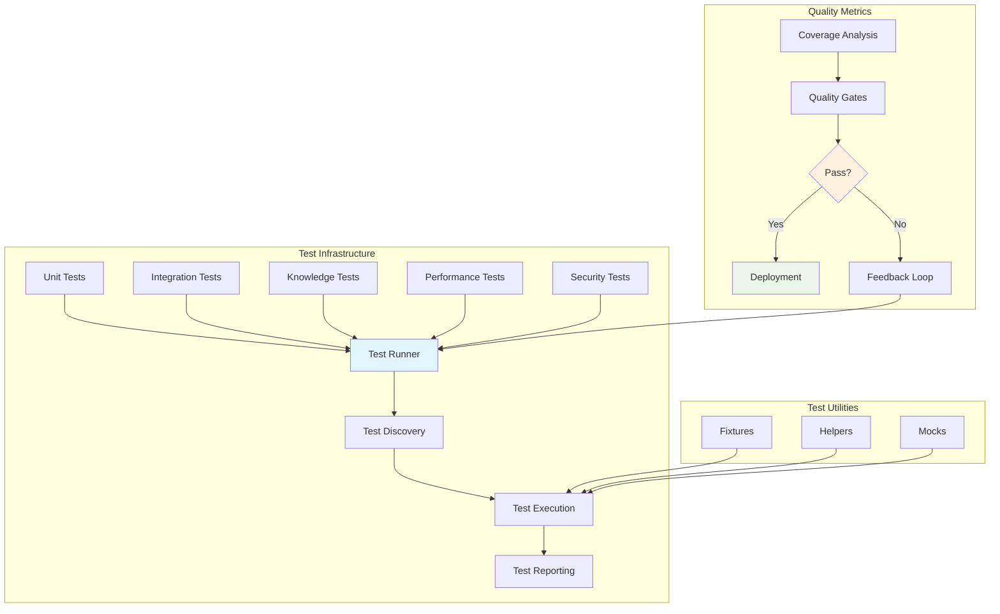

# Testing Framework

Comprehensive testing infrastructure for the Active Inference Knowledge Environment. Provides multi-layered testing with unit tests, integration tests, knowledge validation, performance testing, and security testing.

## Overview

The testing framework ensures code quality, functionality, and reliability across all components of the Active Inference Knowledge Environment. Tests are organized by type and component, with comprehensive fixtures, utilities, and reporting.

## Directory Structure

```
tests/
├── __init__.py              # Test suite initialization
├── README.md                # This file
├── run_tests.py             # Comprehensive test runner
├── coverage_config.py       # Coverage configuration and analysis
├── fixtures/                # Test fixtures and data
│   ├── __init__.py
│   └── test_data.py         # Sample test data and utilities
├── utilities/               # Testing utilities and helpers
│   ├── __init__.py
│   └── test_helpers.py      # Test helper functions and mocks
├── unit/                    # Unit tests for individual components (124 tests)
│   ├── test_knowledge_*.py  # Knowledge system unit tests
│   ├── test_llm_*.py        # LLM integration unit tests
│   ├── test_research_*.py   # Research tools unit tests
│   ├── test_applications_*.py # Application framework unit tests
│   └── test_platform_*.py   # Platform services unit tests
├── integration/             # Integration tests for component interaction (10 tests)
│   └── test_*.py            # End-to-end integration tests
├── knowledge/               # Knowledge content validation tests (23 tests)
│   ├── test_content_accuracy.py     # Mathematical and conceptual accuracy validation
│   ├── test_educational_quality.py  # Educational effectiveness testing
│   └── README.md                     # Knowledge testing documentation
├── performance/             # Performance and scalability tests (5 tests)
│   ├── test_knowledge_repository_performance.py # Repository performance testing
│   ├── README.md                     # Performance testing documentation
│   └── __init__.py                   # Performance testing module
└── security/                # Security and vulnerability tests (8 tests)
    ├── test_knowledge_security.py   # Knowledge repository security testing
    ├── README.md                     # Security testing documentation
    └── __init__.py                   # Security testing module
```

### Testing Framework Architecture



## Test Categories

### 🧪 Unit Tests
Individual component functionality testing with comprehensive edge case coverage.

**Location**: `tests/unit/`  
**Coverage Target**: >95% for core components, >80% overall  
**Tests**: 124 comprehensive unit tests

### 🔗 Integration Tests
Component interaction validation and data flow testing across system boundaries.

**Location**: `tests/integration/`  
**Coverage Target**: >80% for integration points  
**Tests**: 10 comprehensive integration tests

### 📚 Knowledge Tests
Content accuracy, completeness, educational quality validation, and learning path validation.

**Location**: `tests/knowledge/`  
**Coverage Target**: 100% for knowledge content  
**Tests**: 23 comprehensive knowledge validation tests

### ⚡ Performance Tests
Scalability, efficiency, and performance characteristics validation.

**Location**: `tests/performance/`  
**Tests**: 5 performance benchmark tests

### 🔒 Security Tests
Vulnerability assessment and security validation including injection attacks, XSS protection, and path traversal.

**Location**: `tests/security/`  
**Tests**: 8 security vulnerability tests

## Quick Start

```bash
# Run all tests
make test

# Run with coverage
make test-coverage

# Run specific test types
make test-unit
make test-integration
make test-knowledge
make test-performance
make test-security
```

## Related Documentation

- **[Main README](../../README.md)**: Project overview
- **[Troubleshooting](../../docs/TROUBLESHOOTING.md)**: Debugging guide
- **[Quick Start](../../docs/QUICK_START.md)**: Getting started

---

*"Active Inference for, with, by Generative AI"* - Ensuring reliability through comprehensive testing.