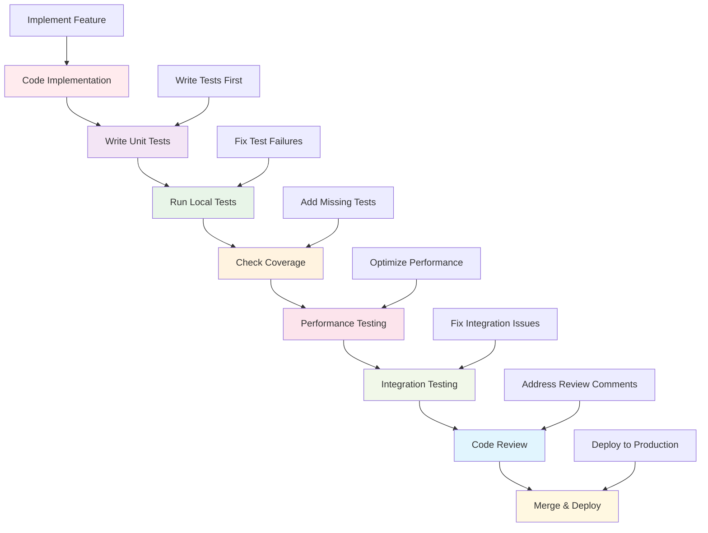

# Unit Testing Framework

This directory contains comprehensive unit tests for all components in the Active Inference Knowledge Environment. Unit tests validate individual functions, methods, and classes in isolation, ensuring each component works correctly before integration testing.

## Overview

The unit testing framework provides systematic validation of individual software components, ensuring reliability, correctness, and maintainability of the Active Inference platform. These tests focus on testing components in isolation with controlled inputs and mocked dependencies.

### Mission & Role

This testing framework contributes to the platform mission by:

- **Code Quality Assurance**: Ensuring individual components meet quality standards
- **Regression Prevention**: Catching bugs before they affect other components
- **Development Confidence**: Providing confidence for refactoring and feature development
- **Documentation Validation**: Testing that code matches documented behavior
- **Performance Validation**: Ensuring components meet performance requirements

## Architecture

### Unit Testing Structure

```
tests/unit/
├── test_knowledge/           # Knowledge base component tests
├── test_research/            # Research framework tests
├── test_visualization/       # Visualization system tests
├── test_applications/        # Application framework tests
├── test_platform/            # Platform service tests
├── test_tools/               # Development tool tests
├── fixtures/                 # Test data and fixtures
└── README.md                # This file
```

### Integration Points

**Platform Integration:**
- **Continuous Integration**: Integration with CI/CD pipelines for automated testing
- **Code Quality Tools**: Integration with linting, formatting, and type checking
- **Coverage Analysis**: Integration with code coverage reporting tools
- **Performance Monitoring**: Integration with performance testing frameworks

**External Systems:**
- **Testing Frameworks**: pytest, unittest, hypothesis for comprehensive testing
- **Mocking Libraries**: unittest.mock, pytest-mock for dependency isolation
- **Coverage Tools**: coverage.py, pytest-cov for test coverage analysis
- **Performance Tools**: pytest-benchmark, timeit for performance testing

## Testing Categories

### Component Unit Tests
Individual component functionality validation:
- **Function Tests**: Test individual function behavior and edge cases
- **Class Tests**: Test class initialization, methods, and state management
- **Module Tests**: Test module-level functionality and integration
- **API Tests**: Test public API compliance and behavior

### Mathematical Tests
Validation of mathematical implementations:
- **Formula Tests**: Test mathematical formulas against analytical solutions
- **Numerical Tests**: Test numerical stability and accuracy
- **Algorithm Tests**: Test algorithmic correctness and convergence
- **Boundary Tests**: Test behavior at mathematical boundaries

### Configuration Tests
Validation of configuration handling:
- **Config Loading**: Test configuration file parsing and validation
- **Parameter Validation**: Test parameter validation and error handling
- **Default Values**: Test default value assignment and behavior
- **Environment Variables**: Test environment variable handling

### Error Handling Tests
Comprehensive error condition testing:
- **Exception Tests**: Test that appropriate exceptions are raised
- **Error Recovery**: Test error recovery and graceful degradation
- **Boundary Conditions**: Test behavior at input boundaries
- **Invalid Input**: Test handling of invalid, malformed, or malicious input

## Getting Started

### Prerequisites
- **Testing Knowledge**: Understanding of unit testing principles and practices
- **Python Testing**: Familiarity with pytest and testing best practices
- **Component Understanding**: Knowledge of components being tested
- **Mocking Skills**: Understanding of mocking and dependency isolation

### Basic Setup

```bash
# Install testing dependencies
pip install pytest pytest-cov pytest-mock pytest-benchmark
pip install hypothesis  # Property-based testing
pip install freezegun  # Time manipulation for testing

# Set up testing environment
export PYTHONPATH="${PYTHONPATH}:src"
export TEST_ENV="unit_testing"
export COVERAGE_FILE="coverage_unit.xml"
```

### Writing Unit Tests

```python
# Basic unit test structure
import pytest
from active_inference.component import ComponentClass

class TestComponentClass:
    """Unit tests for ComponentClass"""

    @pytest.fixture
    def component_config(self):
        """Standard component configuration for testing"""
        return {
            "parameter1": "test_value1",
            "parameter2": "test_value2",
            "debug": True
        }

    @pytest.fixture
    def test_component(self, component_config):
        """Create test component instance"""
        return ComponentClass(component_config)

    def test_component_initialization(self, test_component, component_config):
        """Test component initializes correctly"""
        # Arrange
        expected_attributes = ["config", "logger", "initialized"]

        # Act & Assert
        for attr in expected_attributes:
            assert hasattr(test_component, attr), f"Missing attribute: {attr}"

        assert test_component.config == component_config
        assert test_component.initialized is True

    def test_component_method_functionality(self, test_component):
        """Test core method functionality"""
        # Arrange
        test_input = "test_input_data"
        expected_output = "expected_result"

        # Act
        result = test_component.process_data(test_input)

        # Assert
        assert result == expected_output
        assert result is not None

    @pytest.mark.parametrize("invalid_config", [
        {},
        {"missing_required": True},
        {"invalid_type": 123}
    ])
    def test_invalid_configuration(self, invalid_config):
        """Test error handling for invalid configuration"""
        # Act & Assert
        with pytest.raises((ValueError, TypeError)):
            ComponentClass(invalid_config)
```

## Usage Examples

### Example 1: Mathematical Function Testing

```python
# Test mathematical functions with high precision
import numpy as np
import pytest
from active_inference.mathematics.information_theory import calculate_entropy

class TestEntropyCalculation:
    """Test entropy calculation functions"""

    def test_entropy_calculation_accuracy(self):
        """Test entropy calculation against known analytical values"""
        # Test uniform distribution
        uniform_dist = np.ones(10) / 10
        entropy_uniform = calculate_entropy(uniform_dist)
        expected_entropy = np.log(10)

        assert abs(entropy_uniform - expected_entropy) < 1e-10

        # Test normal distribution
        normal_samples = np.random.normal(0, 1, 10000)
        entropy_normal = calculate_entropy(normal_samples)
        expected_entropy_normal = 0.5 * np.log(2 * np.pi * np.e)

        assert abs(entropy_normal - expected_entropy_normal) < 0.1

    def test_entropy_edge_cases(self):
        """Test entropy calculation edge cases"""
        # Single value
        single_value = np.array([1.0])
        entropy_single = calculate_entropy(single_value)
        assert entropy_single == 0.0

        # Two equal values
        two_equal = np.array([0.5, 0.5])
        entropy_two = calculate_entropy(two_equal)
        assert abs(entropy_two - 1.0) < 1e-10

        # Very small probabilities
        tiny_probs = np.array([1e-20, 1-1e-20])
        entropy_tiny = calculate_entropy(tiny_probs)
        assert np.isfinite(entropy_tiny)

    def test_entropy_numerical_stability(self):
        """Test numerical stability of entropy calculations"""
        # Test with very small numbers
        tiny_dist = np.array([1e-100, 1e-100, 1-2e-100])
        entropy_tiny = calculate_entropy(tiny_dist)
        assert np.isfinite(entropy_tiny)

        # Test with very large numbers
        large_dist = np.array([1e100, 1e100, 1-2e100])
        entropy_large = calculate_entropy(large_dist)
        assert np.isfinite(entropy_large)
```

### Example 2: Configuration Testing

```python
# Test configuration handling and validation
import pytest
from active_inference.platform import PlatformConfig

class TestPlatformConfiguration:
    """Test platform configuration handling"""

    def test_valid_configuration_loading(self):
        """Test loading valid configuration"""
        # Arrange
        config_data = {
            "platform": {
                "host": "localhost",
                "port": 8080,
                "debug": False
            },
            "database": {
                "url": "sqlite:///test.db",
                "pool_size": 10
            }
        }

        # Act
        config = PlatformConfig.from_dict(config_data)

        # Assert
        assert config.platform.host == "localhost"
        assert config.platform.port == 8080
        assert config.platform.debug is False
        assert config.database.url == "sqlite:///test.db"
        assert config.database.pool_size == 10

    def test_configuration_validation(self):
        """Test configuration validation"""
        # Test missing required fields
        invalid_config = {
            "platform": {
                "host": "localhost"
                # missing port
            }
        }

        with pytest.raises(ConfigurationError) as exc_info:
            PlatformConfig.from_dict(invalid_config)

        assert "port" in str(exc_info.value)

        # Test invalid data types
        invalid_types_config = {
            "platform": {
                "host": "localhost",
                "port": "invalid_port_type",
                "debug": False
            }
        }

        with pytest.raises(ConfigurationError) as exc_info:
            PlatformConfig.from_dict(invalid_types_config)

        assert "port" in str(exc_info.value)
```

### Example 3: Mock Testing

```python
# Test with mocked dependencies
import pytest
from unittest.mock import Mock, patch
from active_inference.research import ExperimentManager

class TestExperimentManager:
    """Test experiment manager with mocked dependencies"""

    @pytest.fixture
    def mock_database(self):
        """Mock database for testing"""
        mock_db = Mock()
        mock_db.connect.return_value = True
        mock_db.query.return_value = [{"id": 1, "data": "test"}]
        mock_db.close.return_value = None
        return mock_db

    def test_experiment_with_mock_database(self, mock_database):
        """Test experiment execution with mocked database"""
        # Arrange
        with patch('active_inference.research.Database') as MockDatabase:
            MockDatabase.return_value = mock_database

            experiment_manager = ExperimentManager(config)

            # Act
            result = experiment_manager.run_experiment("test_experiment")

            # Assert
            assert result["success"] is True
            mock_database.connect.assert_called_once()
            mock_database.query.assert_called_once()
            mock_database.close.assert_called_once()

    def test_experiment_database_error_handling(self):
        """Test error handling when database fails"""
        # Arrange
        mock_database = Mock()
        mock_database.connect.side_effect = DatabaseError("Connection failed")

        with patch('active_inference.research.Database') as MockDatabase:
            MockDatabase.return_value = mock_database

            experiment_manager = ExperimentManager(config)

            # Act & Assert
            with pytest.raises(DatabaseError):
                experiment_manager.run_experiment("test_experiment")
```

## Configuration

### Unit Testing Configuration

```python
# pytest configuration for unit tests
pytest_config = {
    "testpaths": ["tests/unit"],
    "python_files": ["test_*.py", "*_test.py"],
    "python_classes": ["Test*"],
    "python_functions": ["test_*"],
    "addopts": [
        "--strict-markers",
        "--strict-config",
        "--verbose",
        "--tb=short",
        "--cov=src",
        "--cov-report=html",
        "--cov-report=xml",
        "--cov-fail-under=95"
    ],
    "markers": [
        "unit: Unit tests",
        "integration: Integration tests",
        "slow: Tests that take longer to run",
        "math: Mathematical accuracy tests",
        "performance: Performance tests"
    ],
    "filterwarnings": [
        "error",
        "ignore::DeprecationWarning",
        "ignore::PendingDeprecationWarning"
    ]
}
```

### Test Data Configuration

```python
# Test data configuration
test_data_config = {
    "fixtures": {
        "directory": "tests/fixtures",
        "auto_cleanup": True,
        "generate_on_demand": True
    },
    "mock_data": {
        "default_size": 1000,
        "distributions": ["normal", "uniform", "exponential"],
        "noise_levels": [0.01, 0.1, 0.5],
        "edge_cases": True
    },
    "performance_data": {
        "small_size": 100,
        "medium_size": 10000,
        "large_size": 1000000,
        "stress_test_size": 10000000
    }
}
```

## API Reference

### Core Testing Classes

#### `TestSuite`
Comprehensive test suite management.

```python
class TestSuite:
    """Manage and execute comprehensive test suites"""

    def __init__(self, test_directory: str, config: Dict[str, Any]):
        """Initialize test suite with directory and configuration"""

    def discover_tests(self, pattern: str = "test_*.py") -> List[TestCase]:
        """Discover tests matching pattern"""

    def run_tests(self, test_selection: Optional[List[str]] = None) -> TestResults:
        """Run tests with optional selection"""

    def generate_report(self, results: TestResults) -> TestReport:
        """Generate comprehensive test report"""

    def validate_coverage(self, coverage_threshold: float = 95.0) -> CoverageReport:
        """Validate test coverage meets requirements"""
```

#### `MockManager`
Advanced mocking and dependency isolation.

```python
class MockManager:
    """Manage complex mocking scenarios"""

    def __init__(self, config: Dict[str, Any]):
        """Initialize mock manager with configuration"""

    def create_mock_service(self, service_name: str, behavior: Dict[str, Any]) -> Mock:
        """Create mock service with specified behavior"""

    def create_mock_database(self, schema: Dict[str, Any], data: Any) -> Mock:
        """Create mock database with schema and test data"""

    def create_mock_network(self, network_config: Dict[str, Any]) -> Mock:
        """Create mock network services and APIs"""

    def validate_mock_behavior(self, mock: Mock, expected_behavior: Dict[str, Any]) -> ValidationResult:
        """Validate mock behaves as expected"""
```

#### `PerformanceTester`
Performance testing and benchmarking.

```python
class PerformanceTester:
    """Test component performance characteristics"""

    def __init__(self, component: Any, config: Dict[str, Any]):
        """Initialize performance tester with component"""

    def benchmark_function(self, func: Callable, inputs: List[Any]) -> BenchmarkResults:
        """Benchmark function performance"""

    def profile_memory_usage(self, operation: Callable) -> MemoryProfile:
        """Profile memory usage of operation"""

    def test_scalability(self, size_range: Tuple[int, int]) -> ScalabilityResults:
        """Test performance scaling with input size"""

    def validate_performance_requirements(self, results: BenchmarkResults) -> ValidationReport:
        """Validate performance meets requirements"""
```

## Testing Workflows

### Standard Unit Testing Pipeline



### Advanced Testing Patterns

```python
# Property-based testing
def test_information_measure_properties():
    """Test mathematical properties of information measures"""
    from hypothesis import given, strategies as st

    @given(st.lists(st.floats(min_value=0.01, max_value=1.0), min_size=2, max_size=10))
    def test_entropy_non_negative(distribution):
        """Test that entropy is always non-negative"""
        # Normalize to valid probability distribution
        normalized_dist = np.array(distribution) / sum(distribution)

        entropy_value = calculate_entropy(normalized_dist)
        assert entropy_value >= 0, f"Entropy negative: {entropy_value}"

    @given(st.lists(st.floats(min_value=0.01, max_value=1.0), min_size=2, max_size=10))
    def test_kl_divergence_non_negative(dist1, dist2):
        """Test that KL divergence is always non-negative"""
        # Normalize distributions
        p = np.array(dist1) / sum(dist1)
        q = np.array(dist2) / sum(dist2)

        kl_divergence = calculate_kl_divergence(p, q)
        assert kl_divergence >= 0, f"KL divergence negative: {kl_divergence}"

# Mutation testing
def test_mutation_sensitivity():
    """Test that tests are sensitive to code changes"""
    original_function = calculate_entropy_original

    # Test original implementation
    original_result = test_entropy_comprehensive(original_function)
    assert original_result["all_passed"]

    # Introduce mutation
    mutated_function = introduce_entropy_mutation(original_function)

    # Test mutated implementation
    mutated_result = test_entropy_comprehensive(mutated_function)

    # At least some tests should fail
    assert not mutated_result["all_passed"], "Tests not sensitive to mutation"
    assert mutated_result["failed_count"] > 0, "No tests detected mutation"
```

## Contributing

### Unit Testing Standards

When contributing to unit tests:

1. **Test-Driven Development**: Write tests before implementing features
2. **Comprehensive Coverage**: Test all functions, methods, and edge cases
3. **Clear Assertions**: Use descriptive assertion messages
4. **Proper Mocking**: Isolate components using appropriate mocking
5. **Performance Consideration**: Ensure tests run efficiently

### Unit Testing Contribution Process

1. **Identify Test Gap**: Find missing or inadequate unit tests
2. **Understand Component**: Learn component functionality and interfaces
3. **Write Comprehensive Tests**: Create thorough test coverage
4. **Validate Test Quality**: Ensure tests are reliable and maintainable
5. **Performance Testing**: Validate tests don't impact performance
6. **Submit for Review**: Follow test review and integration process

## Related Documentation

- **[Testing Framework](../../tests/README.md)**: Overview of testing systems
- **[Integration Testing](../../tests/integration/README.md)**: Integration testing documentation
- **[Performance Testing](../../tests/performance/README.md)**: Performance testing tools
- **[Security Testing](../../tests/security/README.md)**: Security testing frameworks
- **[Quality Assurance](../../../applications/best_practices/)**: Quality standards and guidelines

---

**Unit Testing Framework Version**: 1.0.0 | **Last Updated**: October 2024 | **Development Status**: Active Development

*"Active Inference for, with, by Generative AI"* - Ensuring code quality through comprehensive unit testing, systematic validation, and rigorous quality assurance practices.