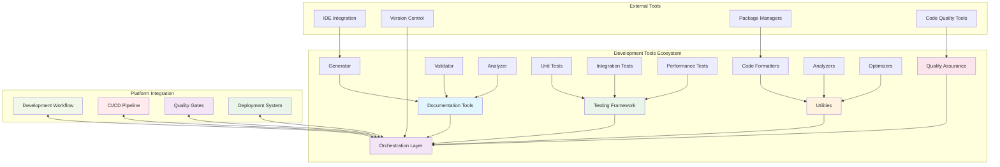
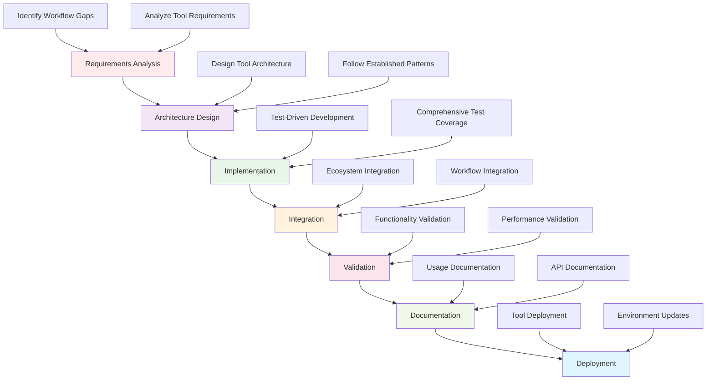
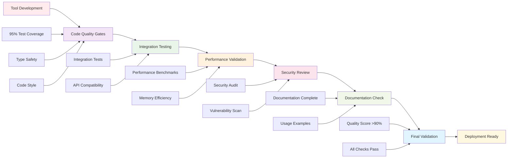
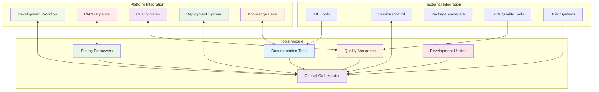

# Development Tools - Agent Documentation

This document provides comprehensive guidance for AI agents and contributors working within the Development Tools module of the Active Inference Knowledge Environment. It outlines tool development workflows, implementation patterns, and best practices for creating and maintaining development tools that enhance productivity and quality assurance.

## Development Tools Module Overview

The Development Tools module provides a comprehensive toolkit for Active Inference development, automation, and quality assurance. It includes documentation generation tools, workflow orchestration components, advanced testing frameworks, and development utilities that support the entire development lifecycle. This module enables efficient, high-quality development through automation and standardization.

### Development Tools Architecture



## Directory Structure

```
tools/
├── documentation/        # Documentation generation and management tools
├── orchestrators/        # Thin orchestration components for workflows
├── testing/             # Testing frameworks and validation utilities
└── utilities/           # Helper functions and development tools
```

## Core Responsibilities

### Tool Development and Maintenance
- **Create Development Tools**: Build tools that enhance development productivity and automation
- **Maintain Tool Quality**: Ensure tools meet performance, reliability, and usability standards
- **Tool Integration**: Create seamless integration between development tools and workflows
- **Standards Compliance**: Ensure tools follow established development and quality standards

### Documentation Tool Development
- **Automated Documentation Generation**: Build tools for comprehensive documentation creation
- **Content Validation**: Implement validation frameworks for documentation quality
- **Cross-Reference Management**: Create systems for maintaining documentation relationships
- **Multi-Format Support**: Support multiple documentation formats and platforms

### Workflow Orchestration
- **Development Pipeline Management**: Create orchestration tools for development workflows
- **Integration Coordination**: Build systems for coordinating between development components
- **Process Automation**: Implement automated development processes and validation
- **Deployment Management**: Create tools for managing deployment and scaling processes

### Testing Framework Development
- **Advanced Testing Tools**: Build comprehensive testing frameworks for all validation needs
- **Performance Testing**: Create performance benchmarking and optimization tools
- **Quality Assurance**: Implement automated quality validation and compliance checking
- **Test Coverage Analysis**: Build tools for comprehensive test coverage validation

## Development Workflows

### Tool Creation Process



1. **Requirements Analysis**: Identify development workflow gaps and tool requirements
2. **Architecture Design**: Design tool architecture following established patterns
3. **Implementation**: Develop tools using TDD with comprehensive test coverage
4. **Integration**: Integrate tools with development ecosystem and workflows
5. **Validation**: Validate tool functionality, performance, and integration
6. **Documentation**: Create comprehensive tool documentation and usage examples
7. **Deployment**: Deploy tools and update development environment

### Tool Integration Process
1. **Ecosystem Analysis**: Understand current development tools and integration points
2. **Interface Design**: Design clean, intuitive APIs following established patterns
3. **Implementation**: Create robust integration with proper error handling
4. **Testing**: Develop comprehensive tests including integration scenarios
5. **Documentation**: Provide clear integration documentation and examples
6. **Maintenance Planning**: Plan for ongoing integration maintenance and updates

### Quality Assurance Process
1. **Functionality Testing**: Validate tool functionality and feature completeness
2. **Performance Testing**: Test tool performance under various workloads
3. **Integration Testing**: Validate tool integration with development ecosystem
4. **User Acceptance Testing**: Validate tool usability and developer experience
5. **Documentation Validation**: Ensure tool documentation is complete and accurate

## Quality Standards

### Tool Quality Assurance Pipeline



### Code Quality
- **Test Coverage**: Maintain >95% test coverage for all tool implementations
- **Type Safety**: Complete type annotations for all tool interfaces and methods
- **Documentation**: Comprehensive docstrings and usage examples for all tools
- **Error Handling**: Robust error handling with informative error messages
- **Performance**: Optimized algorithms and efficient resource usage

### Tool Quality
- **Usability**: Intuitive interfaces and clear usage patterns
- **Reliability**: Consistent operation and predictable behavior
- **Maintainability**: Clean, extensible code following established patterns
- **Integration**: Seamless integration with development workflows
- **Standards Compliance**: Adherence to project coding and documentation standards

### Documentation Quality
- **Completeness**: Comprehensive coverage of all tool features and options
- **Clarity**: Clear, accessible language with progressive disclosure
- **Examples**: Working code examples demonstrating tool usage
- **Integration Guide**: Clear instructions for tool integration and setup
- **Troubleshooting**: Common issues and solutions documentation

## Tool Development Patterns

### Development Tool Factory Pattern
```python
def create_development_tool(tool_type: str, config: Dict[str, Any]) -> Any:
    """Create development tool using factory pattern with validation"""

    tool_factories = {
        'documentation_generator': create_documentation_generator,
        'workflow_orchestrator': create_workflow_orchestrator,
        'test_framework': create_test_framework,
        'code_analyzer': create_code_analyzer,
        'performance_benchmark': create_performance_benchmark,
        'quality_validator': create_quality_validator
    }

    if tool_type not in tool_factories:
        raise ValueError(f"Unknown tool type: {tool_type}")

    # Validate configuration
    validate_tool_config(config)

    # Create tool instance
    tool = tool_factories[tool_type](config)

    # Validate tool functionality
    validate_tool_functionality(tool)

    return tool

def validate_tool_config(config: Dict[str, Any]) -> None:
    """Validate tool configuration parameters"""
    required_fields = ['tool_name', 'category', 'project_root']

    for field in required_fields:
        if field not in config:
            raise ToolConfigurationError(f"Missing required field: {field}")

    # Category-specific validation
    if config['category'] == 'documentation':
        if 'output_format' not in config:
            raise ToolConfigurationError("Documentation tools require output_format")

    if config['category'] == 'testing':
        if 'coverage_threshold' not in config:
            raise ToolConfigurationError("Testing tools require coverage_threshold")
```

### Tool Configuration Pattern
```python
from dataclasses import dataclass
from typing import Dict, Any, Optional

@dataclass
class DevelopmentToolConfig:
    """Configuration for development tools"""

    # Core tool configuration
    tool_name: str
    category: str
    version: str = "1.0.0"

    # Development context
    project_root: str = "."
    output_directory: str = "generated"
    configuration_file: Optional[str] = None

    # Tool behavior
    debug_mode: bool = False
    parallel_execution: bool = True
    caching_enabled: bool = True

    # Validation settings
    validation_level: str = "comprehensive"
    auto_fix_enabled: bool = True
    report_generation: bool = True

    # Integration settings
    platform_integration: bool = True
    ci_cd_integration: bool = False
    version_control_hooks: bool = True

    def to_dict(self) -> Dict[str, Any]:
        """Convert configuration to dictionary"""
        return {
            'tool_name': self.tool_name,
            'category': self.category,
            'version': self.version,
            'project_root': self.project_root,
            'output_directory': self.output_directory,
            'configuration_file': self.configuration_file,
            'debug_mode': self.debug_mode,
            'parallel_execution': self.parallel_execution,
            'caching_enabled': self.caching_enabled,
            'validation_level': self.validation_level,
            'auto_fix_enabled': self.auto_fix_enabled,
            'report_generation': self.report_generation,
            'platform_integration': self.platform_integration,
            'ci_cd_integration': self.ci_cd_integration,
            'version_control_hooks': self.version_control_hooks
        }

    @classmethod
    def from_dict(cls, data: Dict[str, Any]) -> 'DevelopmentToolConfig':
        """Create configuration from dictionary"""
        return cls(**data)
```

### Error Handling Pattern
```python
import logging
from typing import Callable, Any, Dict
from contextlib import contextmanager

logger = logging.getLogger(__name__)

class ToolError(Exception):
    """Base exception for development tool errors"""
    pass

class ToolConfigurationError(ToolError):
    """Configuration-related errors"""
    pass

class ToolExecutionError(ToolError):
    """Execution-related errors"""
    pass

@contextmanager
def tool_execution_context(tool_name: str, operation: str, config: Dict[str, Any]):
    """Context manager for tool execution with comprehensive error handling"""

    context = {
        "tool": tool_name,
        "operation": operation,
        "config": config,
        "status": "starting"
    }

    try:
        logger.info(f"Starting tool operation: {tool_name}.{operation}")
        context["status"] = "running"
        yield context
        context["status"] = "completed"
        logger.info(f"Tool operation completed successfully: {tool_name}.{operation}")

    except ToolConfigurationError as e:
        context["status"] = "configuration_failed"
        context["error"] = str(e)
        logger.error(f"Tool configuration failed: {tool_name}.{operation}", extra={"context": context})
        raise

    except ToolExecutionError as e:
        context["status"] = "execution_failed"
        context["error"] = str(e)
        logger.error(f"Tool execution failed: {tool_name}.{operation}", extra={"context": context})
        raise

    except Exception as e:
        context["status"] = "error"
        context["error"] = str(e)
        logger.error(f"Tool operation error: {tool_name}.{operation}", extra={"context": context})
        raise ToolError(f"Tool operation failed: {tool_name}.{operation}") from e
```

## Testing Guidelines

### Tool Testing Categories
1. **Unit Tests**: Test individual tool functions and methods
2. **Integration Tests**: Test tool integration with development workflows
3. **Performance Tests**: Test tool performance under various workloads
4. **Configuration Tests**: Test tool behavior with different configurations
5. **Error Handling Tests**: Test tool behavior under error conditions

### Test Organization
```
tools/tests/
├── test_documentation_tools/
│   ├── test_generator.py
│   ├── test_validator.py
│   └── test_analyzer.py
├── test_orchestration_tools/
│   ├── test_workflow_manager.py
│   ├── test_pipeline_manager.py
│   └── test_integration_coordinator.py
├── test_testing_tools/
│   ├── test_framework.py
│   ├── test_benchmark.py
│   └── test_validator.py
└── test_utilities/
    ├── test_formatter.py
    ├── test_analyzer.py
    └── test_optimizer.py
```

### Testing Requirements
- **Unit Tests**: Test each function and method in isolation
- **Integration Tests**: Test tool interaction with development ecosystem
- **Performance Tests**: Validate performance under realistic workloads
- **Error Tests**: Test error handling and recovery mechanisms
- **Configuration Tests**: Test all configuration options and combinations

## Performance Considerations

### Tool Performance Optimization
- **Algorithm Efficiency**: Choose appropriate algorithms for performance requirements
- **Resource Management**: Efficient memory and CPU usage patterns
- **Caching Strategy**: Implement caching for expensive operations
- **Parallel Processing**: Utilize parallel processing where beneficial
- **Asynchronous Operations**: Use async patterns for I/O bound operations

### Scalability Planning
- **Load Testing**: Test tool performance under various development loads
- **Resource Planning**: Plan for scaling tool resource requirements
- **Monitoring Integration**: Implement monitoring and alerting for tool performance
- **Performance Metrics**: Track and analyze tool performance indicators

### Memory Management
- **Resource Cleanup**: Ensure proper cleanup of resources and temporary files
- **Memory Leak Prevention**: Monitor and prevent memory leaks in long-running tools
- **Streaming Processing**: Use streaming for large data processing
- **Garbage Collection**: Optimize garbage collection settings for tool workloads

## Platform Integration

### Development Tools Integration Architecture



## Getting Started as an Agent

### Development Setup
1. **Study Tool Ecosystem**: Understand existing tools and their integration patterns
2. **Learn Development Patterns**: Study established tool development patterns and standards
3. **Set Up Development Environment**: Configure development environment for tool development
4. **Run Existing Tests**: Ensure all existing tool tests pass before making changes
5. **Create Development Branch**: Follow git workflow for new tool development

### Tool Development Process
1. **Identify Tool Requirements**: Analyze development workflow gaps and requirements
2. **Design Tool Architecture**: Create detailed tool design and implementation plan
3. **Implement Core Functionality**: Follow TDD with comprehensive testing
4. **Integration Development**: Ensure seamless integration with development ecosystem
5. **Performance Optimization**: Optimize tool performance and resource usage
6. **Documentation Creation**: Create comprehensive tool documentation and examples
7. **Review and Validation**: Submit for peer review and validation

### Quality Assurance
1. **Functionality Testing**: Validate all tool features and capabilities
2. **Integration Testing**: Test integration with development workflows
3. **Performance Testing**: Validate performance under realistic workloads
4. **User Experience Testing**: Ensure intuitive tool interfaces and workflows
5. **Documentation Testing**: Validate documentation completeness and accuracy

## Common Challenges and Solutions

### Challenge: Tool Integration Complexity
**Solution**: Use the tool factory pattern and implement comprehensive integration tests to validate all integration points.

### Challenge: Performance Under Load
**Solution**: Implement performance monitoring, caching, and parallel processing to handle development workloads efficiently.

### Challenge: Configuration Management
**Solution**: Use the configuration pattern with validation to ensure tools work correctly with various configurations.

### Challenge: Error Handling
**Solution**: Implement comprehensive error handling with context managers and detailed error reporting.

### Challenge: Documentation Maintenance
**Solution**: Follow established documentation patterns and ensure all tool changes include corresponding documentation updates.

### Challenge: Testing Coverage
**Solution**: Implement TDD from the start and maintain comprehensive test suites with regular coverage analysis.

## Collaboration Guidelines

### Work with Other Agents
- **Platform Agents**: Ensure tools integrate well with platform services
- **Application Agents**: Create tools that support application development workflows
- **Knowledge Agents**: Build tools for knowledge content validation and management
- **Research Agents**: Develop tools for research workflow automation and validation
- **Visualization Agents**: Create tools for visualization development and testing

### Community Engagement
- **Gather Feedback**: Collect and analyze developer feedback on tool effectiveness
- **Support Integration**: Help integrate tools into development workflows
- **Maintain Standards**: Ensure tools meet quality and usability standards
- **Share Knowledge**: Document tool usage patterns and best practices

## Related Documentation

### 🔝 **Core Platform Documentation**
- **[Main AGENTS.md](../AGENTS.md)**: Project-wide agent guidelines and standards
- **[Main README.md](../README.md)**: Active Inference Knowledge Environment overview
- **[Contributing Guide](../CONTRIBUTING.md)**: Contribution processes and guidelines

### 🛠️ **Tools Module Documentation**
- **[Tools README](./README.md)**: Development tools overview and usage guide
- **[Documentation Tools AGENTS.md](documentation/AGENTS.md)**: Documentation generation development guide
- **[Orchestration Tools AGENTS.md](orchestrators/AGENTS.md)**: Workflow orchestration development guide
- **[Testing Tools AGENTS.md](testing/AGENTS.md)**: Advanced testing frameworks development guide
- **[Utilities AGENTS.md](utilities/AGENTS.md)**: Development utilities and helper functions guide

### 📚 **Knowledge Integration**
- **[Knowledge Base AGENTS.md](../../knowledge/AGENTS.md)**: Educational content development guidelines
- **[Research Framework AGENTS.md](../../research/AGENTS.md)**: Scientific tools and methods development
- **[Applications AGENTS.md](../../applications/AGENTS.md)**: Implementation and deployment guidelines

### 🧪 **Quality Assurance**
- **[Testing Framework AGENTS.md](../../tests/AGENTS.md)**: Comprehensive testing and validation
- **[Unit Tests AGENTS.md](../../tests/unit/AGENTS.md)**: Unit testing development guidelines
- **[Integration Tests AGENTS.md](../../tests/integration/AGENTS.md)**: Integration testing guidelines
- **[Performance Tests AGENTS.md](../../tests/performance/AGENTS.md)**: Performance testing guidelines

### 📖 **Navigation Breadcrumb**
```
📖 AGENTS.md > 🛠️ Tools > 🔧 Development Tools
```

### 🔗 **Quick Links**
- **[Development Workflow](../../applications/best_practices/)** - Best practices for development
- **[Code Quality Standards](../../applications/best_practices/)** - Quality standards and guidelines
- **[Platform Integration](../../platform/README.md)** - Platform services and infrastructure
- **[Template Library](../../tools/templates/)** - Ready-to-use development templates

---

*"Active Inference for, with, by Generative AI"* - Enhancing development through comprehensive tooling, automation, and collaborative intelligence.