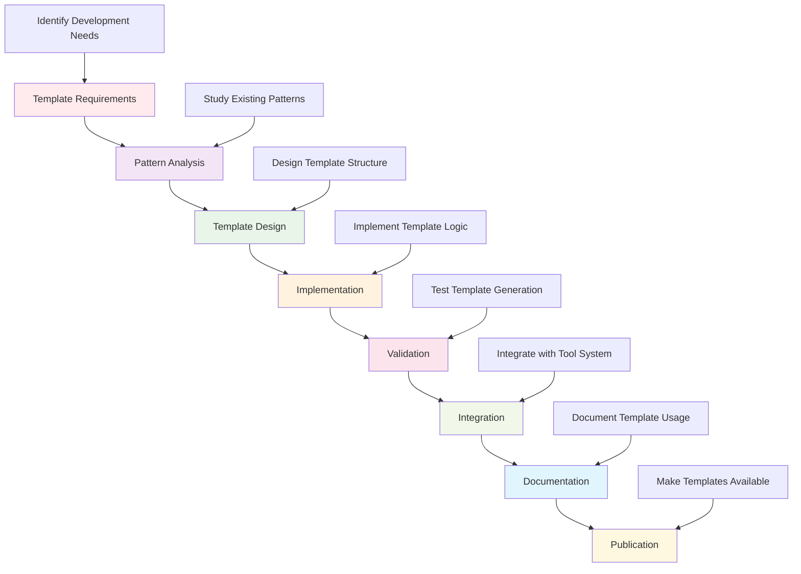

# Development Templates Hub

This directory contains comprehensive templates for development workflows, documentation standards, and code patterns in the Active Inference Knowledge Environment. These templates ensure consistency, quality, and efficiency across all development activities.

## Overview

The development templates hub provides standardized templates for documentation, code development, testing, and project organization. These templates embody the established patterns and best practices for contributing to the Active Inference platform.

### Mission & Role

This template system contributes to the platform mission by:

- **Development Consistency**: Ensuring uniform development practices and standards
- **Quality Assurance**: Providing templates that embody quality standards
- **Onboarding Efficiency**: Accelerating new contributor productivity
- **Maintenance Simplicity**: Standardizing project structure and documentation
- **Pattern Consistency**: Establishing and maintaining development patterns

## Architecture

### Template System Structure

```
tools/templates/
├── component_README_template.md    # Standard README.md template for components
├── component_AGENTS_template.md    # Standard AGENTS.md template for components
├── generated/                      # Auto-generated templates and patterns
└── README.md                      # This file
```

### Integration Points

**Platform Integration:**
- **Development Tools**: Integration with documentation generation and validation tools
- **Quality Assurance**: Templates embody quality standards and validation rules
- **Code Generation**: Templates support automated code and documentation generation
- **Pattern Library**: Centralized repository of established development patterns

**External Systems:**
- **Documentation Tools**: Sphinx, MkDocs, and other documentation generators
- **Code Quality Tools**: Black, isort, flake8, mypy for code formatting and validation
- **Development Environments**: IDE integration and development tool support
- **Version Control**: Git hooks and automated template application

## Template Categories

### Documentation Templates
Standardized templates for project documentation:
- **README.md Templates**: Component and module documentation standards
- **AGENTS.md Templates**: Agent development guidelines and patterns
- **API Documentation**: Automated API documentation generation
- **Tutorial Templates**: Educational content and learning materials

### Code Templates
Development patterns and code structures:
- **Class Templates**: Standard class structures and inheritance patterns
- **Function Templates**: Function patterns with comprehensive documentation
- **Test Templates**: Unit, integration, and performance test structures
- **Configuration Templates**: Configuration file patterns and validation

### Project Templates
Project organization and workflow templates:
- **Directory Structure**: Standard project layout and organization
- **Build Configuration**: Makefile and build system templates
- **CI/CD Templates**: Continuous integration and deployment workflows
- **Quality Gates**: Automated quality assurance and validation

## Getting Started

### Prerequisites
- **Template System Knowledge**: Understanding of template structure and usage
- **Development Standards**: Familiarity with project coding and documentation standards
- **Tool Integration**: Understanding of template integration with development tools
- **Quality Standards**: Knowledge of quality requirements and validation

### Basic Setup

```bash
# Install template tools
pip install jinja2 pyyaml markdown

# Set up template environment
export TEMPLATE_DIR="./tools/templates"
export PROJECT_TEMPLATES="$TEMPLATE_DIR"

# Initialize template system
python tools/templates/initialize_templates.py
```

### Using Templates

```python
# Basic template usage
from tools.templates import TemplateManager

# Initialize template manager
template_manager = TemplateManager(template_directory="./tools/templates")

# Generate component documentation
readme_template = template_manager.get_template("component_README_template.md")
agents_template = template_manager.get_template("component_AGENTS_template.md")

# Fill templates with project data
component_data = {
    "component_name": "My New Component",
    "description": "Brief description of component functionality",
    "author": "Your Name",
    "version": "1.0.0"
}

readme_content = readme_template.render(component_data)
agents_content = agents_template.render(component_data)

# Save generated documentation
save_documentation("README.md", readme_content)
save_documentation("AGENTS.md", agents_content)
```

## Usage Examples

### Example 1: Creating Component Documentation

```python
# Generate complete component documentation
from tools.templates import ComponentTemplateGenerator

# Define component specifications
component_spec = {
    "name": "ActiveInferenceModel",
    "type": "core_component",
    "description": "Core Active Inference model implementation",
    "author": "Active Inference Community",
    "difficulty": "intermediate",
    "prerequisites": ["bayesian_inference", "information_theory"],
    "features": ["variational_inference", "free_energy_optimization", "policy_selection"],
    "integration_points": ["knowledge_base", "research_tools", "visualization"]
}

# Generate documentation
generator = ComponentTemplateGenerator()
readme_content = generator.generate_readme(component_spec)
agents_content = generator.generate_agents(component_spec)

# Save to component directory
component_path = "src/active_inference/core/"
save_file(f"{component_path}/README.md", readme_content)
save_file(f"{component_path}/AGENTS.md", agents_content)
```

### Example 2: Code Pattern Templates

```python
# Generate standard code patterns
from tools.templates import CodePatternGenerator

# Define pattern requirements
pattern_config = {
    "pattern_type": "factory_pattern",
    "component_name": "ResearchFramework",
    "config_type": "ResearchConfig",
    "validation_requirements": ["type_safety", "error_handling", "performance"]
}

# Generate factory pattern
pattern_generator = CodePatternGenerator()
factory_code = pattern_generator.generate_factory_pattern(pattern_config)

# Generate configuration pattern
config_code = pattern_generator.generate_configuration_pattern(pattern_config)

# Generate error handling pattern
error_handling_code = pattern_generator.generate_error_handling_pattern(pattern_config)

# Combine into complete implementation
complete_implementation = combine_patterns([factory_code, config_code, error_handling_code])
```

### Example 3: Test Template Generation

```python
# Generate comprehensive test templates
from tools.templates import TestTemplateGenerator

# Define testing requirements
test_config = {
    "component_name": "StatisticalAnalyzer",
    "test_types": ["unit", "integration", "performance", "security"],
    "coverage_target": 95,
    "mock_requirements": ["external_api", "database", "file_system"],
    "fixture_data": ["test_data", "config_data", "performance_data"]
}

# Generate test structure
test_generator = TestTemplateGenerator()
test_structure = test_generator.generate_test_structure(test_config)

# Generate individual test files
for test_type in test_config["test_types"]:
    test_file = test_generator.generate_test_file(test_type, test_config)
    save_file(f"tests/{test_type}/test_{component_name.lower()}.py", test_file)

# Generate test configuration
test_config_content = test_generator.generate_test_configuration(test_config)
save_file("pytest.ini", test_config_content)
```

## Configuration

### Template System Configuration

```python
# Template system configuration
template_config = {
    "system": {
        "template_directory": "./tools/templates",
        "generated_directory": "./tools/templates/generated",
        "backup_originals": True,
        "version_control": True
    },
    "documentation": {
        "style_guide": "google",
        "code_style": "black",
        "type_hints": True,
        "examples_required": True,
        "validation_enabled": True
    },
    "code_generation": {
        "pattern_enforcement": True,
        "quality_gates": True,
        "auto_formatting": True,
        "dependency_checking": True,
        "integration_testing": True
    },
    "quality_assurance": {
        "coverage_threshold": 95,
        "complexity_limit": 10,
        "documentation_coverage": 100,
        "security_scanning": True,
        "performance_benchmarks": True
    }
}
```

### Template Customization

```python
# Customize templates for specific project needs
customization_config = {
    "project_type": "research_platform",
    "documentation_style": "academic",
    "code_complexity": "intermediate",
    "testing_strategy": "comprehensive",
    "integration_requirements": "platform_wide"
}

# Apply customizations
template_manager = TemplateManager()
customized_templates = template_manager.customize_templates(customization_config)

# Generate project-specific templates
project_templates = template_manager.generate_project_templates(customized_templates)
```

## API Reference

### Core Template Classes

#### `TemplateManager`
Central template management and generation system.

```python
class TemplateManager:
    """Manage and generate development templates"""

    def __init__(self, template_directory: str = "./tools/templates"):
        """Initialize template manager with template directory"""

    def get_template(self, template_name: str) -> Template:
        """Retrieve template by name"""

    def list_templates(self, category: Optional[str] = None) -> List[str]:
        """List available templates, optionally filtered by category"""

    def customize_template(self, template_name: str, customizations: Dict[str, Any]) -> Template:
        """Customize template with specific requirements"""

    def generate_from_template(self, template_name: str, data: Dict[str, Any]) -> str:
        """Generate content from template with provided data"""
```

#### `ComponentTemplateGenerator`
Specialized generator for component documentation templates.

```python
class ComponentTemplateGenerator:
    """Generate component-specific documentation templates"""

    def __init__(self, base_templates: Dict[str, Template]):
        """Initialize with base template collection"""

    def generate_readme(self, component_spec: Dict[str, Any]) -> str:
        """Generate README.md for component"""

    def generate_agents(self, component_spec: Dict[str, Any]) -> str:
        """Generate AGENTS.md for component"""

    def generate_api_docs(self, component_spec: Dict[str, Any]) -> str:
        """Generate API documentation for component"""

    def validate_generated_content(self, content: str, validation_rules: Dict[str, Any]) -> ValidationResult:
        """Validate generated documentation content"""
```

#### `CodePatternGenerator`
Generator for code patterns and implementation templates.

```python
class CodePatternGenerator:
    """Generate code patterns and implementation templates"""

    def __init__(self, pattern_library: Dict[str, str]):
        """Initialize with pattern library"""

    def generate_factory_pattern(self, config: Dict[str, Any]) -> str:
        """Generate factory pattern implementation"""

    def generate_configuration_pattern(self, config: Dict[str, Any]) -> str:
        """Generate configuration pattern with validation"""

    def generate_error_handling_pattern(self, config: Dict[str, Any]) -> str:
        """Generate comprehensive error handling pattern"""

    def generate_testing_pattern(self, config: Dict[str, Any]) -> str:
        """Generate testing pattern with comprehensive coverage"""
```

## Development Workflows

### Template Development Pipeline



### Template Customization Workflow

```python
# Workflow for customizing templates
def customize_template_for_project(project_config: Dict[str, Any]) -> Dict[str, Template]:
    """Customize templates for specific project requirements"""

    # Analyze project requirements
    requirements_analysis = analyze_project_requirements(project_config)

    # Select base templates
    base_templates = select_relevant_templates(requirements_analysis)

    # Apply customizations
    customization_rules = generate_customization_rules(requirements_analysis)
    customized_templates = apply_customizations(base_templates, customization_rules)

    # Validate customizations
    validation_result = validate_template_customizations(customized_templates)
    if not validation_result["valid"]:
        raise ValueError(f"Template customization failed: {validation_result['errors']}")

    return customized_templates

# Generate project-specific templates
def generate_project_templates(customized_templates: Dict[str, Template],
                             project_structure: Dict[str, Any]) -> Dict[str, str]:
    """Generate complete template set for project"""

    generated_templates = {}

    # Generate documentation templates
    for component in project_structure["components"]:
        readme_content = customized_templates["readme"].render(component)
        agents_content = customized_templates["agents"].render(component)
        api_content = customized_templates["api"].render(component)

        generated_templates[f"{component['name']}_README.md"] = readme_content
        generated_templates[f"{component['name']}_AGENTS.md"] = agents_content
        generated_templates[f"{component['name']}_API.md"] = api_content

    # Generate code templates
    for pattern in project_structure["patterns"]:
        code_content = customized_templates["code"].render(pattern)
        test_content = customized_templates["test"].render(pattern)

        generated_templates[f"{pattern['name']}_implementation.py"] = code_content
        generated_templates[f"test_{pattern['name']}.py"] = test_content

    return generated_templates
```

## Contributing

### Template Development Standards

When contributing to the template system:

1. **Pattern Validation**: Ensure templates embody established patterns and standards
2. **Quality Integration**: Templates must integrate quality assurance requirements
3. **Documentation Completeness**: All templates must be thoroughly documented
4. **Usage Examples**: Provide clear examples of template usage and customization
5. **Validation Rules**: Include validation rules for generated content

### Template Contribution Process

1. **Identify Template Gap**: Find missing or inadequate template types
2. **Study Existing Patterns**: Understand current template structure and patterns
3. **Design Template Structure**: Create comprehensive template design
4. **Implement Template Logic**: Develop robust template generation logic
5. **Add Validation**: Include comprehensive validation and quality checks
6. **Document Usage**: Provide complete documentation and examples
7. **Submit for Review**: Follow template review and integration process

## Related Documentation

- **[Development Tools](../../tools/README.md)**: Overview of development tools and utilities
- **[Documentation Tools](../../tools/documentation/README.md)**: Documentation generation and management
- **[Quality Assurance](../../applications/best_practices/)**: Quality standards and best practices
- **[Development Standards](../../../.cursorrules)**: Complete development standards and patterns
- **[Template System AGENTS.md](AGENTS.md)**: Template development guidelines

---

**Development Templates Version**: 1.0.0 | **Last Updated**: October 2024 | **Development Status**: Active Development

*"Active Inference for, with, by Generative AI"* - Accelerating development through standardized templates, consistent patterns, and comprehensive development support.
